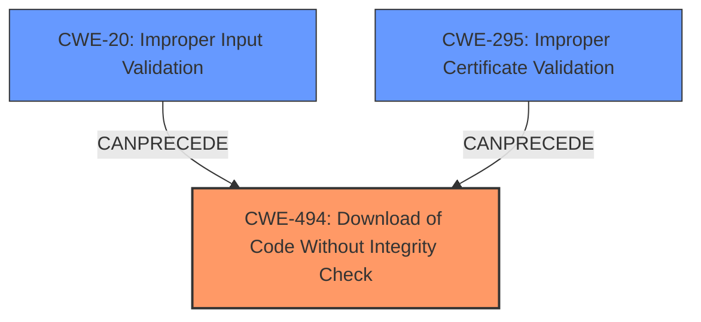

# Analysis for CVE-2021-3485

# Summary
| CWE ID | CWE Name | Confidence | CWE Abstraction Level | CWE Vulnerability Mapping Label | CWE-Vulnerability Mapping Notes |
|---|---|---|---|---|---|
| CWE-494 | Download of Code Without Integrity Check | 0.9 | Base | Allowed | Primary CWE. The product downloads code without sufficiently verifying its origin and integrity. |
| CWE-295 | Improper Certificate Validation | 0.7 | Base | Allowed | Secondary CWE. The use of `--no-check-certificate` disables certificate validation. |
| CWE-20 | Improper Input Validation | 0.6 | Class | Discouraged | Secondary CWE. The application does not properly validate the downloaded update files. |

## Evidence and Confidence

*   **Confidence Score:** 0.8
*   **Evidence Strength:** HIGH

## Relationship Analysis
The relationship analysis reveals a clear hierarchy and chain of events contributing to the vulnerability. CWE-494, Download of Code Without Integrity Check, is the primary weakness, stemming from the absence of proper verification during code download. This is compounded by CWE-295, Improper Certificate Validation, as the `--no-check-certificate` flag disables necessary security checks. Additionally, CWE-20, Improper Input Validation, plays a role as the application doesn't validate the downloaded update files, allowing malicious code to be executed.

## Vulnerability Chain
The vulnerability chain starts with the **insecure communication channel** (HTTP), leading to **missing certificate validation** (CWE-295) and ultimately, **download of code without integrity check** (CWE-494). This results in the **improper input validation** (CWE-20) of the downloaded files, allowing for **remote code execution**.

## Summary of Analysis
The initial analysis focused on the **Improper Input Validation** identified in the vulnerability description. However, the detailed information in the "CVE Reference Links Content Summary" reveals a more complex scenario. The primary issue is the insecure update mechanism, specifically the download of code without integrity checks. This is supported by the evidence: "The `product-update` script uses an insecure channel (HTTP) and the `wget` command with the `--no-check-certificate` flag to download update files," leading to a potential man-in-the-middle attack and remote code execution.

The graph relationships influenced the final selection by highlighting the chain of events. CWE-494 is the most direct representation of the vulnerability, as it describes the core issue of downloading code without proper verification. CWE-295 is included as a contributing factor, as the disabled certificate validation exacerbates the risk. CWE-20 is also relevant because the downloaded update files are not properly validated before execution.

The selected CWEs are at the optimal level of specificity. CWE-494 is a Base-level CWE that directly addresses the downloading of code without integrity checks. CWE-295 is also a Base-level CWE that specifies the lack of certificate validation. While CWE-20 is a Class-level CWE, it accurately reflects the **improper input validation** of the downloaded files.

# Relevant CWE Information:

The following CWEs were identified as potentially relevant to this vulnerability:

## CWE-1289: Improper Validation of Unsafe Equivalence in Input
**Abstraction Level**: Base
**Similarity Score**: 0.77
**Source**: dense

**Description**:
The product receives an input value that is used as a resource identifier or other type of reference, but it does not validate or incorrectly validates that the input is equivalent to a potentially-unsafe value.

**Mapping Guidance**:
- Usage: Allowed
- Rationale: This CWE entry is at the Base level of abstraction, which is a preferred level of abstraction for mapping to the root causes of vulnerabilities.

*This CWE was not selected because the primary issue is not about validating equivalence, but rather the lack of integrity checking during download.*

## CWE-274: Improper Handling of Insufficient Privileges
**Abstraction Level**: Base
**Similarity Score**: 0.76
**Source**: dense

**Description**:
The product does not handle or incorrectly handles when it has insufficient privileges to perform an operation, leading to resultant weaknesses.

**Mapping Guidance**:
- Usage: Discouraged
- Rationale: This CWE entry could be deprecated in a future version of CWE.

*This CWE was not selected because the vulnerability is not related to insufficient privileges.*

## CWE-807: Reliance on Untrusted Inputs in a Security Decision
**Abstraction Level**: Base
**Similarity Score**: 0.76
**Source**: dense

**Description**:
The product uses a protection mechanism that relies on the existence or values of an input, but the input can be modified by an untrusted actor in a way that bypasses the protection mechanism.

**Mapping Guidance**:
- Usage: Allowed
- Rationale: This CWE entry is at the Base level of abstraction, which is a preferred level of abstraction for mapping to the root causes of vulnerabilities.

*This CWE was not selected because the vulnerability is not specifically about relying on untrusted inputs for a security decision, but rather the lack of integrity checking during code download.*

## CWE-653: Improper Isolation or Compartmentalization
**Abstraction Level**: Class
**Similarity Score**: 0.76
**Source**: dense

**Description**:
The product does not properly compartmentalize or isolate functionality, processes, or resources that require different privilege levels, rights, or permissions.

**Mapping Guidance**:
- Usage: Allowed
- Rationale: This CWE entry is at the Base level of abstraction, which is a preferred level of abstraction for mapping to the root causes of vulnerabilities.

*This CWE was not selected because the vulnerability is not related to improper isolation or compartmentalization.*

## CWE-1220: Insufficient Granularity of Access Control
**Abstraction Level**: Base
**Similarity Score**: 0.76
**Source**: dense

**Description**:
The product implements access controls via a policy or other feature with the intention to disable or restrict accesses (reads and/or writes) to assets in a system from untrusted agents. However, implemented access controls lack required granularity, which renders the control policy too broad because it allows accesses from unauthorized agents to the security-sensitive assets.

**Mapping Guidance**:
- Usage: Allowed
- Rationale: This CWE entry is at the Base level of abstraction, which is a preferred level of abstraction for mapping to the root causes of vulnerabilities.

*This CWE was not selected because the vulnerability is not about insufficient granularity of access control.*

## CWE-280: Improper Handling of Insufficient Permissions or Privileges 
**Abstraction Level**: Base
**Similarity Score**: 0.76
**Source**: dense

**Description**:
The product does not handle or incorrectly handles when it has insufficient privileges to access resources or functionality as specified by their permissions. This may cause it to follow unexpected code paths that may leave the product in an invalid state.

**Mapping Guidance**:
- Usage: Allowed
- Rationale: This CWE entry is at the Base level of abstraction, which is a preferred level of abstraction for mapping to the root causes of vulnerabilities.

*This CWE was not selected because the vulnerability is not related to insufficient permissions or privileges.*

## CWE-184: Incomplete List of Disallowed Inputs
**Abstraction Level**: Base
**Similarity Score**: 0.75
**Source**: dense

**Description**:
The product implements a protection mechanism that relies on a list of inputs (or properties of inputs) that are not allowed by policy or otherwise require other action to neutralize before additional processing takes place, but the list is incomplete.

**Mapping Guidance**:
- Usage: Allowed
- Rationale: This CWE entry is at the Base level of abstraction, which is a preferred level of abstraction for mapping to the root causes of vulnerabilities.

*This CWE was not selected because the vulnerability is not about an incomplete list of disallowed inputs.*

## CWE-691: Insufficient Control Flow Management
**Abstraction Level**: Pillar
**Similarity Score**: 0.75
**Source**: dense

**Description**:
The code does not sufficiently manage its control flow during execution, creating conditions in which the control flow can be modified in unexpected ways.

**Mapping Guidance**:
- Usage: Discouraged
- Rationale: This CWE entry is extremely high-level, a Pillar. However, classification research is limited for weaknesses of this type, so there can be gaps or organizational difficulties within CWE that force use of this weakness, even at such a high level of abstraction.

*This CWE was not selected because it is too high-level and does not accurately represent the specific vulnerability.*

## CWE-664: Improper Control of a Resource Through its Lifetime
**