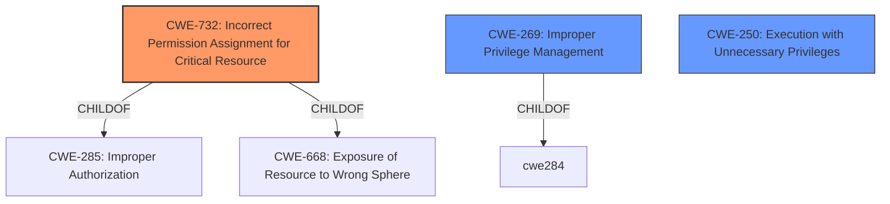

# Raw Analyzer Response for CVE-2021-34864

# Summary
| CWE ID | CWE Name | Confidence | CWE Abstraction Level | CWE Vulnerability Mapping Label | CWE-Vulnerability Mapping Notes |
|---|---|---|---|---|---|
| CWE-732 | Incorrect Permission Assignment for Critical Resource | 0.9 | Class | Allowed-with-Review | Primary CWE |
| CWE-250 | Execution with Unnecessary Privileges | 0.7 | Base | Allowed | Secondary Candidate |
| CWE-269 | Improper Privilege Management | 0.6 | Class | Discouraged | Secondary Candidate |

## Evidence and Confidence

*   **Confidence Score:** 0.8
*   **Evidence Strength:** HIGH

## Relationship Analysis
The primary CWE is CWE-732 **Incorrect Permission Assignment for Critical Resource**, which is a Class-level CWE. It is a child of CWE-285 **Improper Authorization** and CWE-668 **Exposure of Resource to Wrong Sphere**. This relationship suggests that the **lack of proper access control** leads to a critical resource having incorrect permissions, potentially exposing it to unauthorized actors. CWE-250 **Execution with Unnecessary Privileges** and CWE-269 **Improper Privilege Management** are also related to the **lack of proper access control**, which may lead to privilege escalation.

## Vulnerability Chain
The vulnerability chain starts with the **lack of proper access control** in the WinAppHelper component (root cause), which leads to **incorrect permission assignment** for critical resources (CWE-732). This allows a local attacker with low-privileged code execution to escalate privileges and execute arbitrary code in the context of the hypervisor (impact).

## Summary of Analysis
The initial analysis identified the **lack of proper access control** as the root cause, leading to privilege escalation. The Retriever Results pointed to CWE-732 **Incorrect Permission Assignment for Critical Resource** as a strong candidate, which aligns well with the description.

The provided description explicitly mentions the **lack of proper access control** as the root cause, which directly relates to authorization and permission issues. The vulnerability enables a local attacker to escalate privileges and execute arbitrary code, highlighting the potential impact of the **improper access control**.

The selection of CWE-732 as the primary CWE is based on the following:

*   The **Vulnerability Description Key Phrases** section highlights the **"lack of proper access control"** as the root cause.
*   The **CVE Reference Links Content Summary** confirms that the **root cause of the vulnerability** is the **lack of proper access control** within the WinAppHelper component.
*   CWE-732 directly addresses the scenario where permissions for a security-critical resource are incorrectly assigned, which aligns with the vulnerability description.
*   The mapping guidance for CWE-732 suggests analyzing the specific mistake that allows the resource to be exposed, which is the **lack of proper access control** in this case.

CWE-250 **Execution with Unnecessary Privileges** is considered as a secondary candidate since the attacker escalates privileges to execute arbitrary code.
CWE-269 **Improper Privilege Management** is also considered as a secondary candidate, but it is less specific than CWE-732 and CWE-250.

The selected CWEs are at the optimal level of specificity, representing the underlying cause and potential consequences of the vulnerability. CWE-732 accurately captures the root cause (incorrect permission assignment), while CWE-250 reflects the impact (execution with elevated privileges).