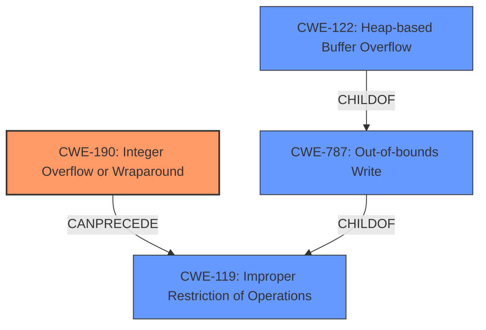

# Analysis Report for CVE-2021-3491

# Vulnerability Analysis Report: CVE-2021-3491

## Description


## Analysis (with Relationship Data)

# Summary
| CWE ID  | CWE Name                                                      | Confidence | CWE Abstraction Level | CWE Vulnerability Mapping Label | CWE-Vulnerability Mapping Notes |
| ------- | ------------------------------------------------------------- | ---------- | --------------------- | ------------------------------- | ------------------------------- |
| CWE-190 | Integer Overflow or Wraparound                                | 0.9        | Base                  | Primary                         | Allowed                        |
| CWE-787 | Out-of-bounds Write                                           | 0.7        | Base                  | Secondary                       | Allowed                        |
| CWE-122 | Heap-based Buffer Overflow                                    | 0.6        | Variant               | Secondary                       | Allowed                        |

## Evidence and Confidence

*   **Confidence Score:** 0.8
*   **Evidence Strength:** HIGH

## Relationship Analysis
The primary weakness is **CWE-190 [Integer Overflow or Wraparound]**, which can **CANPRECEDE** **CWE-119 [Improper Restriction of Operations within the Bounds of a Memory Buffer]**. **CWE-787 [Out-of-bounds Write]** is a **CHILDOF** **CWE-119 [Improper Restriction of Operations within the Bounds of a Memory Buffer]** and can result from an integer overflow. **CWE-122 [Heap-based Buffer Overflow]** is a **CHILDOF** **CWE-787 [Out-of-bounds Write]**, indicating that the out-of-bounds write occurs on the heap.



## Vulnerability Chain
The vulnerability chain starts with an **CWE-190 [Integer Overflow or Wraparound]** due to **improper** validation of user-supplied data. This leads to a bypass of the `MAX_RW_COUNT` limit, which results in an **CWE-787 [Out-of-bounds Write]**, specifically a **CWE-122 [Heap-based Buffer Overflow]**.

## Summary of Analysis
The analysis is based on the vulnerability description and CVE reference links content summary, which provide clear evidence of an **integer overflow** vulnerability in the `io_uring` subsystem of the Linux kernel. The **weakness** is that the `MAX_RW_COUNT` limit can be bypassed in the `PROVIDE_BUFFERS` operation, leading to negative values being used when reading `/proc//mem`. This can be exploited to cause a **heap overflow**, leading to arbitrary code execution in the kernel.

The primary CWE is **CWE-190 [Integer Overflow or Wraparound]** because the **root cause** is the lack of proper enforcement of the `MAX_RW_COUNT` limit, which allows lengths larger than `MAX_RW_COUNT` to be used and accepted, potentially leading to an integer overflow. This aligns with the CWE description: "The product performs a calculation that can produce an integer overflow or wraparound when the logic assumes that the resulting value will always be larger than the original value."

The secondary CWEs are **CWE-787 [Out-of-bounds Write]** and **CWE-122 [Heap-based Buffer Overflow]**. These are consequences of the integer overflow. The integer overflow leads to writing data past the end of the intended buffer (out-of-bounds write), and since the buffer is allocated on the heap, it is specifically a heap-based buffer overflow.

The selected CWEs are at the optimal level of specificity. **CWE-190 [Integer Overflow or Wraparound]** is a Base CWE that accurately represents the **root cause** of the vulnerability. **CWE-787 [Out-of-bounds Write]** and **CWE-122 [Heap-based Buffer Overflow]** are more specific CWEs that describe the consequences of the integer overflow.

Relevant CWE Information:

# Enhanced Context (25 CWEs)
The following CWEs were identified as potentially relevant to this vulnerability:

## CWE-208: Observable Timing Discrepancy
**Abstraction Level**: Base
**Similarity Score**: 0.79
**Source**: dense

**Description**:
Two separate operations in a product require different amounts of time to complete, in a way that is observable to an actor and reveals security-relevant information about the state of the product, such as whether a particular operation was successful or not.

**Mapping Guidance**:
- Usage: Allowed
- Rationale: This CWE entry is at the Base level of abstraction, which is a preferred level of abstraction for mapping to the root causes of vulnerabilities.

*   **Why it was not selected:** Timing discrepancy is not relevant to the described vulnerability.

## CWE-667: Improper Locking
**Abstraction Level**: Class
**Similarity Score**: 0.79
**Source**: dense

**Description**:
The product does not properly acquire or release a lock on a resource, leading to unexpected resource state changes and behaviors.

**Mapping Guidance**:
- Usage: Allowed-with-Review
- Rationale: This CWE entry is a Class and might have Base-level children that would be more appropriate

*   **Why it was not selected:** Locking issues are not relevant to the described vulnerability.

## CWE-191: Integer Underflow (Wrap or Wraparound)
**Abstraction Level**: Base
**Similarity Score**: 0.79
**Source**: dense

**Description**:
The product subtracts one value from another, such that the result is less than the minimum allowable integer value, which produces a value that is not equal to the correct result.

**Mapping Guidance**:
- Usage: Allowed
- Rationale: This CWE entry is at the Base level of abstraction, which is a preferred level of abstraction for mapping to the root causes of vulnerabilities.

*   **Why it was not selected:** The vulnerability is related to exceeding the maximum value (overflow), not going below the minimum (underflow).

## CWE-131: Incorrect Calculation of Buffer Size
**Abstraction Level**: Base
**Similarity Score**: 0.78
**Source**: dense

**Description**:
The product does not correctly calculate the size to be used when allocating a buffer, which could lead to a buffer overflow.

**Mapping Guidance**:
- Usage: Allowed
- Rationale: This CWE entry is at the Base level of abstraction, which is a preferred level of abstraction for mapping to the root causes of vulnerabilities.

*   **Why it was not selected:** While a buffer overflow occurs, the **root cause** is the integer overflow due to improper input validation, not a direct miscalculation of the buffer size itself.

## CWE-125: Out-of-bounds Read
**Abstraction Level**: Base
**Similarity Score**: 0.77
**Source**: dense

**Description**:
The product reads data past the end, or before the beginning, of the intended buffer.

**Mapping Guidance**:
- Usage: Allowed
- Rationale: This CWE entry is at the Base level of abstraction, which is a preferred level of abstraction for mapping to the root causes of vulnerabilities.

*   **Why it was not selected:** The vulnerability leads to an out-of-bounds *write*, not an out-of-bounds *read*.

## CWE-119: Improper Restriction of Operations within the Bounds of a Memory Buffer
**Abstraction Level**: Class
**Similarity Score**: 0.77
**Source**: dense

**Description**:
The product performs operations on a memory buffer, but it reads from or writes to a memory location outside the buffer's intended boundary. This may result in read or write operations on unexpected memory locations that could be linked to other variables, data structures, or internal program data.

**Mapping Guidance**:
- Usage: Discouraged
- Rationale: CWE-119 is commonly misused in low-information vulnerability reports when lower-level CWEs could be used instead, or when more details about the vulnerability are available.

*   **Why it was not selected:** Although the vulnerability results in out-of-bounds memory operations, **CWE-787 [Out-of-bounds Write]** is more specific and directly describes the **weakness**. **CWE-119 [Improper Restriction of Operations within the Bounds of a Memory Buffer]** is a class-level CWE and should be avoided when a more specific Base CWE is available.

## CWE-226: Sensitive Information in Resource Not Removed Before Reuse
**Abstraction Level**: Base
**Similarity Score**: 0.7


## CWE Relationship Analysis

Current CWEs represent these abstraction levels: .


### Vulnerability Chain Analysis

**Chain starting from CWE-667:**
- 667 (Improper Locking) - ROOT


**Chain starting from CWE-787:**
- 787 (Out-of-bounds Write) - ROOT


### CWE Relationship Diagram

```mermaid
graph TD
    classDef primary fill:#f96,stroke:#333,stroke-width:2px
    classDef secondary fill:#69f,stroke:#333
    classDef tertiary fill:#9e9,stroke:#333
```


*Report generated on 2025-04-02 04:59:14*
