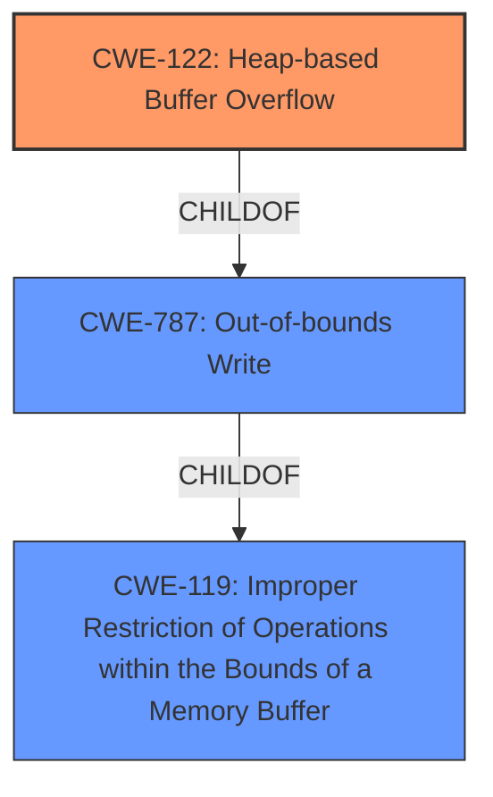

# Analysis for CVE-2021-3496

# Summary
| CWE ID    | CWE Name                                                                 | Confidence | CWE Abstraction Level | CWE Vulnerability Mapping Label | CWE-Vulnerability Mapping Notes |
| :-------- | :----------------------------------------------------------------------- | :--------- | :-------------------- | :------------------------------ | :---------------------------- |
| CWE-122   | Heap-based Buffer Overflow                                               | 1.0        | Variant               | Primary CWE                     | Allowed                       |
| CWE-787   | Out-of-bounds Write                                                      | 0.7        | Base                  | Secondary Candidate             | Allowed                       |
| CWE-119   | Improper Restriction of Operations within the Bounds of a Memory Buffer | 0.6        | Class                 | Secondary Candidate             | Discouraged                    |

## Evidence and Confidence

*   **Confidence Score:** 0.8
*   **Evidence Strength:** HIGH

## Relationship Analysis
The primary relationship influencing my decision is the hierarchical structure. CWE-122 (Heap-based Buffer Overflow) is a Variant of CWE-787 (Out-of-bounds Write) and CWE-119 (Improper Restriction of Operations within the Bounds of a Memory Buffer). Since the description explicitly states "heap-based buffer overflow," selecting the more specific CWE-122 is appropriate. The chain relationship isn't as evident here, as the description focuses on the direct cause rather than a sequence of events. The abstraction level played a key role; I chose the Variant (CWE-122) as it was more precise than the Class (CWE-119).

## Vulnerability Chain
The vulnerability chain is relatively direct:
1.  **Heap-based Buffer Overflow (CWE-122):** The **root cause** is the heap-based buffer overflow in `Get16u()` in `exif.c`.
2.  **Out-of-bounds Write (CWE-787):** This is a consequence of the overflow, data is written beyond the allocated buffer.
3.  **Improper Restriction of Operations within the Bounds of a Memory Buffer (CWE-119):** This is a more general description of the problem.

## Summary of Analysis
My assessment is heavily based on the provided evidence, particularly the vulnerability description and the CVE Reference Links Content Summary.

The vulnerability description clearly states: "A **heap-based buffer overflow** was found in jhead in version 3.06 in Get16u() in exif.c when processing a crafted file." The CVE Reference Links Content Summary reinforces this: "The vulnerability is a heap-based buffer overflow in the `Get16u()` function within `exif.c` of jhead."

The graph relationships influenced my decision by highlighting the hierarchical structure of the CWEs. I initially considered CWE-119 due to its broader nature, but the explicit mention of "heap-based" made CWE-122 the more appropriate choice. I considered CWE-787 as it is the Parent of CWE-122, but as CWE-122 is a Variant, it is a more specific match.

My selected CWEs are at the optimal level of specificity because CWE-122 directly reflects the stated vulnerability, providing the most accurate classification based on the available information.

Relevant CWE Information:

# Enhanced Context (25 CWEs)

## CWE-124: Buffer Underwrite ('Buffer Underflow')
**Abstraction Level**: Base
**Similarity Score**: 0.77
**Source**: dense

**Description**:
The product writes to a buffer using an index or pointer that references a memory location prior to the beginning of the buffer.
*This was not selected because the vulnerability is a buffer overflow and not a buffer underflow.*

## CWE-131: Incorrect Calculation of Buffer Size
**Abstraction Level**: Base
**Similarity Score**: 0.76
**Source**: dense

**Description**:
The product does not correctly calculate the size to be used when allocating a buffer, which could lead to a buffer overflow.
*This was not selected because there is no evidence to suggest that the buffer size was incorrectly calculated.*

## CWE-191: Integer Underflow (Wrap or Wraparound)
**Abstraction Level**: Base
**Similarity Score**: 0.76
**Source**: dense

**Description**:
The product subtracts one value from another, such that the result is less than the minimum allowable integer value, which produces a value that is not equal to the correct result.
*This was not selected because the vulnerability is a buffer overflow and not an integer underflow.*

## CWE-193: Off-by-one Error
**Abstraction Level**: Base
**Similarity Score**: 0.76
**Source**: dense

**Description**:
A product calculates or uses an incorrect maximum or minimum value that is 1 more, or 1 less, than the correct value.
*This was not selected because there is no evidence to suggest that the rootcause of the overflow was an off-by-one error.*

## CWE-805: Buffer Access with Incorrect Length Value
**Abstraction Level**: Base
**Similarity Score**: 0.75
**Source**: dense

**Description**:
The product uses a sequential operation to read or write a buffer, but it uses an incorrect length value that causes it to access memory that is outside of the bounds of the buffer.
*This was not selected because there is no evidence to suggest the **rootcause** was an incorrect length value.*

## CWE-197: Numeric Truncation Error
**Abstraction Level**: Base
**Similarity Score**: 0.74
**Source**: dense

**Description**:
Truncation errors occur when a primitive is cast to a primitive of a smaller size and data is lost in the conversion.
*This was not selected because there is no evidence to suggest that a numeric truncation error was the **rootcause**.*

## CWE-127: Buffer Under-read
**Abstraction Level**: Variant
**Similarity Score**: 0.74
**Source**: dense

**Description**:
The product reads from a buffer using buffer access mechanisms such as indexes or pointers that reference memory locations prior to the targeted buffer.
*This was not selected because the vulnerability is a buffer overflow and not a buffer under-read.*

## CWE-126: Buffer Over-read
**Abstraction Level**: Variant
**Similarity Score**: 0.74
**Source**: dense

**Description**:
The product reads from a buffer using buffer access mechanisms such as indexes or pointers that reference memory locations after the targeted buffer.
*This was not selected because the vulnerability is a buffer overflow (write) and not a buffer over-read.*

## CWE-680: Integer Overflow to Buffer Overflow
**Abstraction Level**: Compound
**Similarity Score**: 0.74
**Source**: dense

**Description**:
The product performs a calculation to determine how much memory to allocate, but an integer overflow can occur that causes less memory to be allocated than expected, leading to a buffer overflow.
*This was not selected because there is no evidence to suggest that an integer overflow led to the buffer overflow.*

## CWE-681: Incorrect Conversion between Numeric Types
**Abstraction Level**: Base
**Similarity Score**: 0.73
**Source**: dense

**Description**:
When converting from one data type to another, such as long to integer, data can be omitted or translated in a way that produces unexpected values. If the resulting values are used in a sensitive context, then dangerous behaviors may occur.
*This was not selected because there is no evidence to suggest that an incorrect conversion between numeric types led to the buffer overflow.*

## CWE-190: Integer Overflow or Wraparound
**Abstraction Level**: Base
**Similarity Score**: 6522.72
**Source**: sparse

**Description**:
The product performs a calculation that can
         produce an integer overflow or wraparound when the logic
         assumes that the resulting value will always be larger than
         the original value. This occurs when an integer value is
         incremented to a value that is too large to store in the
         associated representation. When this occurs, the value may
         become a very small or negative number.
*This was not selected because there is no evidence to suggest that an integer overflow led to the buffer overflow.*

## CWE-125: Out-of-bounds Read
**Abstraction Level**: Base
**Similarity Score**: 6065.38
**Source**: sparse

**Description**:
The product reads data past the end, or before the beginning