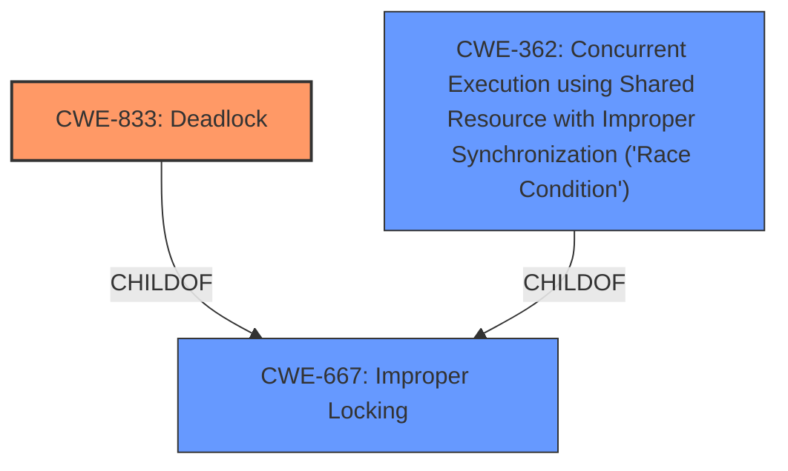

# Raw Analyzer Response for CVE-2021-3499

# Summary
| CWE ID  | CWE Name | Confidence | CWE Abstraction Level | CWE Vulnerability Mapping Label | CWE-Vulnerability Mapping Notes |
|--------------|------------------------------------------------------------------------------------------------------------------------------------------|-------------------|-----------------------------|------------------------------------|--------------------------------------------------------------------------------------------------------------------------------------------------------------------------------------------------------------------------------------------------------------------------------------------------------------------------------------------------------------------------------------------------------------------------------------------------------------------------------------------------------------------------------------------------------------------------------------------------------------------------------------------------------------------------------------------------------------------------------------------------------------------------------------------------------------------------------------------------------------------|
| CWE-833 | Deadlock | 0.8 | Base | Allowed | The **weakness** is a deadlock due to multiple DNS rules. The Retriever Results list CWE-833 first. |
| CWE-362 | Concurrent Execution using Shared Resource with Improper Synchronization ('Race Condition') | 0.6 | Class | Allowed-with-Review | This is a secondary candidate because the **weakness** could also be due to a race condition, but the evidence is not strong enough. |

## Evidence and Confidence

*   **Confidence Score:** 0.7
*   **Evidence Strength:** MEDIUM

## Relationship Analysis
The analysis focused on the parent-child relationship between CWE-667 (Improper Locking) and CWE-833 (Deadlock), as well as CWE-362. The final decision leaned towards CWE-833 due to the explicit mention of deadlock in the CVE summary.

## Vulnerability Chain
The chain of root cause and weaknesses that followed for the Vulnerability Description:
1.  Multiple DNS rules lead to a condition.
2.  This condition results in a **deadlock**.
3.  The **deadlock** leads to inconsistent firewall rules being applied.
4.  Inconsistent firewall rules lead to a potential loss of confidentiality, integrity, or availability.

## Summary of Analysis
The initial analysis focused on identifying the root cause of the vulnerability, which was identified as a **deadlock** occurring when adding EgressFirewalls with 5 or more dnsNames. This leads to inconsistent firewall rules being applied. The final decision was based on the clear evidence of a **deadlock** and the high retriever score for CWE-833. The selection of CWE-833 is at the optimal level of specificity because it accurately represents the root cause of the vulnerability as a **deadlock**.

Relevant CWE Information:

# Enhanced Context (25 CWEs)

## CWE-833: Deadlock
**Abstraction:** Base
**Status:** Incomplete

### Description
The product contains multiple threads or executable segments that are waiting for each other to release a necessary lock, resulting in deadlock.

### Mapping Guidance
**Usage:** Allowed
**Rationale:** This CWE entry is at the Base level of abstraction, which is a preferred level of abstraction for mapping to the root causes of vulnerabilities.

## CWE-362: Concurrent Execution using Shared Resource with Improper Synchronization ('Race Condition')
**Abstraction:** Class
**Status:** Draft

### Description
The product contains a concurrent code sequence that requires temporary, exclusive access to a shared resource, but a timing window exists in which the shared resource can be modified by another code sequence operating concurrently.

### Mapping Guidance
**Usage:** Allowed-with-Review
**Rationale:** This CWE entry is a Class and might have Base-level children that would be more appropriate

## CWE-923: Improper Restriction of Communication Channel to Intended Endpoints
**Abstraction:** Class
**Status:** Incomplete

### Description
The product establishes a communication channel to (or from) an endpoint for privileged or protected operations, but it does not properly ensure that it is communicating with the correct endpoint.

**CWE-833: Deadlock**
The vulnerability description and the CVE Reference Links Content Summary both point to a **deadlock** as the root cause. The Egress Firewall in OVN-Kubernetes does not reliably apply firewall rules when there are multiple DNS rules, and a **deadlock** can occur when adding EgressFirewalls with 5 or more dnsNames. This aligns perfectly with the description of CWE-833, which states that the product contains multiple threads or executable segments that are waiting for each other to release a necessary lock, resulting in deadlock. The security implication is a potential denial of service, as the firewall rules are not being applied correctly. The relationship analysis supports this, as CWE-833 is a child of CWE-667 (Improper Locking), suggesting that the **deadlock** may be related to improper locking mechanisms.

**CWE-362: Concurrent Execution using Shared Resource with Improper Synchronization ('Race Condition')**
While a **deadlock** is the primary cause, a race condition could also be present. The description mentions that inconsistent firewall rules are applied, which could be due to concurrent execution issues. However, the evidence is not as strong as it is for CWE-833.

**CWE-923: Improper Restriction of Communication Channel to Intended Endpoints**
CWE-923 was considered due to the mention of firewall rules and communication channels. However, the **root cause** is not related to improper restriction of the communication channel, but rather a **deadlock** situation. Therefore, CWE-923 was not selected.