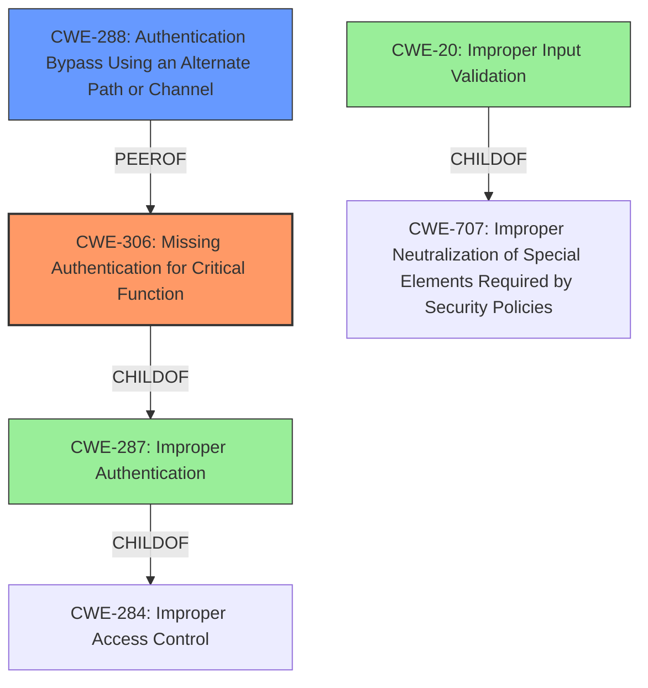

# Raw Analyzer Response for CVE-2021-34993

# Summary
| CWE ID  | CWE Name                                                         | Confidence | CWE Abstraction Level | CWE Vulnerability Mapping Label | CWE-Vulnerability Mapping Notes |
|---------|------------------------------------------------------------------|------------|-----------------------|-------------------------------|---------------------------------|
| CWE-306 | Missing Authentication for Critical Function                      | 0.9        | Base                  | Allowed                       | N/A                             |
| CWE-288 | Authentication Bypass Using an Alternate Path or Channel          | 0.7        | Base                  | Allowed                       | N/A                             |
| CWE-287 | Improper Authentication                                          | 0.5        | Class                 | Discouraged                   | Suggested Alternative: CWE-306  |
| CWE-20  | Improper Input Validation                                        | 0.3        | Class                 | Discouraged                   | Too generic                       |

## Evidence and Confidence

*   **Confidence Score:** 0.8
*   **Evidence Strength:** HIGH

## Relationship Analysis
The primary weakness is **CWE-306 Missing Authentication for Critical Function**, which directly reflects the vulnerability's core issue: the **lack of proper validation prior to authentication**, allowing attackers to bypass authentication. **CWE-288 Authentication Bypass Using an Alternate Path or Channel** is a related weakness, as the vulnerability effectively provides an alternate path that bypasses authentication. **CWE-287 Improper Authentication** is a more general classification and is discouraged when more specific CWEs like CWE-306 are applicable. **CWE-20 Improper Input Validation** is also too general and doesn't capture the specific authentication bypass.

## Vulnerability Chain
The vulnerability chain starts with the **lack of proper validation prior to authentication** (CWE-306), which leads to the ability to bypass authentication (CWE-288). The impact is unauthorized access to the Commvault CommCell system.

## Summary of Analysis
The initial assessment identified several potential CWEs, including CWE-620, CWE-287, and CWE-20. However, after further analysis and consideration of the vulnerability description, CVE Reference Links Content Summary, and Retriever Results, **CWE-306 Missing Authentication for Critical Function** was determined to be the most accurate and specific classification. This decision is based on the explicit statement in the vulnerability description that there is a **lack of proper validation prior to authentication**.

The evidence supporting this decision is found in the "Vulnerability Description Key Phrases" section, which highlights the **rootcause** as "**lack of proper validation prior to authentication**." Furthermore, the "CVE Reference Links Content Summary" confirms that "The vulnerability stems from a **lack of proper validation prior to authentication** within the `CVSearchService` service."

The selection of CWE-306 is at the optimal level of specificity because it directly addresses the core issue of missing authentication for a critical function. While CWE-287 Improper Authentication is a parent CWE of CWE-306, it is less specific and doesn't fully capture the essence of the vulnerability. Similarly, CWE-20 Improper Input Validation is a more general classification that applies to a broader range of input-related weaknesses.
**CWE-288 Authentication Bypass Using an Alternate Path or Channel** is also a good fit, as the **lack of authentication** allows for bypassing the intended authentication mechanism, but not as clear a match as CWE-306.

Relevant CWE Information:
*   **CWE-306: Missing Authentication for Critical Function** - This CWE accurately describes the vulnerability, as the `CVSearchService` service **lacks proper validation prior to authentication**, allowing attackers to bypass authentication.
*   **CWE-288: Authentication Bypass Using an Alternate Path or Channel** - This CWE is applicable because the **lack of authentication** effectively provides an alternate path that bypasses the intended authentication mechanism.
*   **CWE-287: Improper Authentication** - This CWE is a more general classification that applies to a broader range of authentication-related weaknesses. While it is relevant, it is less specific than CWE-306 and CWE-288. The mapping guidance for CWE-287 discourages its use when lower-level CWE entries are applicable, suggesting CWE-306 as a better alternative.
*   **CWE-20: Improper Input Validation** - This CWE is too general and does not specifically address the authentication bypass. While input validation may be related to authentication, it is not the primary issue in this vulnerability.