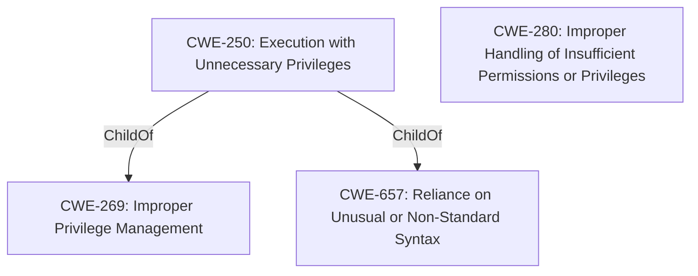

# Raw Analyzer Response for CVE-2021-34998

# Summary
| CWE ID  | CWE Name  | Confidence | CWE Abstraction Level | CWE Vulnerability Mapping Label | CWE-Vulnerability Mapping Notes |
|---|---|---|---|---|---|
| CWE-250 | Execution with Unnecessary Privileges | 0.9 | Base | Allowed | Primary CWE |
| CWE-280 | Improper Handling of Insufficient Permissions or Privileges  | 0.7 | Base | Allowed | Secondary Candidate |

## Evidence and Confidence

*   **Confidence Score:** 0.8
*   **Evidence Strength:** HIGH

## Relationship Analysis
The primary relationship considered was the hierarchical nature of CWEs, specifically how CWE-250 (Execution with Unnecessary Privileges) relates to higher-level categories like CWE-269 (Improper Privilege Management). Since the vulnerability involves an untrusted process gaining SYSTEM level access, indicating execution with higher privileges than necessary, CWE-250 was selected. Also considered was CWE-280 (Improper Handling of Insufficient Permissions or Privileges), which addresses the opposite scenario but relates to privilege management issues.

## Vulnerability Chain
The vulnerability chain involves the following sequence:
1.  **Root Cause:** Allowing an untrusted process to impersonate the client of a pipe.
2.  **Weakness:** Improper Impersonation due to the application's failure to properly validate or restrict processes.
3.  **Impact:** Privilege escalation to SYSTEM level and arbitrary code execution.

## Summary of Analysis
The initial analysis focused on identifying the root cause of the vulnerability. The vulnerability description and CVE details highlight that the core issue is the application **allowing an untrusted process to impersonate the client of a pipe**, leading to privilege escalation. This aligns directly with **CWE-250 (Execution with Unnecessary Privileges)**, as the untrusted process is effectively executing with higher privileges than it should have, giving it the ability to run arbitrary code in the context of SYSTEM.

The evidence supporting this decision comes directly from the "**Vulnerability Description Key Phrases**" and "**CVE Reference Links Content Summary**" sections.

> **Vulnerability Description Key Phrases:**
> - **rootcause:** **allowing an untrusted process to impersonate the client of a pipe**
> - **impact:** escalate privileges and execute arbitrary code in the context of SYSTEM

> **CVE Reference Links Content Summary:**
> - **Improper Impersonation:** The core vulnerability lies in the application's failure to properly validate or restrict which processes can impersonate a client connecting to its named pipe. This allows a malicious, low-privileged process to pose as a legitimate client.
> - **Privilege Escalation:** A successful exploit allows a local attacker to escalate their privileges from a low-privileged context to the SYSTEM level.

The graph relationships influenced the decision by reinforcing the hierarchical structure of CWEs related to privilege management. While a higher-level CWE like **CWE-269 (Improper Privilege Management)** could be considered, the more specific **CWE-250 (Execution with Unnecessary Privileges)** is a better fit because it accurately captures the fact that the vulnerability leads to a process running with higher privileges than required.

The selected CWEs are at the optimal level of specificity because they directly address the root cause (improper impersonation) and the immediate consequence (execution with unnecessary privileges). This level of detail provides a clear understanding of the vulnerability and avoids the ambiguity of more general CWEs.

Relevant CWE Information:

# Enhanced Context (25 CWEs)
The following CWEs were identified as potentially relevant to this vulnerability:

## CWE-274: Improper Handling of Insufficient Privileges
**Abstraction Level**: Base
**Similarity Score**: 0.75
**Source**: dense

**Description**:
The product does not handle or incorrectly handles when it has insufficient privileges to perform an operation, leading to resultant weaknesses.

**Mapping Guidance**:
- Usage: Discouraged
- Rationale: This CWE entry could be deprecated in a future version of CWE.

## CWE-1289: Improper Validation of Unsafe Equivalence in Input
**Abstraction Level**: Base
**Similarity Score**: 0.75
**Source**: dense

**Description**:
The product receives an input value that is used as a resource identifier or other type of reference, but it does not validate or incorrectly validates that the input is equivalent to a potentially-unsafe value.

**Mapping Guidance**:
- Usage: Allowed
- Rationale: This CWE entry is at the Base level of abstraction, which is a preferred level of abstraction for mapping to the root causes of vulnerabilities.

## CWE-807: Reliance on Untrusted Inputs in a Security Decision
**Abstraction Level**: Base
**Similarity Score**: 0.75
**Source**: dense

**Description**:
The product uses a protection mechanism that relies on the existence or values of an input, but the input can be modified by an untrusted actor in a way that bypasses the protection mechanism.

**Mapping Guidance**:
- Usage: Allowed
- Rationale: This CWE entry is at the Base level of abstraction, which is a preferred level of abstraction for mapping to the root causes of vulnerabilities.

## CWE-280: Improper Handling of Insufficient Permissions or Privileges
**Abstraction Level**: Base
**Similarity Score**: 0.75
**Source**: dense

**Description**:
The product does not handle or incorrectly handles when it has insufficient privileges to access resources or functionality as specified by their permissions. This may cause it to follow unexpected code paths that may leave the product in an invalid state.

**Mapping Guidance**:
- Usage: Allowed
- Rationale: This CWE entry is at the Base level of abstraction, which is a preferred level of abstraction for mapping to the root causes of vulnerabilities.

**CWE-280 was considered** because the vulnerability leads to a low-privileged attacker gaining SYSTEM level access, indicating that the application doesn't properly handle the intended permission levels. However, since the root cause is specifically related to allowing an untrusted process to impersonate a client, **CWE-250 is a more precise fit.**

## CWE-668: Exposure of Resource to Wrong Sphere
**Abstraction Level**: Class
**Similarity Score**: 0.74
**Source**: dense

**Description**:
The product exposes a resource to the wrong control sphere, providing unintended actors with inappropriate access to the resource.

**Mapping Guidance**:
- Usage: Discouraged
- Rationale: CWE-668 is high-level and is often misused as a catch-all when lower-level CWE IDs might be applicable. It is sometimes used for low-information vulnerability reports [REF-1287]. It is a level-1 Class (i.e., a child of a Pillar). It is not useful for trend analysis.

## CWE-653: Improper Isolation or Compartmentalization
**Abstraction Level**: Class
**Similarity Score**: 0.74
**Source**: dense

**Description**:
The product does not properly compartmentalize or isolate functionality, processes, or resources that require different privilege levels, rights, or permissions.

**Mapping Guidance**:
- Usage: Allowed
- Rationale: This CWE entry is at the Base level of abstraction, which is a preferred level of abstraction for mapping to the root causes of vulnerabilities.

## CWE-266: Incorrect Privilege Assignment
**Abstraction Level**: Base
**Similarity Score**: 0.74
**Source**: dense

**Description**:
A product incorrectly assigns a privilege to a particular actor, creating an unintended sphere of control for that actor.

**Mapping Guidance**:
- Usage: Allowed
- Rationale: This CWE entry is at the Base level of abstraction, which is a preferred level of abstraction for mapping to the root causes of vulnerabilities.

## CWE-691: Insufficient Control Flow Management
**Abstraction Level**: Pillar
**Similarity Score**: 0.74
**Source**: dense

**Description**:
The code does not sufficiently manage its control flow during execution, creating conditions in which the control flow can be modified in unexpected ways.

**Mapping Guidance**:
- Usage: Discouraged
- Rationale: This CWE entry is extremely high-level, a Pillar. However, classification research is limited for weaknesses of this type, so there can be gaps or organizational difficulties within CWE that force use of this weakness, even at such a high level of abstraction.

## CWE-59: Improper Link Resolution Before File Access ('Link Following')
**Abstraction Level**: Base
**Similarity Score**: 0.74
**Source**: dense

**Description**:
The product attempts to access a file based on the filename, but it does not properly prevent that filename from identifying a link or shortcut that resolves to an unintended resource.

**Mapping Guidance**:
- Usage: Allowed
- Rationale: This CWE entry is at the Base level of abstraction, which is a preferred level of abstraction for mapping to the root causes of vulnerabilities.

## CWE-664