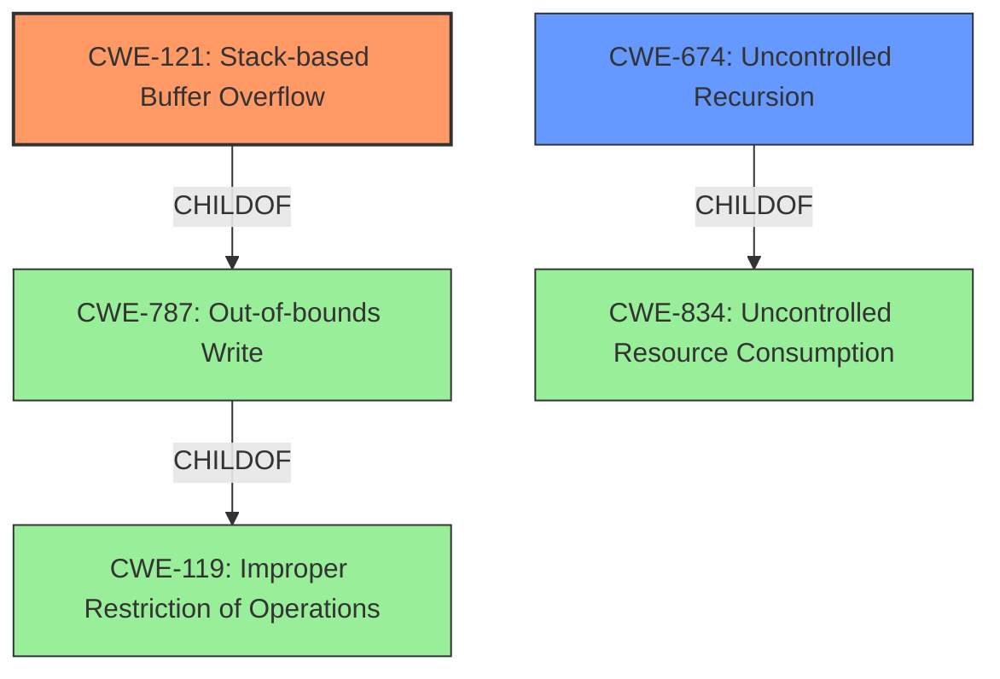

# Raw Analyzer Response for CVE-2021-3500

# Summary
| CWE ID | CWE Name | Confidence | CWE Abstraction Level | CWE Vulnerability Mapping Label | CWE-Vulnerability Mapping Notes |
|---|---|---|---|---|---|
| CWE-121 | Stack-based Buffer Overflow | 1.0 | Variant | Allowed | Primary CWE. Matches the vulnerability description of a **stack overflow** due to a crafted file. |
| CWE-674 | Uncontrolled Recursion | 0.6 | Class | Allowed-with-Review | Secondary CWE. Matches the description of recursive file opening. |

## Evidence and Confidence

*   **Confidence Score:** 0.8
*   **Evidence Strength:** HIGH

## Relationship Analysis
The primary CWE is CWE-121 (Stack-based Buffer Overflow), which is a variant of CWE-787 (Out-of-bounds Write) and CWE-119 (Improper Restriction of Operations Within the Bounds of a Memory Buffer). CWE-674 (Uncontrolled Recursion) is considered as a secondary CWE, since the root cause indicates recursive file opening without proper cycle breaking which leads to stack exhaustion. It is a child of CWE-834 (Uncontrolled Resource Consumption). These relationships help clarify the nature of the vulnerability and confirm the relevance of the selected CWEs.

## Vulnerability Chain
The vulnerability chain starts with the crafted djvu file leading to recursive file opening without proper cycle breaking resulting in a **stack overflow**, which leads to application crash.
  - Root Cause: Crafted djvu file, recursive file opening.
  - Weakness: **Stack overflow**
  - Impact: Application crash

## Summary of Analysis
The initial analysis focused on the provided evidence, specifically the "**stack overflow**" vulnerability description key phrase and the CVE Reference Links Content Summary, which mentioned "recursive file opening without proper cycle breaking." The **Retriever Results** indicated CWE-121 (Stack-based Buffer Overflow) as the top combined result, which aligns well with the vulnerability description. The analysis considered CWE-674 (Uncontrolled Recursion) as a secondary weakness, because the crafted file leads to recursive calls that are not properly controlled.

The relationship analysis confirmed that CWE-121 is a variant of CWE-787 (Out-of-bounds Write), which is a child of CWE-119 (Improper Restriction of Operations Within the Bounds of a Memory Buffer). This hierarchy supports the selection of CWE-121 as the most specific and relevant CWE.

The final decision is based on the evidence of a **stack overflow** caused by a crafted djvu file due to recursive file opening. CWE-121 is the most appropriate CWE because it directly describes the vulnerability.

CWE-190 (Integer Overflow or Wraparound), CWE-122 (Heap-based Buffer Overflow), CWE-125 (Out-of-bounds Read), CWE-770 (Allocation of Resources Without Limits or Throttling), and CWE-789 (Memory Allocation with Excessive Size Value) were considered but not selected because they did not directly match the vulnerability's root cause of a **stack overflow** caused by a crafted file and recursive opening.

Relevant CWE Information:

# Enhanced Context (25 CWEs)
The following CWEs were identified as potentially relevant to this vulnerability:

## CWE-1325: Improperly Controlled Sequential Memory Allocation
**Abstraction Level**: Base
**Similarity Score**: 0.79
**Source**: dense

**Description**:
The product manages a group of objects or resources and performs a separate memory allocation for each object, but it does not properly limit the total amount of memory that is consumed by all of the combined objects.

**Mapping Guidance**:
- Usage: Allowed
- Rationale: This CWE entry is at the Base level of abstraction, which is a preferred level of abstraction for mapping to the root causes of vulnerabilities.

## CWE-789: Memory Allocation with Excessive Size Value
**Abstraction Level**: Variant
**Similarity Score**: 0.78
**Source**: dense

**Description**:
The product allocates memory based on an untrusted, large size value, but it does not ensure that the size is within expected limits, allowing arbitrary amounts of memory to be allocated.

**Mapping Guidance**:
- Usage: Allowed
- Rationale: This CWE entry is at the Variant level of abstraction, which is a preferred level of abstraction for mapping to the root causes of vulnerabilities.

## CWE-131: Incorrect Calculation of Buffer Size
**Abstraction Level**: Base
**Similarity Score**: 0.76
**Source**: dense

**Description**:
The product does not correctly calculate the size to be used when allocating a buffer, which could lead to a buffer overflow.

**Mapping Guidance**:
- Usage: Allowed
- Rationale: This CWE entry is at the Base level of abstraction, which is a preferred level of abstraction for mapping to the root causes of vulnerabilities.

## CWE-191: Integer Underflow (Wrap or Wraparound)
**Abstraction Level**: Base
**Similarity Score**: 0.76
**Source**: dense

**Description**:
The product subtracts one value from another, such that the result is less than the minimum allowable integer value, which produces a value that is not equal to the correct result.

**Mapping Guidance**:
- Usage: Allowed
- Rationale: This CWE entry is at the Base level of abstraction, which is a preferred level of abstraction for mapping to the root causes of vulnerabilities.

## CWE-190: Integer Overflow or Wraparound
**Abstraction Level**: Base
**Similarity Score**: 0.75
**Source**: dense

**Description**:
The product performs a calculation that can
         produce an integer overflow or wraparound when the logic
         assumes that the resulting value will always be larger than
         the original value. This occurs when an integer value is
         incremented to a value that is too large to store in the
         associated representation. When this occurs, the value may
         become a very small or negative number.

**Mapping Guidance**:
- Usage: Allowed
- Rationale: This CWE entry is at the Base level of abstraction, which is a preferred level of abstraction for mapping to the root causes of vulnerabilities.

## CWE-126: Buffer Over-read
**Abstraction Level**: Variant
**Similarity Score**: 0.75
**Source**: dense

**Description**:
The product reads from a buffer using buffer access mechanisms such as indexes or pointers that reference memory locations after the targeted buffer.

**Mapping Guidance**:
- Usage: Allowed
- Rationale: This CWE entry is at the Variant level of abstraction, which is a preferred level of abstraction for mapping to the root causes of vulnerabilities.

## CWE-124: Buffer Underwrite ('Buffer Underflow')
**Abstraction Level**: Base
**Similarity Score**: 0.75
**Source**: dense

**Description**:
The product writes to a buffer using an index or pointer that references a memory location prior to the beginning of the buffer.

**Mapping Guidance**:
- Usage: Allowed
- Rationale: This CWE entry is at the Base level of abstraction, which is a preferred level of abstraction for mapping to the root causes of vulnerabilities.

## CWE-805: Buffer Access with Incorrect Length Value
**Abstraction Level**: Base
**Similarity Score**: 0.75
**Source**: dense

**Description**:
The product uses a sequential operation to read or write a buffer, but it uses an incorrect length value that causes it to access memory that is outside of the bounds of the buffer.

**Mapping Guidance**:
- Usage: Allowed
- Rationale: This CWE entry is at the Base level of abstraction, which is a preferred level of abstraction for mapping to the root causes of vulnerabilities.

## CWE-226: Sensitive Information in Resource Not Removed Before Reuse
**Abstraction Level**: Base
**Similarity Score**: 0.74
**Source**: dense

**Description**:
The product releases a resource such as memory or a file so that it can be made available for reuse, but it does not clear or "zeroize" the information contained in the resource before the product performs a critical state transition or makes the resource available for reuse by other entities.

**Mapping Guidance**:
- Usage: Allowed
- Rationale: This CWE entry is at the Base level of abstraction, which is a preferred