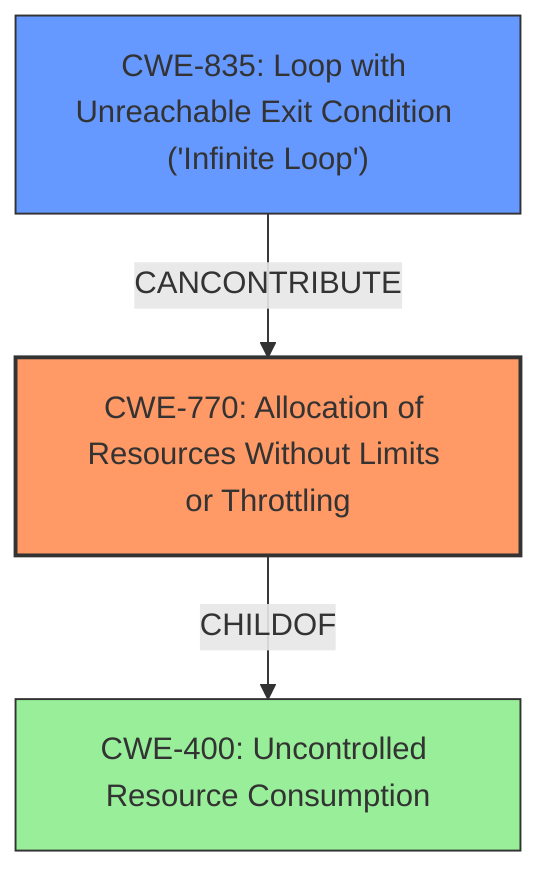

# Analysis Report for CVE-2021-35041

# Vulnerability Analysis Report: CVE-2021-35041

## Description


## Analysis (with Relationship Data)

# Summary
| CWE ID  | CWE Name                                                                                                  | Confidence | CWE Abstraction Level | CWE Vulnerability Mapping Label | CWE-Vulnerability Mapping Notes |
| :-------- | :---------------------------------------------------------------------------------------------------------- | :----------- | :---------------------- | :-------------------------------- | :-------------------------------- |
| CWE-770 | Allocation of Resources Without Limits or Throttling                                                        | 0.9          | Base                    | Allowed                          | Primary                           |
| CWE-835 | Loop with Unreachable Exit Condition ('Infinite Loop')                                                       | 0.8          | Base                    | Allowed                          | Secondary                         |

## Evidence and Confidence

*   **Confidence Score:** 0.85
*   **Evidence Strength:** HIGH

## Relationship Analysis
The primary weakness is **CWE-770 Allocation of Resources Without Limits or Throttling**, because the node allocates resources without any limits, which is triggered by malformed packets, eventually leading to a denial of service. The secondary weakness is **CWE-835 Loop with Unreachable Exit Condition ('Infinite Loop')** because the decoding logic results in a recursive call of the `doRead` function without releasing resources.



## Vulnerability Chain
The vulnerability chain begins with a malicious node sending malformed packets to the target node. The target node's P2P message decoding logic **does not handle malformed packets correctly**, leading to a recursive call of the `doRead` function and memory exhaustion. The **improper handling of malformed P2P packets** with an incorrect length field results in **uncontrolled memory consumption** and recursive function calls, which triggers an infinite loop consuming memory until the node crashes due to resource exhaustion and denial of service.

## Summary of Analysis
The initial assessment identifies **CWE-770 Allocation of Resources Without Limits or Throttling** as the primary weakness. This is due to the node allocating resources without limits when receiving malformed packets. The CVE Reference Links Content Summary confirms that the decoding logic doesn't properly handle malformed packets, leading to a recursive call and memory exhaustion. This aligns with the description of CWE-770, which discusses the allocation of reusable resources without restrictions, potentially leading to a denial of service.

The recursive call of `doRead` without releasing resources also strongly suggests **CWE-835 Loop with Unreachable Exit Condition ('Infinite Loop')**. The retriever results listed this as a possibility.

The analysis is heavily based on the provided evidence, especially the CVE Reference Links Content Summary, which states that the node's P2P message decoding logic does not handle malformed packets correctly, leading to a recursive call of the `doRead` function and memory exhaustion. This confirms the uncontrolled resource allocation and the presence of an infinite loop.

The chosen CWEs are at the optimal level of specificity because they directly address the root causes of the vulnerability. **CWE-770** describes the lack of resource limits, and **CWE-835** describes the infinite loop caused by the decoding logic.

Relevant CWE Information:

# Enhanced Context (25 CWEs)
The following CWEs were identified as potentially relevant to this vulnerability:

## CWE-1289: Improper Validation of Unsafe Equivalence in Input
**Abstraction Level**: Base
**Similarity Score**: 0.79
**Source**: dense

**Description**:
The product receives an input value that is used as a resource identifier or other type of reference, but it does not validate or incorrectly validates that the input is equivalent to a potentially-unsafe value.

**Mapping Guidance**:
- Usage: Allowed
- Rationale: This CWE entry is at the Base level of abstraction, which is a preferred level of abstraction for mapping to the root causes of vulnerabilities.

## CWE-404: Improper Resource Shutdown or Release
**Abstraction Level**: Class
**Similarity Score**: 0.76
**Source**: dense

**Description**:
The product does not release or incorrectly releases a resource before it is made available for re-use.

**Mapping Guidance**:
- Usage: Allowed-with-Review
- Rationale: This CWE entry is a Class and might have Base-level children that would be more appropriate

## CWE-664: Improper Control of a Resource Through its Lifetime
**Abstraction Level**: Pillar
**Similarity Score**: 0.76
**Source**: dense

**Description**:
The product does not maintain or incorrectly maintains control over a resource throughout its lifetime of creation, use, and release.

**Mapping Guidance**:
- Usage: Discouraged
- Rationale: This CWE entry is high-level when lower-level children are available.

## CWE-1288: Improper Validation of Consistency within Input
**Abstraction Level**: Base
**Similarity Score**: 0.76
**Source**: dense

**Description**:
The product receives a complex input with multiple elements or fields that must be consistent with each other, but it does not validate or incorrectly validates that the input is actually consistent.

**Mapping Guidance**:
- Usage: Allowed
- Rationale: This CWE entry is at the Base level of abstraction, which is a preferred level of abstraction for mapping to the root causes of vulnerabilities.

## CWE-226: Sensitive Information in Resource Not Removed Before Reuse
**Abstraction Level**: Base
**Similarity Score**: 0.76
**Source**: dense

**Description**:
The product releases a resource such as memory or a file so that it can be made available for reuse, but it does not clear or "zeroize" the information contained in the resource before the product performs a critical state transition or makes the resource available for reuse by other entities.

**Mapping Guidance**:
- Usage: Allowed
- Rationale: This CWE entry is at the Base level of abstraction, which is a preferred level of abstraction for mapping to the root causes of vulnerabilities.

## CWE-1389: Incorrect Parsing of Numbers with Different Radices
**Abstraction Level**: Base
**Similarity Score**: 0.76
**Source**: dense

**Description**:
The product parses numeric input assuming base 10 (decimal) values, but it does not account for inputs that use a different base number (radix).

**Mapping Guidance**:
- Usage: Allowed
- Rationale: This CWE entry is at the Base level of abstraction, which is a preferred level of abstraction for mapping to the root causes of vulnerabilities.

## CWE-131: Incorrect Calculation of Buffer Size
**Abstraction Level**: Base
**Similarity Score**: 0.76
**Source**: dense

**Description**:
The product does not correctly calculate the size to be used when allocating a buffer, which could lead to a buffer overflow.

**Mapping Guidance**:
- Usage: Allowed
- Rationale: This CWE entry is at the Base level of abstraction, which is a preferred level of abstraction for mapping to the root causes of vulnerabilities.

## CWE-682: Incorrect Calculation
**Abstraction Level**: Pillar
**Similarity Score**: 0.75
**Source**: dense

**Description**:
The product performs a calculation that generates incorrect or unintended results that are later used in security-critical decisions or resource management.

**Mapping Guidance**:
- Usage: Discouraged
- Rationale: This CWE entry is extremely high-level, a Pillar. In many cases, lower-level children or descendants are more appropriate. However, sometimes this weakness is forced to be used due to the lack of in-depth weakness research. See Research Gaps.

## CWE-130: Improper Handling of Length Parameter Inconsistency
**Abstraction Level**: Base
**Similarity Score**: 0.75
**Source**: dense

**Description**:
The product parses a formatted message or structure, but it does not handle or incorrectly handles a length field that is inconsistent with the actual length of the associated data.

**Mapping Guidance**:
- Usage: Allowed
- Rationale: This CWE entry is at the Base level of abstraction, which is a preferred level of abstraction for mapping to the root causes of vulnerabilities.

## CWE-703: Improper Check or Handling of Exceptional Conditions
**Abstraction Level**: Pillar
**Similarity Score**: 0.75
**Source**: dense

**Description**:
The product does not properly anticipate or handle exceptional conditions that rarely occur during normal operation of the product.

**Mapping Guidance**:
- Usage: Discouraged
- Rationale: This CWE entry is extremely high-level, a Pillar.

## CWE-789: Memory Allocation with Excessive Size Value
**Abstraction Level**: Variant
**Similarity Score**: 6769.85
**Source**: sparse

**Description**:
The product allocates memory based on an


## CWE Relationship Analysis

Current CWEs represent these abstraction levels: .


### Vulnerability Chain Analysis

**Chain starting from CWE-664:**
- 664 (Improper Control of a Resource Through its Lifetime) - ROOT


**Chain starting from CWE-1389:**
- 1389 (Incorrect Parsing of Numbers with Different Radices) - ROOT


### CWE Relationship Diagram

```mermaid
graph TD
    classDef primary fill:#f96,stroke:#333,stroke-width:2px
    classDef secondary fill:#69f,stroke:#333
    classDef tertiary fill:#9e9,stroke:#333
```


*Report generated on 2025-04-01 19:17:51*
