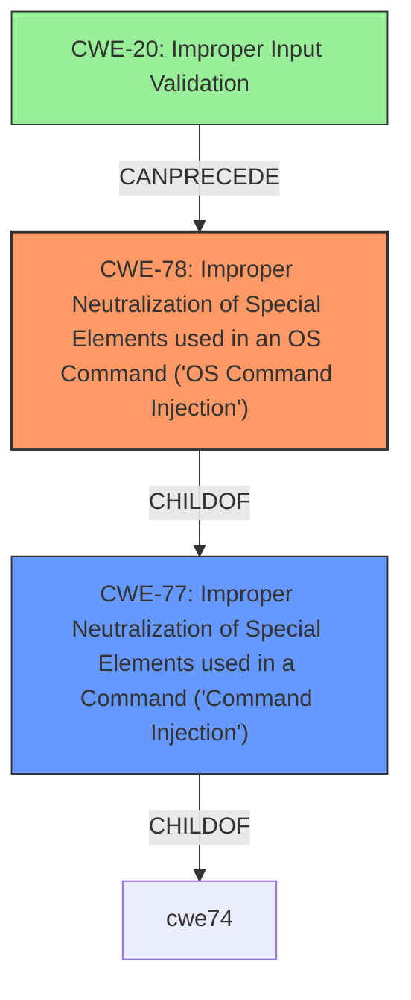

# Raw Analyzer Response for CVE-2021-35049

# Summary
| CWE ID | CWE Name | Confidence | CWE Abstraction Level | CWE Vulnerability Mapping Label | CWE-Vulnerability Mapping Notes |
|---|---|---|---|---|---|
| CWE-78 | Improper Neutralization of Special Elements used in an OS Command ('OS Command Injection') | 1.0 | Base | Allowed | Primary CWE. Matches the vulnerability description and root cause evidence.|
| CWE-77 | Improper Neutralization of Special Elements used in a Command ('Command Injection') | 0.7 | Class | Allowed-with-Review | Considered as a broader category but CWE-78 is more specific.|
| CWE-20 | Improper Input Validation | 0.4 | Class | Discouraged | Secondary. Considered because command injection often stems from a lack of proper input validation, but it's a high-level CWE. |

## Evidence and Confidence

*   **Confidence Score:** 1.0
*   **Evidence Strength:** HIGH

## Relationship Analysis
The primary relationship that influenced the decision was the parent-child relationship between CWE-77 and CWE-78. CWE-78 is a more specific case of CWE-77, focusing on OS commands. The vulnerability description clearly indicates the ability to execute system commands, which aligns directly with CWE-78. CWE-20 was considered due to the likelihood of improper input validation contributing to the command injection, representing a potential chain relationship where **improper input validation** could precede **command injection**. The abstraction level was a key factor, as CWE-78 is at the Base level, which is preferred for root cause analysis, while CWE-77 is at the Class level.

## Vulnerability Chain
The chain of events leading to the vulnerability involves the following:
1.  **Root Cause:** **Improper Neutralization** of special elements in input used in an OS command (CWE-78), potentially due to **improper input validation** (CWE-20)
2.  **Weakness:** **Command Injection** in the web interface.
3.  **Impact:** Execution of arbitrary system commands on the CommandPost with root privileges.

The chain starts with the **improper neutralization** which might be caused by **improper input validation**, leading to the **command injection** and ultimately the **execution of arbitrary commands**.

## Summary of Analysis
The initial assessment focused on identifying the most accurate CWE based on the vulnerability description and supporting evidence. The description explicitly mentions **"command injection"** and the ability to **"execute system commands,"** strongly suggesting either CWE-77 or CWE-78. The "CVE Reference Links Content Summary" further confirms the **root cause** as a **"command injection flaw"** and the **impact** as the ability to **"execute arbitrary commands with root privileges."**

The relationship analysis highlighted that CWE-78 is a more specific type of CWE-77, focusing on OS commands. Given that the vulnerability enables the execution of *system* commands, CWE-78 is the more precise and appropriate choice.

The decision is heavily based on the provided evidence, specifically the vulnerability description and the CVE reference content summary. The selection of CWE-78 is at the optimal level of specificity because it directly addresses the identified weakness—the ability to inject and execute OS commands.

CWE-77 was considered but ultimately deemed too broad, as it encompasses all types of command injection, not just OS commands. CWE-20 was also considered as a potential contributing factor, but it is a higher-level class and doesn't directly represent the **command injection** itself. Other CWEs like CWE-22, CWE-74, CWE-89, and CWE-93 were considered but did not fit the specific vulnerability details as closely as CWE-78. They relate to path traversal, general injection, SQL injection, and CRLF injection, respectively, none of which were explicitly mentioned or implied in the vulnerability description.

Relevant CWE Information:
- **CWE-78:** The product constructs all or part of an OS command using externally-influenced input from an upstream component, but it does not neutralize or incorrectly neutralizes special elements that could modify the intended OS command when it is sent to a downstream component.
- **CWE-77:** The product constructs all or part of a command using externally-influenced input from an upstream component, but it does not neutralize or incorrectly neutralizes special elements that could modify the intended command when it is sent to a downstream component.
- **CWE-20:** The product receives input or data, but it does not validate or incorrectly validates that the input has the properties that are required to process the data safely and correctly.