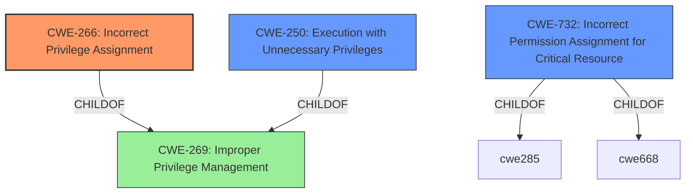

# Analysis for CVE-2021-35064

# Summary
| CWE ID | CWE Name | Confidence | CWE Abstraction Level | CWE Vulnerability Mapping Label | CWE-Vulnerability Mapping Notes |
|---|---|---|---|---|---|
| CWE-266 | Incorrect Privilege Assignment | 0.9 | Base | Allowed | Primary CWE. The **misconfiguration of sudo** allows for **privilege escalation** because an incorrect privilege was assigned to a user to execute dangerous commands. |
| CWE-250 | Execution with Unnecessary Privileges | 0.7 | Base | Allowed | Secondary CWE. Sudo allows for execution with unnecessary privileges, since it allows the execution of commands at a higher privilege level than required. |
| CWE-732 | Incorrect Permission Assignment for Critical Resource | 0.6 | Class | Allowed-with-Review | Secondary CWE. The sudoers file is a critical resource, and the misconfiguration results in incorrect permission assignment for it. |

## Evidence and Confidence

*   **Confidence Score:** 0.9
*   **Evidence Strength:** HIGH

## Relationship Analysis
The primary CWE is CWE-266, Incorrect Privilege Assignment, at the Base level, directly reflecting the **misconfiguration of sudo** leading to **privilege escalation**. CWE-250, Execution with Unnecessary Privileges, is a related weakness where operations are performed at higher than necessary privilege levels. CWE-732, Incorrect Permission Assignment for Critical Resource, is also related since the sudoers file, a critical resource, has its permissions incorrectly assigned.

## Vulnerability Chain
The vulnerability chain starts with the **misconfiguration of sudo** (CWE-266), leading to the ability to run dangerous commands (CWE-250) and ultimately resulting in **privilege escalation**.

## Summary of Analysis
The vulnerability description clearly states that the root cause is a **misconfiguration of sudo**, which allows for **privilege escalation**. This directly aligns with CWE-266, Incorrect Privilege Assignment, as the sudo configuration grants unintended privileges to users. CWE-250 (Execution with Unnecessary Privileges) is a valid secondary concern because the misconfiguration allows users to execute commands with higher privileges than necessary. CWE-732 (Incorrect Permission Assignment for Critical Resource) is considered because the sudoers file, a critical resource, is improperly configured.

The evidence supporting CWE-266 is: "**misconfiguration of sudo**" and "**privilege escalation**".

The relationships in the graph influenced the selection by showing the hierarchical structure. CWE-266 is a child of CWE-269 (Improper Privilege Management), but CWE-266 is more specific and directly reflects the vulnerability. The selection is based on the evidence provided, favoring specificity.

Relevant CWE Information:
- CWE-250: Execution with Unnecessary Privileges
- CWE-426: Untrusted Search Path
- CWE-732: Incorrect Permission Assignment for Critical Resource
- CWE-193: Off-by-one Error
- CWE-266: Incorrect Privilege Assignment
- CWE-269: Improper Privilege Management
- CWE-98: Improper Control of Filename for Include/Require Statement in PHP Program ('PHP Remote File Inclusion')
- CWE-362: Concurrent Execution using Shared Resource with Improper Synchronization ('Race Condition')
- CWE-520: .NET Misconfiguration: Use of Impersonation
- CWE-923: Improper Restriction of Communication Channel to Intended Endpoints

CWEs considered but not used:

*   CWE-426 (Untrusted Search Path): While sudo might use search paths, the core issue is the **misconfiguration**, not an untrusted path.
*   CWE-193 (Off-by-one Error): There is no evidence of an off-by-one error.
*   CWE-269 (Improper Privilege Management): This is a broader category. CWE-266 is a more specific child that directly addresses the **incorrect privilege assignment**.
*   CWE-98 (Improper Control of Filename for Include/Require Statement in PHP Program ('PHP Remote File Inclusion')): Not relevant to the vulnerability.
*   CWE-362 (Concurrent Execution using Shared Resource with Improper Synchronization ('Race Condition')): Not relevant to the vulnerability.
*   CWE-520 (.NET Misconfiguration: Use of Impersonation): Not relevant to the vulnerability.
*   CWE-923 (Improper Restriction of Communication Channel to Intended Endpoints): Not relevant to the vulnerability.
*   CWE-653: Improper Isolation or Compartmentalization, CWE-280: Improper Handling of Insufficient Permissions or Privileges, CWE-799: Improper Control of Interaction Frequency, CWE-274: Improper Handling of Insufficient Privileges, CWE-41: Improper Resolution of Path Equivalence, CWE-941: Incorrectly Specified Destination in a Communication Channel, CWE-668: Exposure of Resource to Wrong Sphere, CWE-754: Improper Check for Unusual or Exceptional Conditions, CWE-476: NULL Pointer Dereference, CWE-94: Improper Control of Generation of Code ('Code Injection'), CWE-170: Improper Null Termination, CWE-617: Reachable Assertion, CWE-416: Use After Free, CWE-428: Unquoted Search Path or Element, CWE-123: Write-what-where Condition: None of these are relevant because the **misconfiguration of sudo** is the root cause, not these other types of programming errors.