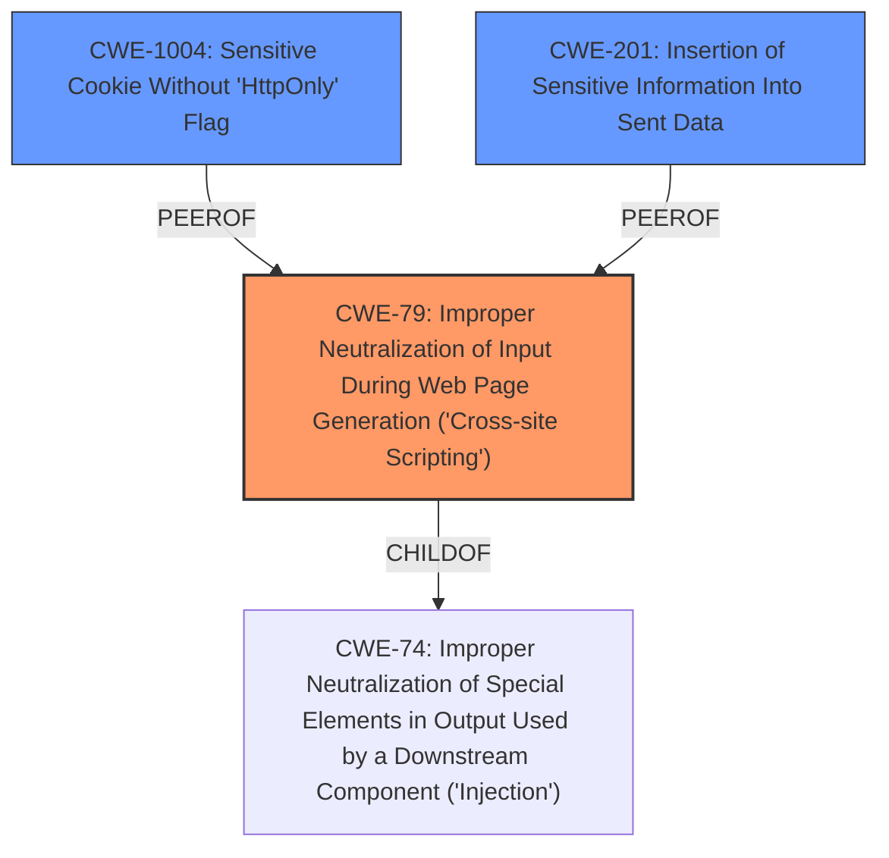

# Analysis Report for CVE-2021-3509

# Vulnerability Analysis Report: CVE-2021-3509

## Description


## Analysis (with Relationship Data)

# Summary
| CWE ID | CWE Name | Confidence | CWE Abstraction Level | CWE Vulnerability Mapping Label | CWE-Vulnerability Mapping Notes |
|---|---|---|---|---|---|
| CWE-79 | Improper Neutralization of Input During Web Page Generation ('Cross-site Scripting') | 1.0 | Base | Allowed | Primary CWE |
| CWE-1004 | Sensitive Cookie Without 'HttpOnly' Flag | 0.7 | Variant | Allowed | Secondary Candidate |
| CWE-201 | Insertion of Sensitive Information Into Sent Data | 0.6 | Base | Allowed | Secondary Candidate |

## Evidence and Confidence

*   **Confidence Score:** 0.9
*   **Evidence Strength:** HIGH

## Relationship Analysis
The primary relationship that influenced the CWE selection was the parent-child relationship between CWE-74 (Improper Neutralization of Special Elements in Output Used by a Downstream Component ('Injection')) and CWE-79 (Improper Neutralization of Input During Web Page Generation ('Cross-site Scripting')). CWE-79 is a specific type of injection that occurs in web page generation, making it a more precise fit for the vulnerability description than its parent.



## Vulnerability Chain
The vulnerability chain starts with the **improper handling of the JWT token**, which, despite being moved to an httpOnly cookie, is still used in the HTTP response body for documentation. This leads to the **Cross-Site Scripting (XSS)** vulnerability, where malicious scripts can be injected via the token cookie. The impact is the **exposure of JWT tokens**, potentially compromising the confidentiality, integrity, and availability of the system.

## Summary of Analysis
The initial assessment focused on identifying the root cause and the specific type of vulnerability. The evidence from the CVE Reference Links Content Summary clearly indicates that the vulnerability is a **Cross-Site Scripting (XSS)** issue, as the **JWT token** is exposed in the HTTP response body, allowing for the injection of malicious scripts.

The relationship analysis highlighted the importance of choosing the most specific CWE. While CWE-74 (Improper Neutralization of Special Elements in Output Used by a Downstream Component ('Injection')) could be considered, CWE-79 (Improper Neutralization of Input During Web Page Generation ('Cross-site Scripting')) is a more accurate representation of the vulnerability because it specifically addresses XSS in web page generation.

The decision to select CWE-79 is based on the following evidence:

-   **Vulnerability Description Key Phrases:** "weakness: **cross-site scripting**"
-   **CVE Reference Links Content Summary:** "root_cause: The JWT token, moved from localStorage to an httpOnly cookie to address CVE-2020-27839, was still being used in the HTTP response body for documentation, which made it available for XSS attacks."
-   **CVE Reference Links Content Summary:** "weaknesses: \[ "Cross-site scripting (XSS)" \]"

The selected CWE is at the optimal level of specificity because it directly addresses the XSS vulnerability, which is the core issue. The other considered CWEs, such as CWE-74, are more general and do not capture the specific nature of the vulnerability as accurately as CWE-79.

Relevant CWE Information:

# Enhanced Context (25 CWEs)

## CWE-113: Improper Neutralization of CRLF Sequences in HTTP Headers ('HTTP Request/Response Splitting')
**Abstraction Level**: Variant
**Similarity Score**: 0.78
**Source**: dense

**Description**:
The product receives data from an HTTP agent/component (e.g., web server, proxy, browser, etc.), but it does not neutralize or incorrectly neutralizes CR and LF characters before the data is included in outgoing HTTP headers.
*Reason for not using:* This is about splitting HTTP requests, not the vulnerability at hand.

## CWE-444: Inconsistent Interpretation of HTTP Requests ('HTTP Request/Response Smuggling')
**Abstraction Level**: Base
**Similarity Score**: 0.77
**Source**: dense

**Description**:
The product acts as an intermediary HTTP agent
         (such as a proxy or firewall) in the data flow between two
         entities such as a client and server, but it does not
         interpret malformed HTTP requests or responses in ways that
         are consistent with how the messages will be processed by
         those entities that are at the ultimate destination.
*Reason for not using:* This is about HTTP Smuggling not the vulnerability at hand.

## CWE-807: Reliance on Untrusted Inputs in a Security Decision
**Abstraction Level**: Base
**Similarity Score**: 0.76
**Source**: dense

**Description**:
The product uses a protection mechanism that relies on the existence or values of an input, but the input can be modified by an untrusted actor in a way that bypasses the protection mechanism.
*Reason for not using:* While there is untrusted input, the primary issue is not reliance on it for a security decision, but rather **improper neutralization** of it.

## CWE-1289: Improper Validation of Unsafe Equivalence in Input
**Abstraction Level**: Base
**Similarity Score**: 0.75
**Source**: dense

**Description**:
The product receives an input value that is used as a resource identifier or other type of reference, but it does not validate or incorrectly validates that the input is equivalent to a potentially-unsafe value.
*Reason for not using:* There is no unsafe equivalence being validated in the description.

## CWE-74: Improper Neutralization of Special Elements in Output Used by a Downstream Component ('Injection')
**Abstraction Level**: Class
**Similarity Score**: 0.75
**Source**: dense

**Description**:
The product constructs all or part of a command, data structure, or record using externally-influenced input from an upstream component, but it does not neutralize or incorrectly neutralizes special elements that could modify how it is parsed or interpreted when it is sent to a downstream component.
*Reason for not using:* While this could be the parent, CWE-79 is more specific.

## CWE-212: Improper Removal of Sensitive Information Before Storage or Transfer
**Abstraction Level**: Base
**Similarity Score**: 0.74
**Source**: dense

**Description**:
The product stores, transfers, or shares a resource that contains sensitive information, but it does not properly remove that information before the product makes the resource available to unauthorized actors.
*Reason for not using:* The vulnerability is not about removing sensitive information, but about how the information is being used.

## CWE-319: Cleartext Transmission of Sensitive Information
**Abstraction Level**: Base
**Similarity Score**: 0.74
**Source**: dense

**Description**:
The product transmits sensitive or security-critical data in cleartext in a communication channel that can be sniffed by unauthorized actors.
*Reason for not using:* The vulnerability isn't about cleartext transmission, but about **improper neutralization** of input.

## CWE-799: Improper Control of Interaction Frequency
**Abstraction Level**: Class
**Similarity Score**: 0.74
**Source**: dense

**Description**:
The product does not properly limit the number or frequency of interactions that it has with an actor, such as the number of incoming requests.
*Reason for not using:* The description has nothing to do with Interaction Frequency.

## CWE-41: Improper Resolution of Path Equivalence
**Abstraction Level**: Base
**Similarity Score**: 0.74
**Source**: dense

**Description**:
The product is vulnerable to file system contents disclosure through path equivalence. Path equivalence involves the use of special characters in file and directory names. The associated manipulations are intended to generate multiple names for the same object.
*Reason for not using:* There is no Path Equivalence.

## CWE-226: Sensitive Information in Resource Not Removed Before Reuse
**Abstraction Level**: Base
**Similarity Score**: 0.74
**Source**: dense

**Description**:
The product releases a resource such as memory or a file so that it can be made available for reuse, but it does not clear or "zeroize" the information contained in the resource before the product performs a critical state transition or makes the resource available for reuse by other entities.
*Reason for not using:* There is no reuse of resources.

## CWE-79: Improper Neutralization of


## CWE Relationship Analysis

Current CWEs represent these abstraction levels: .


### Vulnerability Chain Analysis

**Chain starting from CWE-113:**
- 113 (Improper Neutralization of CRLF Sequences in HTTP Headers ('HTTP Request/Response Splitting')) - ROOT


**Chain starting from CWE-79:**
- 79 (Improper Neutralization of Input During Web Page Generation ('Cross-site Scripting')) - ROOT


### CWE Relationship Diagram

```mermaid
graph TD
    classDef primary fill:#f96,stroke:#333,stroke-width:2px
    classDef secondary fill:#69f,stroke:#333
    classDef tertiary fill:#9e9,stroke:#333
```


*Report generated on 2025-04-02 02:35:16*
