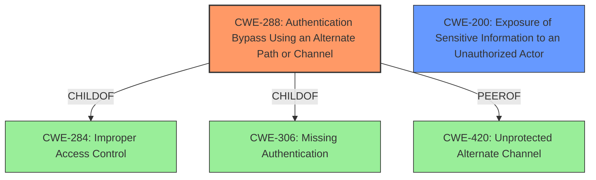

# Raw Analyzer Response for CVE-2021-3511

# Summary
| CWE ID    | CWE Name                                                                                                | Confidence | CWE Abstraction Level | CWE Vulnerability Mapping Label | CWE-Vulnerability Mapping Notes |
| :-------- | :------------------------------------------------------------------------------------------------------ | :--------- | :---------------------- | :------------------------------ | :------------------------------ |
| CWE-288   | Authentication Bypass Using an Alternate Path or Channel                                              | 0.9        | Base                    | Primary                         | Allowed                         |
| CWE-200   | Exposure of Sensitive Information to an Unauthorized Actor                                              | 0.7        | Class                    | Secondary                         | Allowed-with-Review                         |

## Evidence and Confidence

*   **Confidence Score:** 0.8
*   **Evidence Strength:** MEDIUM

## Relationship Analysis
The primary CWE is CWE-288, which is a Base level CWE. It is a child of CWE-284 (Improper Access Control) and CWE-306 (Missing Authentication). CWE-288 also has a peer relationship with CWE-420 (Unprotected Alternate Channel). The secondary CWE is CWE-200, which is a Class level CWE with many children which are variants of information exposure.

## Vulnerability Chain
The vulnerability chain starts with the **lack of authentication** for certain paths or channels (CWE-288), leading to the **exposure of sensitive configuration information** to unauthenticated attackers (CWE-200).

## Summary of Analysis
The vulnerability description indicates that remote unauthenticated attackers can obtain sensitive information, such as configuration details, from Buffalo broadband routers. The key phrase is "remote unauthenticated attackers to obtain information such as configuration". The CVE Reference Links Content Summary confirms this, stating, "An unauthenticated network-adjacent attacker can potentially gain access to sensitive information, such as configurations."

The primary weakness is **CWE-288 Authentication Bypass Using an Alternate Path or Channel**. This CWE accurately describes the scenario where authentication is required, but an alternate path exists that bypasses this requirement, allowing unauthenticated access. The "Retriever Results" also lists CWE-288 as a high scoring candidate.

The secondary weakness is **CWE-200 Exposure of Sensitive Information to an Unauthorized Actor**. This CWE captures the impact of the authentication bypass, where sensitive information is disclosed to unauthorized individuals. This is supported by the CVE Reference Links Content Summary which lists CWE-200 as a weakness.

The choice of CWE-288 as primary is based on the root cause being the authentication bypass that enables the exposure of sensitive information. CWE-200 is secondary as it represents the consequence of this bypass.

Other CWEs Considered:

*   CWE-912 (Hidden Functionality): While the vulnerability involves unspecified vectors, it's more directly related to authentication bypass than hidden functionality.
*   CWE-284 (Improper Access Control): This is a high-level pillar that is too general for this specific vulnerability. CWE-288, a child of CWE-284, is a more accurate representation.
*   CWE-77 (Improper Neutralization of Special Elements used in a Command ('Command Injection')): This CWE is not applicable as there is no mention of command injection in the vulnerability description.
*   CWE-184 (Incomplete List of Disallowed Inputs): This CWE is not applicable as the vulnerability is related to authentication bypass not an incomplete list of disallowed inputs.
* CWE-303 (Incorrect Implementation of Authentication Algorithm): While there might be an incorrect implementation of an authentication algorithm, the primary issue is the existence of an alternate path that bypasses authentication altogether.

The selected CWEs are at the optimal level of specificity, representing both the root cause (authentication bypass) and the direct impact (information exposure).