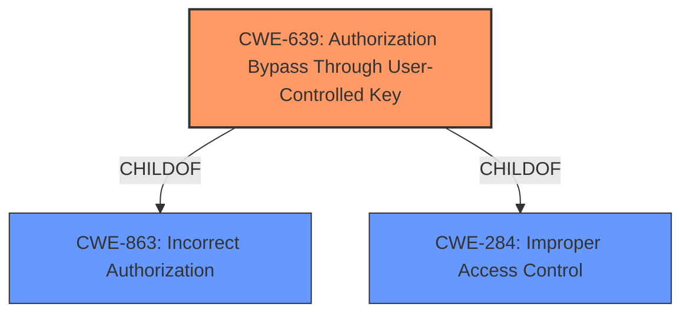

# Analysis Report for CVE-2021-35202

# Vulnerability Analysis Report: CVE-2021-35202

## Description


## Analysis (with Relationship Data)

# Summary
| CWE ID | CWE Name | Confidence | CWE Abstraction Level | CWE Vulnerability Mapping Label | CWE-Vulnerability Mapping Notes |
|---|---|---|---|---|---|
| CWE-639 | Authorization Bypass Through User-Controlled Key | 0.9 | Base | Allowed | Primary CWE |
| CWE-863 | Incorrect Authorization | 0.7 | Class | Allowed-with-Review | Secondary Candidate |

## Evidence and Confidence

*   **Confidence Score:** 0.9
*   **Evidence Strength:** HIGH

## Relationship Analysis
The primary CWE, CWE-639, is a child of CWE-863 and CWE-284 (Improper Access Control). CWE-863 is a class-level CWE, while CWE-639 is a more specific base-level CWE, which is generally preferred. CWE-639 directly addresses the mechanism of authorization bypass through user-controlled keys, aligning well with the vulnerability description.



## Vulnerability Chain
The vulnerability chain starts with **Insecure Permissions** in the FDSQueryService, leading to an **Authorization Bypass**, which then allows an attacker to reach restricted endpoints.

## Summary of Analysis
The initial analysis identified CWE-639 as the most appropriate CWE based on the vulnerability description, key phrases, and CVE reference summary. The vulnerability description clearly states an **Authorization Bypass** in FDSQueryService. The CVE reference confirms this, stating "**Authorization Bypass**" as a **weakness** and "**Insecure Permissions** in FDSQueryService" as the root cause. The Retriever Results also listed CWE-639 as a potential match.

The relationship analysis further solidifies this choice, as CWE-639 is a more specific (Base) child of the more general (Class) CWE-863. The mapping guidance for CWE-639 explicitly allows its use, stating it is at the Base level of abstraction, which is preferred.

I am primarily basing my assessment on the provided evidence, specifically:
- **Vulnerability Description Key Phrases:** "**weakness:** **Authorization Bypass**"
- **CVE Reference Links Content Summary:** "root_cause": "Insecure Permissions in FDSQueryService.", "weaknesses": ["Authorization Bypass"]

CWE-639 is at the optimal level of specificity because it directly describes the mechanism of bypassing authorization through user-controlled keys, which aligns with the **Authorization Bypass** in FDSQueryService due to **Insecure Permissions**.

Relevant CWE Information:

# Enhanced Context (25 CWEs)

## CWE-807: Reliance on Untrusted Inputs in a Security Decision
**Abstraction Level**: Base
**Similarity Score**: 0.76
**Source**: dense

This CWE was considered but not selected because, while it involves untrusted inputs, the core issue isn't about relying on those inputs for a security decision. The primary weakness is the lack of proper authorization, not the trustworthiness of the input itself.

## CWE-639: Authorization Bypass Through User-Controlled Key
**Abstraction Level**: Base
**Similarity Score**: 0.76
**Source**: dense

This CWE is the primary candidate and is selected because it directly addresses the scenario of bypassing authorization by manipulating user-controlled keys.

## CWE-1390: Weak Authentication
**Abstraction Level**: Class
**Similarity Score**: 0.76
**Source**: dense

This CWE was considered but not selected because the vulnerability is about authorization, not authentication. The issue is not about proving the user's identity but about what resources the user can access after authentication.

## CWE-274: Improper Handling of Insufficient Privileges
**Abstraction Level**: Base
**Similarity Score**: 0.75
**Source**: dense

This CWE was considered but not selected because the root cause is **Insecure Permissions** not the "Handling of Insufficient Privileges".

## CWE-472: External Control of Assumed-Immutable Web Parameter
**Abstraction Level**: Base
**Similarity Score**: 0.75
**Source**: dense

This CWE was considered but not selected because the primary issue is authorization, not the immutability of parameters.

## CWE-668: Exposure of Resource to Wrong Sphere
**Abstraction Level**: Class
**Similarity Score**: 0.75
**Source**: dense

This CWE was considered but not selected because it's too high-level and doesn't accurately capture the specific weakness of authorization bypass.

## CWE-303: Incorrect Implementation of Authentication Algorithm
**Abstraction Level**: Base
**Similarity Score**: 0.75
**Source**: dense

This CWE was considered but not selected because the issue is about authorization, not the correctness of the authentication algorithm.

## CWE-280: Improper Handling of Insufficient Permissions or Privileges
**Abstraction Level**: Base
**Similarity Score**: 0.75
**Source**: dense

This CWE was considered but not selected because the root cause is **Insecure Permissions** not the "Handling of Insufficient Permissions".

## CWE-288: Authentication Bypass Using an Alternate Path or Channel
**Abstraction Level**: Base
**Similarity Score**: 0.75
**Source**: dense

This CWE was considered but not selected because the vulnerability is about authorization bypass, not authentication bypass.

## CWE-41: Improper Resolution of Path Equivalence
**Abstraction Level**: Base
**Similarity Score**: 0.75
**Source**: dense

This CWE was considered but not selected because the vulnerability is about authorization, not path equivalence.

## CWE-863: Incorrect Authorization
**Abstraction Level**: Class
**Similarity Score**: 5369.26
**Source**: sparse

This CWE was considered and selected as a secondary candidate because it is a parent of CWE-639.

## CWE-425: Direct Request ('Forced Browsing')
**Abstraction Level**: Base
**Similarity Score**: 5343.13
**Source**: sparse

This CWE was considered but not selected because the vulnerability is about authorization, not just directly requesting a resource.


## CWE Relationship Analysis

Current CWEs represent these abstraction levels: .


### Vulnerability Chain Analysis

**Chain starting from CWE-288:**
- 288 (Authentication Bypass Using an Alternate Path or Channel) - ROOT


**Chain starting from CWE-303:**
- 303 (Incorrect Implementation of Authentication Algorithm) - ROOT


### CWE Relationship Diagram

```mermaid
graph TD
    classDef primary fill:#f96,stroke:#333,stroke-width:2px
    classDef secondary fill:#69f,stroke:#333
    classDef tertiary fill:#9e9,stroke:#333
```


*Report generated on 2025-04-02 02:49:18*
