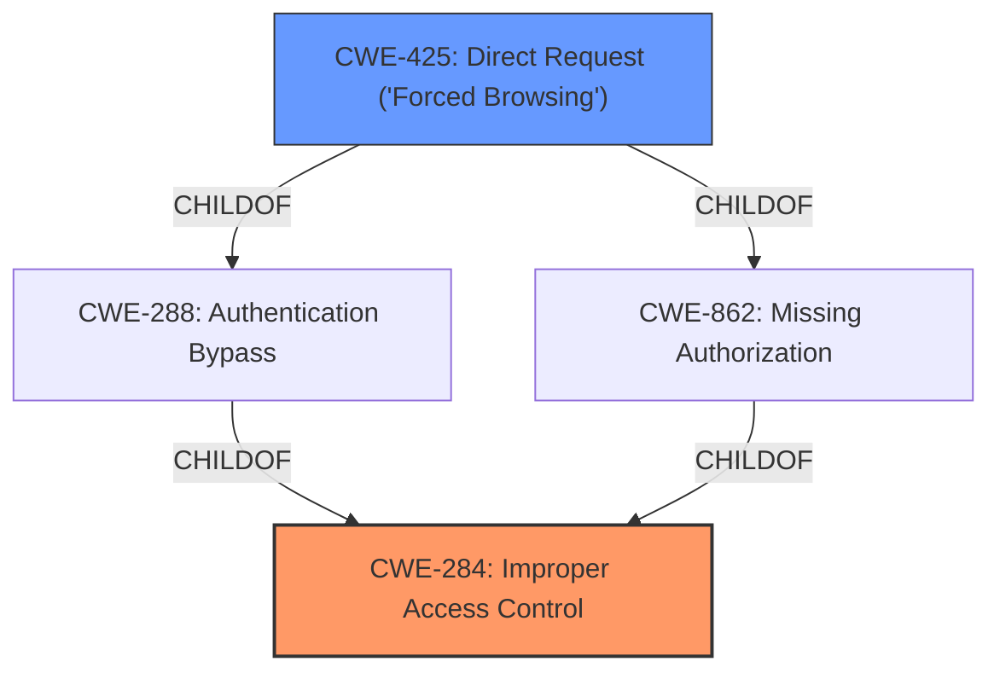

# Enhanced Analysis for CVE-2021-35221

# Summary
| CWE ID | CWE Name | Confidence | CWE Abstraction Level | CWE Vulnerability Mapping Label | CWE-Vulnerability Mapping Notes |
|---|---|---|---|---|---|
| CWE-284 | Improper Access Control | 0.7 | Pillar | Primary | Discouraged |
| CWE-425 | Direct Request ('Forced Browsing') | 0.6 | Base | Secondary | Allowed |

## Evidence and Confidence

*   **Confidence Score:** 0.7
*   **Evidence Strength:** MEDIUM

## Relationship Analysis
The primary relationship influencing the CWE selection is the hierarchical relationship where CWE-284 (Improper Access Control) is a high-level pillar, and CWE-425 (Direct Request) is a more specific base-level weakness and a child of CWE-288 and CWE-862 both related to authorization issues. The vulnerability's description points towards a general **Improper Access Control** issue that can be further specified by a direct request.



## Vulnerability Chain
The chain of root cause and weaknesses is as follows:
1.  **Root Cause:** **Improper Access Control** (CWE-284) allows unauthorized actions.
2.  **Weakness:** Direct Request (CWE-425) is possible because the system doesn't properly enforce authorization.
3.  **Impact:** Remote Code Execution (RCE) is achievable by tampering with system settings.

## Summary of Analysis
The initial assessment focused on the **Improper Access Control** as the primary weakness, based on the "Vulnerability Description Key Phrases" section: "**rootcause:** **Improper Access Control**". However, the "CVE Reference Links Content Summary" revealed more specific details about how this **Improper Access Control** is exploited: "The primary weakness is the lack of proper access controls on the alert import functionality. This allows even guest users to make changes to the server configuration."

The retriever results suggested CWE-425 (Direct Request) which fits because the vulnerability allows unauthorized access to functionalities without proper checks.

Given that the attacker can directly access and modify system settings due to the **Improper Access Control**, CWE-425 is considered a secondary weakness describing the exploitation mechanism. CWE-284 is still the primary issue but is a high-level Pillar.

The chosen CWEs are at the optimal level of specificity because CWE-284 describes the general access control problem, while CWE-425 highlights the direct access to restricted resources without proper authorization checks.

Relevant CWE Information:

# Enhanced Context (25 CWEs)

## CWE-807: Reliance on Untrusted Inputs in a Security Decision
**Abstraction Level**: Base
**Similarity Score**: 0.74
**Source**: dense

**Description**:
The product uses a protection mechanism that relies on the existence or values of an input, but the input can be modified by an untrusted actor in a way that bypasses the protection mechanism.
**Rationale:** Although this is related it does not best describe the **improper access control** issue.

## CWE-184: Incomplete List of Disallowed Inputs
**Abstraction Level**: Base
**Similarity Score**: 0.74
**Source**: dense

**Description**:
The product implements a protection mechanism that relies on a list of inputs (or properties of inputs) that are not allowed by policy or otherwise require other action to neutralize before additional processing takes place, but the list is incomplete.
**Rationale:** Although this is related it does not best describe the **improper access control** issue.

## CWE-74: Improper Neutralization of Special Elements in Output Used by a Downstream Component ('Injection')
**Abstraction Level**: Class
**Similarity Score**: 0.74
**Source**: dense

**Description**:
The product constructs all or part of a command, data structure, or record using externally-influenced input from an upstream component, but it does not neutralize or incorrectly neutralizes special elements that could modify how it is parsed or interpreted when it is sent to a downstream component.
**Rationale:** This is related to injection vulnerabilities, but the primary issue here is **improper access control**, not injection.

## CWE-472: External Control of Assumed-Immutable Web Parameter
**Abstraction Level**: Base
**Similarity Score**: 0.74
**Source**: dense

**Description**:
The web application does not sufficiently verify inputs that are assumed to be immutable but are actually externally controllable, such as hidden form fields.
**Rationale:** Although this could be a contributing factor, the core issue is broader than just immutable web parameters.

## CWE-668: Exposure of Resource to Wrong Sphere
**Abstraction Level**: Class
**Similarity Score**: 0.74
**Source**: dense

**Description**:
The product exposes a resource to the wrong control sphere, providing unintended actors with inappropriate access to the resource.
**Rationale:** This is a high-level class that relates to access control, but CWE-284 and CWE-425 better capture the specifics of the vulnerability.

## CWE-138: Improper Neutralization of Special Elements
**Abstraction Level**: Class
**Similarity Score**: 0.73
**Source**: dense

**Description**:
The product receives input from an upstream component, but it does not neutralize or incorrectly neutralizes special elements that could be interpreted as control elements or syntactic markers when they are sent to a downstream component.
**Rationale:** This relates to neutralization issues, which are not the primary concern in this vulnerability.

## CWE-1289: Improper Validation of Unsafe Equivalence in Input
**Abstraction Level**: Base
**Similarity Score**: 0.73
**Source**: dense

**Description**:
The product receives an input value that is used as a resource identifier or other type of reference, but it does not validate or incorrectly validates that the input is equivalent to a potentially-unsafe value.
**Rationale:** Not directly related to the described vulnerability.

## CWE-41: Improper Resolution of Path Equivalence
**Abstraction Level**: Base
**Similarity Score**: 0.73
**Source**: dense

**Description**:
The product is vulnerable to file system contents disclosure through path equivalence. Path equivalence involves the use of special characters in file and directory names. The associated manipulations are intended to generate multiple names for the same object.
**Rationale:** This is not related to path equivalence issues.

## CWE-212: Improper Removal of Sensitive Information Before Storage or Transfer
**Abstraction Level**: Base
**Similarity Score**: 0.73
**Source**: dense

**Description**:
The product stores, transfers, or shares a resource that contains sensitive information, but it does not properly remove that information before the product makes the resource available to unauthorized actors.
**Rationale:** Not relevant to this access control vulnerability.

## CWE-653: Improper Isolation or Compartmentalization
**Abstraction Level**: Class
**Similarity Score**: 0.72
**Source**: dense

**Description**:
The product does not properly compartmentalize or isolate functionality, processes, or resources that require different privilege levels, rights, or permissions.
**Rationale:** This is related but less specific than the **Improper Access Control**

## CWE-1336: Improper Neutralization of Special Elements Used in a Template Engine
**Abstraction Level**: Base
**Similarity Score**: 5395.54
**Source**: sparse

**Description**:
The product uses a template engine to insert or process externally-influenced input, but it does not neutralize or incorrectly neutralizes special elements or syntax that can be interpreted as template expressions or other code directives when processed by the engine.
**Rationale:** Although RCE is the final impact, the root cause is not related to Template Injection.

## CWE-863: Incorrect Authorization
**Abstraction Level**: Class
**Similarity Score**: 5329.35
**Source**: sparse

**Description**:
The product performs an authorization check when an actor attempts to access a resource or perform an action, but it does not correctly perform the check.
**Rationale**: It is related to authorization, but CWE-425 best describes the **improper access control** issue.

## CWE-639: Authorization Bypass Through User-Controlled Key
**Abstraction Level**: Base
**Similarity Score**: 5226.98
**Source**: sparse

**Description**:
The system's authorization functionality does not prevent one user from gaining access to another user's data or record by modifying the key value identifying the data.
**Rationale**: Not


## CWE Relationship Analysis

Current CWEs represent these abstraction levels: .


### Vulnerability Chain Analysis

**Chain starting from CWE-288:**
- 288 (Authentication Bypass Using an Alternate Path or Channel) - ROOT


**Chain starting from CWE-1336:**
- 1336 (Improper Neutralization of Special Elements Used in a Template Engine) - ROOT


### CWE Relationship Diagram

```mermaid
graph TD
    classDef primary fill:#f96,stroke:#333,stroke-width:2px
    classDef secondary fill:#69f,stroke:#333
    classDef tertiary fill:#9e9,stroke:#333
```