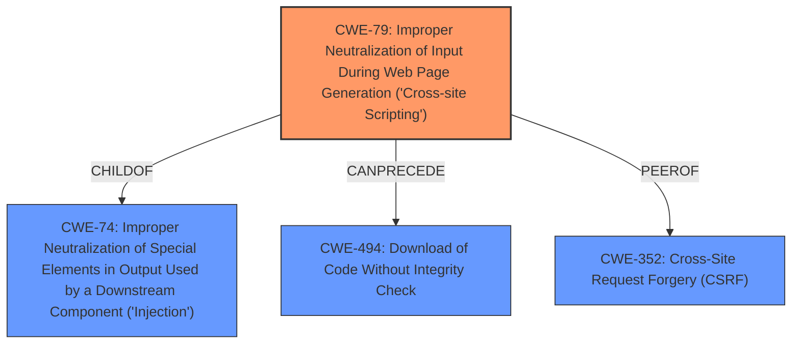

# Analysis for CVE-2021-35229

# Summary
| CWE ID | CWE Name | Confidence | CWE Abstraction Level | CWE Vulnerability Mapping Label | CWE-Vulnerability Mapping Notes |
|---|---|---|---|---|---|
| CWE-79 | Improper Neutralization of Input During Web Page Generation ('Cross-site Scripting') | 1 | Base | Primary | Allowed |

## Evidence and Confidence

*   **Confidence Score:** 1
*   **Evidence Strength:** HIGH

## Relationship Analysis
The primary relationship that influenced my decision was the direct match of the vulnerability description to the CWE-79 description. The other CWEs were considered based on the retriever results.

## Vulnerability Chain
The vulnerability chain involves the following steps:
1.  A user provides input, specifically a complex SQL query.
2.  The application fails to properly neutralize this input.
3.  The un-neutralized input is used to generate a web page.
4.  The generated web page contains malicious script.
5.  A user's browser executes the malicious script, leading to XSS.

The root cause is the **improper neutralization** of the input, and the impact is the execution of malicious script in the user's browser.

## Summary of Analysis
The initial assessment strongly pointed towards CWE-79, which aligns directly with the vulnerability description stating a "**Cross-site scripting**" **weakness** due to **improper handling** of SQL queries, allowing injection of malicious scripts. The evidence from the "CVE Reference Links Content Summary" section confirms this.

The vulnerability description explicitly mentions "**Cross-site scripting** vulnerability is present in Database Performance Monitor 2022.1.7779 and previous versions when using a complex SQL query". The "CVE Reference Links Content Summary" confirms that the **root cause of the vulnerability** is a Cross-Site Scripting (XSS) issue caused by **improper handling** of SQL queries. This is strong evidence supporting the selection of CWE-79.

The selection of CWE-79 as the primary weakness is based on the evidence that the application **does not properly sanitize or encode** user-supplied data within SQL queries, leading to XSS.

Relevant CWE Information:

# Enhanced Context (25 CWEs)
The following CWEs were identified as potentially relevant to this vulnerability:

## CWE-79: Improper Neutralization of Input During Web Page Generation ('Cross-site Scripting')
**Abstraction Level**: Base
**Similarity Score**: 8641.05
**Source**: sparse

**Description**:
The product does not neutralize or incorrectly neutralizes user-controllable input before it is placed in output that is used as a web page that is served to other users.

**Mapping Guidance**:
- Usage: Allowed
- Rationale: This CWE entry is at the Base level of abstraction, which is a preferred level of abstraction for mapping to the root causes of vulnerabilities.

## CWE-79: Improper Neutralization of Input During Web Page Generation ('Cross-site Scripting')
**Abstraction Level**: base
**Similarity Score**: 5.03
**Source**: graph

**Description**:
CWE-79: Improper Neutralization of Input During Web Page Generation ('Cross-site Scripting')

**Mapping Guidance**:
- Usage: Allowed
- Rationale: This CWE entry is at the Base level of abstraction, which is a preferred level of abstraction for mapping to the root causes of vulnerabilities.

**Relationships**:
- PARENTOF -> CWE-87
- PARENTOF -> CWE-86
- PARENTOF -> CWE-85
- PARENTOF -> CWE-84
- PARENTOF -> CWE-83

## CWE-80: Improper Neutralization of Script-Related HTML Tags in a Web Page (Basic XSS)
**Abstraction Level**: Variant
**Similarity Score**: 0.78
**Source**: dense

**Description**:
The product receives input from an upstream component, but it does not neutralize or incorrectly neutralizes special characters such as "<", ">", and "&" that could be interpreted as web-scripting elements when they are sent to a downstream component that processes web pages.

**Mapping Guidance**:
- Usage: Allowed
- Rationale: This CWE entry is at the Variant level of abstraction, which is a preferred level of abstraction for mapping to the root causes of vulnerabilities.

## CWE-89: Improper Neutralization of Special Elements used in an SQL Command ('SQL Injection')
**Abstraction Level**: base
**Similarity Score**: 3.30
**Source**: graph

**Description**:
CWE-89: Improper Neutralization of Special Elements used in an SQL Command ('SQL Injection')

**Mapping Guidance**:
- Usage: Allowed
- Rationale: This CWE entry is at the Base level of abstraction, which is a preferred level of abstraction for mapping to the root causes of vulnerabilities.

**Relationships**:
- PARENTOF -> CWE-564
- CANFOLLOW -> CWE-456
- CHILDOF -> CWE-74
- CHILDOF -> CWE-943
- PARENTOF -> CWE-89

## CWE-116: Improper Encoding or Escaping of Output
**Abstraction Level**: Class
**Similarity Score**: 0.75
**Source**: dense

**Description**:
The product prepares a structured message for communication with another component, but encoding or escaping of the data is either missing or done incorrectly. As a result, the intended structure of the message is not preserved.

**Mapping Guidance**:
- Usage: Allowed-with-Review
- Rationale: This CWE entry is a Class and might have Base-level children that would be more appropriate

## CWE-352: Cross-Site Request Forgery (CSRF)
**Abstraction Level**: compound
**Similarity Score**: 3.54
**Source**: graph

**Description**:
CWE-352: Cross-Site Request Forgery (CSRF)

**Mapping Guidance**:
- Usage: Allowed
- Rationale: This is a well-known Composite of multiple weaknesses that must all occur simultaneously, although it is attack-oriented in nature.

**Relationships**:
- CANFOLLOW -> CWE-1275
- REQUIRES -> CWE-613
- REQUIRES -> CWE-642
- REQUIRES -> CWE-441
- REQUIRES -> CWE-346

## CWE-943: Improper Neutralization of Special Elements in Data Query Logic
**Abstraction Level**: Class
**Similarity Score**: 0.75
**Source**: dense

**Description**:
The product generates a query intended to access or manipulate data in a data store such as a database, but it does not neutralize or incorrectly neutralizes special elements that can modify the intended logic of the query.

**Mapping Guidance**:
- Usage: Allowed-with-Review
- Rationale: This CWE entry is a Class and might have Base-level children that would be more appropriate

## CWE-184: Incomplete List of Disallowed Inputs
**Abstraction Level**: Base
**Similarity Score**: 0.77
**Source**: dense

**Description**:
The product implements a protection mechanism that relies on a list of inputs (or properties of inputs) that are not allowed by policy or otherwise require other action to neutralize before additional processing takes place, but the list is incomplete.

**Mapping Guidance**:
- Usage: Allowed
- Rationale: This CWE entry is at the Base level of abstraction, which is a preferred level of abstraction for mapping to the root causes of vulnerabilities.

## CWE-918: Server-Side Request Forgery (SSRF)
**Abstraction Level**: Base
**Similarity Score**: 0.76
**Source**: dense

**Description**:
The web server receives a URL or similar request from an upstream component and retrieves the contents of this URL, but it does not sufficiently ensure that the request is being sent to the expected destination.

**Mapping Guidance**:
- Usage: Allowed
- Rationale: This CWE entry is at the Base level of abstraction, which is a preferred level of abstraction for mapping to the root causes of vulnerabilities.

## CWE-434: Unrestricted Upload of File with Dangerous Type
**Abstraction Level**: base
**Similarity Score**: 4.33
**Source**: graph

**Description**:
CWE-434: Unrestricted Upload of File with Dangerous Type

**Mapping Guidance**:
- Usage: Allowed