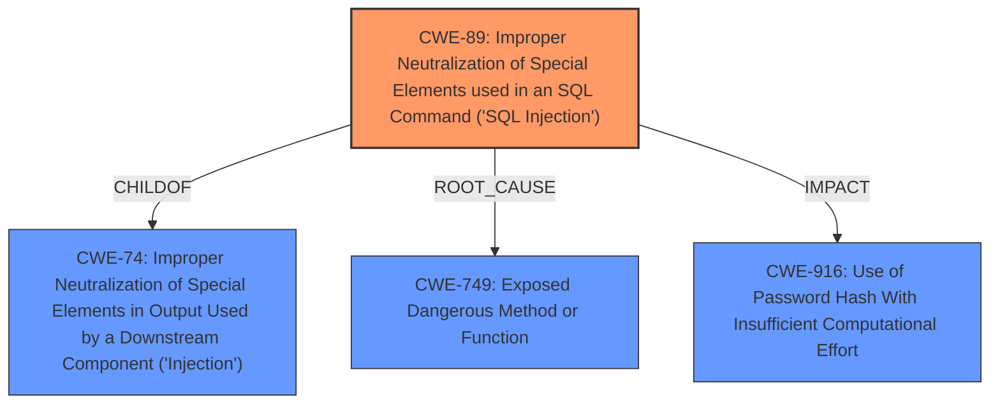

# Raw Analyzer Response for CVE-2021-35234

# Summary
| CWE ID | CWE Name | Confidence | CWE Abstraction Level | CWE Vulnerability Mapping Label | CWE-Vulnerability Mapping Notes |
|---|---|---|---|---|---|
| CWE-89 | Improper Neutralization of Special Elements used in an SQL Command ('SQL Injection') | 1.0 | Base | Allowed | Primary CWE |
| CWE-749 | Exposed Dangerous Method or Function | 0.7 | Base | Allowed | Secondary Candidate |
| CWE-916 | Use of Password Hash With Insufficient Computational Effort | 0.6 | Base | Allowed | Secondary Candidate |

## Evidence and Confidence

*   **Confidence Score:** 0.9
*   **Evidence Strength:** HIGH

## Relationship Analysis
The primary relationship that impacted my decision was the parent-child relationship between CWE-89 and CWE-74. CWE-89 is a child of CWE-74 (Improper Neutralization of Special Elements in Output Used by a Downstream Component ('Injection')), making it a more specific classification for SQL injection vulnerabilities. The presence of exposed dangerous methods (CWE-749) that directly lead to SQL injection further solidifies this classification.

## Vulnerability Chain
The vulnerability chain begins with **exposed dangerous functions** that allow for user-supplied input to construct SQL queries. The **lack of proper sanitization** leads to **SQL injection**, which in turn allows attackers to **steal password hashes and salts**, ultimately resulting in **privilege escalation.**
  - Exposed Dangerous Functions (within SolarWinds.Orion.Core.Actions.dll)
  - **Improper Neutralization of Special Elements used in an SQL Command ('SQL Injection')** (CWE-89)
  - Data Theft (Password Hashes and Salts)
  - Privilege Escalation

## Summary of Analysis
Initially, the vulnerability description points to a read-only **SQL injection** leading to privileged escalation, allowing an attacker to steal password hashes and salts. The CVE Reference Links Content Summary confirms that the **root cause** stems from dangerous functions within the `SolarWinds.Orion.Core.Actions.dll` module, which allow for the execution of SQL queries constructed from user-supplied strings, and the **lack of proper sanitization**. This leads to the primary weakness of **SQL Injection (CWE-89)**.

The retriever results also strongly suggest CWE-89 as the primary candidate, with a score of 1.0. Other candidates like CWE-749 (Exposed Dangerous Method or Function) and CWE-916 (Use of Password Hash With Insufficient Computational Effort) are considered as contributing factors or impacts.

The choice of CWE-89 is based on the clear evidence of **SQL injection** as the root cause, supported by the vulnerability description and CVE reference links content summary: "The core weakness is the ability to inject malicious SQL queries by manipulating user-supplied input. The application fails to properly sanitize or validate the input before using it to construct SQL queries."

CWE-749 (Exposed Dangerous Method or Function) is a valid secondary consideration, as the exposed functions are the entry point for the **SQL injection**. CWE-916 (Use of Password Hash With Insufficient Computational Effort) is included as the impact, since the attacker can steal password hashes and salt information.

The selected CWEs are at the optimal level of specificity because CWE-89 accurately represents the specific weakness of **SQL injection**, while the others reflect contributing factors or impacts.

Relevant CWE Information:

# Enhanced Context (25 CWEs)
The following CWEs were identified as potentially relevant to this vulnerability:

## CWE-538: Insertion of Sensitive Information into Externally-Accessible File or Directory
**Abstraction Level**: Base
**Similarity Score**: 0.77
**Source**: dense

**Description**:
The product places sensitive information into files or directories that are accessible to actors who are allowed to have access to the files, but not to the sensitive information.

**Mapping Guidance**:
- Usage: Allowed
- Rationale: This CWE entry is at the Base level of abstraction, which is a preferred level of abstraction for mapping to the root causes of vulnerabilities.

## CWE-212: Improper Removal of Sensitive Information Before Storage or Transfer
**Abstraction Level**: Base
**Similarity Score**: 0.76
**Source**: dense

**Description**:
The product stores, transfers, or shares a resource that contains sensitive information, but it does not properly remove that information before the product makes the resource available to unauthorized actors.

**Mapping Guidance**:
- Usage: Allowed
- Rationale: This CWE entry is at the Base level of abstraction, which is a preferred level of abstraction for mapping to the root causes of vulnerabilities.

## CWE-312: Cleartext Storage of Sensitive Information
**Abstraction Level**: Base
**Similarity Score**: 0.75
**Source**: dense

**Description**:
The product stores sensitive information in cleartext within a resource that might be accessible to another control sphere.

**Mapping Guidance**:
- Usage: Allowed
- Rationale: This CWE entry is at the Base level of abstraction, which is a preferred level of abstraction for mapping to the root causes of vulnerabilities.

## CWE-74: Improper Neutralization of Special Elements in Output Used by a Downstream Component ('Injection')
**Abstraction Level**: Class
**Similarity Score**: 0.75
**Source**: dense

**Description**:
The product constructs all or part of a command, data structure, or record using externally-influenced input from an upstream component, but it does not neutralize or incorrectly neutralizes special elements that could modify how it is parsed or interpreted when it is sent to a downstream component.

**Mapping Guidance**:
- Usage: Discouraged
- Rationale: CWE-74 is high-level and often misused when lower-level weaknesses are more appropriate.

## CWE-668: Exposure of Resource to Wrong Sphere
**Abstraction Level**: Class
**Similarity Score**: 0.74
**Source**: dense

**Description**:
The product exposes a resource to the wrong control sphere, providing unintended actors with inappropriate access to the resource.

**Mapping Guidance**:
- Usage: Discouraged
- Rationale: CWE-668 is high-level and is often misused as a catch-all when lower-level CWE IDs might be applicable. It is sometimes used for low-information vulnerability reports [REF-1287]. It is a level-1 Class (i.e., a child of a Pillar). It is not useful for trend analysis.

## CWE-798: Use of Hard-coded Credentials
**Abstraction Level**: Base
**Similarity Score**: 0.74
**Source**: dense

**Description**:
The product contains hard-coded credentials, such as a password or cryptographic key.

**Mapping Guidance**:
- Usage: Allowed
- Rationale: This CWE entry is at the Base level of abstraction, which is a preferred level of abstraction for mapping to the root causes of vulnerabilities.

## CWE-497: Exposure of Sensitive System Information to an Unauthorized Control Sphere
**Abstraction Level**: Base
**Similarity Score**: 0.74
**Source**: dense

**Description**:
The product does not properly prevent sensitive system-level information from being accessed by unauthorized actors who do not have the same level of access to the underlying system as the product does.

**Mapping Guidance**:
- Usage: Allowed
- Rationale: This CWE entry is at the Base level of abstraction, which is a preferred level of abstraction for mapping to the root causes of vulnerabilities.

## CWE-345: Insufficient Verification of Data Authenticity
**Abstraction Level**: Class
**Similarity Score**: 0.74
**Source**: dense

**Description**:
The product does not sufficiently verify the origin or authenticity of data, in a way that causes it to accept invalid data.

**Mapping Guidance**:
- Usage: Discouraged
- Rationale: This CWE entry is a level-1 Class (i.e., a child of a Pillar). It might have lower-level children that would be more appropriate

## CWE-1391: Use of Weak Credentials
**Abstraction Level**: Class
**Similarity Score**: 0.74
**Source**: dense

**Description**:
The product uses weak credentials (such as a default key or hard-coded password) that can be calculated, derived, reused, or guessed by an attacker.

**Mapping Guidance**:
- Usage: Allowed-with-Review
-