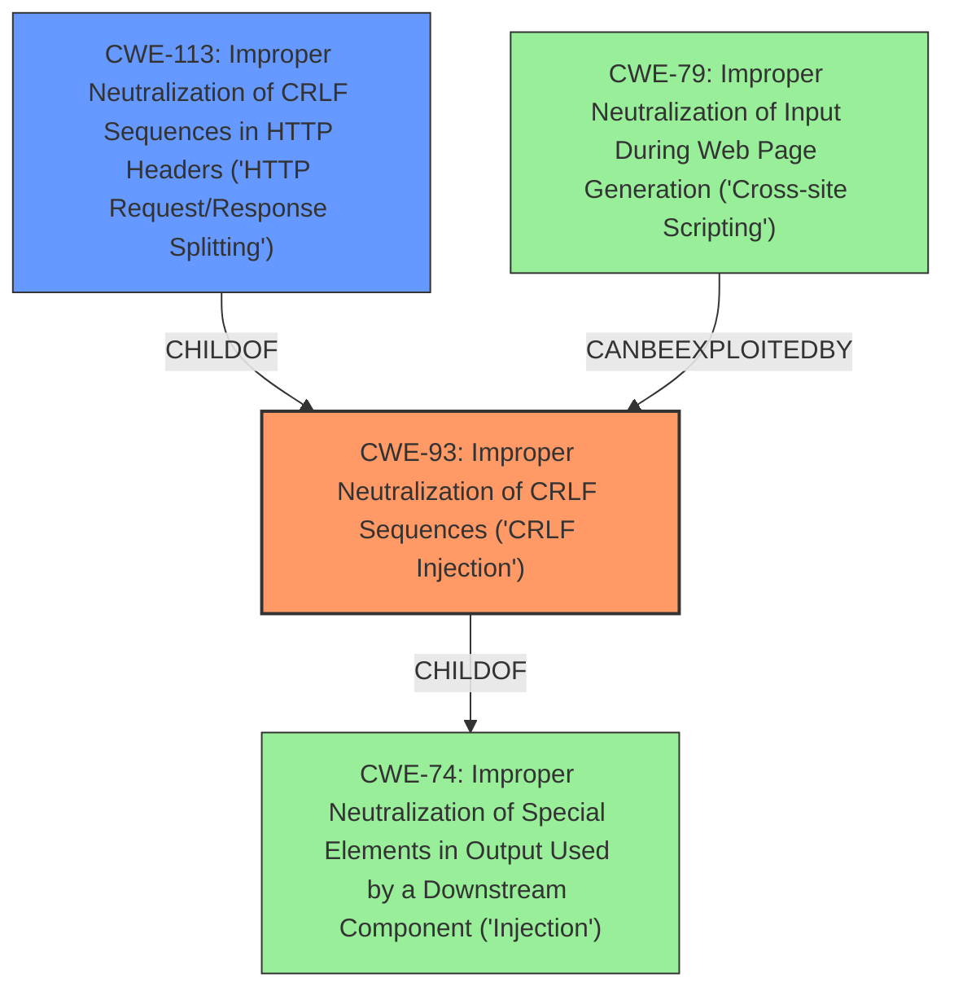

# Analysis for CVE-2021-3524

# Summary
| CWE ID | CWE Name | Confidence | CWE Abstraction Level | CWE Vulnerability Mapping Label | CWE-Vulnerability Mapping Notes |
|---|---|---|---|---|---|
| CWE-93 | Improper Neutralization of CRLF Sequences ('CRLF Injection') | 1.0 | Base | Allowed | Primary CWE |
| CWE-113 | Improper Neutralization of CRLF Sequences in HTTP Headers ('HTTP Request/Response Splitting') | 0.8 | Variant | Allowed | Secondary Candidate |
| CWE-79 | Improper Neutralization of Input During Web Page Generation ('Cross-site Scripting') | 0.6 | Base | Allowed | Secondary Candidate |

## Evidence and Confidence

*   **Confidence Score:** 0.9
*   **Evidence Strength:** HIGH

## Relationship Analysis
The primary CWE, CWE-93 [Improper Neutralization of CRLF Sequences ('CRLF Injection')], is a base CWE. CWE-113 [Improper Neutralization of CRLF Sequences in HTTP Headers ('HTTP Request/Response Splitting')] is a variant of CWE-93. The vulnerability involves the **injection** of HTTP headers via a newline character in the CORS ExposeHeader tag. CWE-79 [Improper Neutralization of Input During Web Page Generation ('Cross-site Scripting')] is related to the impact of injecting headers.

## Vulnerability Chain
The chain of root cause and weaknesses for the vulnerability description is as follows:
1.  **Root Cause:** The RadosGW does not properly neutralize untrusted input in the ExposeHeader tag, specifically newline characters.
2.  **Weakness:** **Improper Neutralization of CRLF Sequences ('CRLF Injection')** (CWE-93)
3.  **Impact:** HTTP header **injection**, potentially leading to XSS attacks and other security compromises.

## Summary of Analysis
The initial analysis identified the **weakness** as **header injection** due to improper handling of newline characters within the CORS ExposeHeader tag.

The CVE Reference Links Content Summary explicitly states:
*   "The vulnerability is caused by improper handling of newline characters within the CORS ExposeHeader tag in the Ceph Object Gateway (RGW)."
*   "The RGW doesn't properly neutralize untrusted input in the ExposeHeader tag."
*   "HTTP header **injection** via newline characters (\n and \r) in the CORS ExposeHeader tag."
*   "An attacker can **inject** arbitrary HTTP headers, such as 'Set-Cookie', which could lead to potential XSS attacks and other security compromises."

Based on the provided evidence and the retriever results, the primary CWE is CWE-93 [Improper Neutralization of CRLF Sequences ('CRLF Injection')]. This is because the root cause is the improper handling of CRLF sequences in the ExposeHeader tag.

CWE-113 [Improper Neutralization of CRLF Sequences in HTTP Headers ('HTTP Request/Response Splitting')] is also relevant because the vulnerability specifically involves HTTP headers. However, since the root cause is the CRLF injection itself, CWE-93 is the more appropriate primary CWE.

CWE-79 [Improper Neutralization of Input During Web Page Generation ('Cross-site Scripting')] is a potential impact of the vulnerability, as an attacker could inject arbitrary headers, such as 'Set-Cookie', leading to potential XSS attacks. However, it is not the root cause.

The selected CWEs are at the optimal level of specificity because CWE-93 directly addresses the **improper neutralization** of CRLF sequences, which is the root cause of the vulnerability. It is a Base level CWE which is preferred.

The retriever scores also support this analysis, with CWE-93 having the highest score.