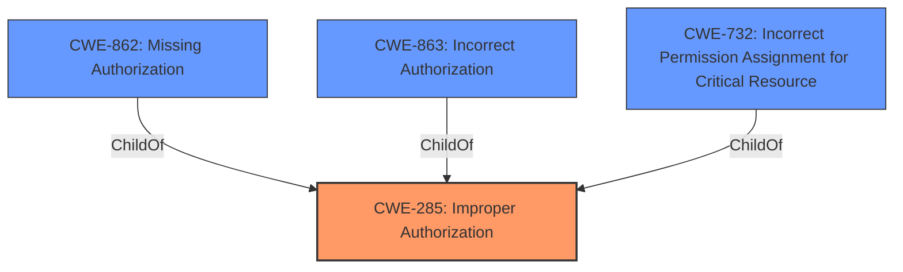

# Raw Analyzer Response for CVE-2021-35248

# Summary

| CWE ID   | CWE Name                                                                     | Confidence | CWE Abstraction Level | CWE Vulnerability Mapping Label | CWE-Vulnerability Mapping Notes |
| :------- | :--------------------------------------------------------------------------- | :--------- | :-------------------- | :------------------------------ | :------------------------------ |
| CWE-285  | Improper Authorization                                                       | 0.9        | Class               | Primary                         | Discouraged                     |
| CWE-863  | Incorrect Authorization                                                      | 0.7        | Class               | Secondary                       | Allowed-with-Review             |
| CWE-862  | Missing Authorization                                                        | 0.6        | Class               | Secondary                       | Allowed-with-Review             |
| CWE-732  | Incorrect Permission Assignment for Critical Resource                        | 0.5        | Class               | Secondary                       | Allowed-with-Review             |

## Evidence and Confidence

*   **Confidence Score:** 0.7
*   **Evidence Strength:** HIGH

## Relationship Analysis

The primary focus is on authorization-related CWEs. CWE-285 (Improper Authorization) is a high-level class with children like CWE-862 (Missing Authorization) and CWE-863 (Incorrect Authorization). CWE-732 (Incorrect Permission Assignment for Critical Resource) is also related as it involves incorrect permission settings. The choice between these depends on the specific flaw.

## Vulnerability Chain

The chain involves an **insecure permission** configuration leading to **information disclosure**.

## Summary of Analysis

Initially, the assessment focused on the **insecure permissions** that allow low-privilege users to query sensitive information. The primary concern is that the system **does not properly authorize** access to the `Orion.UserSettings` entity, leading to unauthorized enumeration of users and their settings.

The vulnerability description states: "It has been reported that any Orion user, e.g. guest accounts can query the Orion.UserSettings entity and enumerate users and their basic settings." The CVE Reference Links Content Summary says: "The vulnerability stems from **insecure permissions** that allow low-privilege Orion users to query the `Orion.UserSettings` SWIS entity" and "**Insecure Permissions:** Low-privilege users should not have access to the `Orion.UserSettings` SWIS entity."

The initial high-level assessment points to CWE-285 (Improper Authorization), as it broadly covers cases where authorization is not correctly performed. However, due to its high level, it is discouraged. The next step is to consider its children for a more specific classification.

CWE-862 (Missing Authorization) is considered but doesn't fully capture the scenario, since some level of access is granted, but it's not properly restricted.
CWE-863 (Incorrect Authorization) seems more appropriate since the authorization check is performed, but it's flawed, allowing low-privilege users access to sensitive data.
CWE-732 (Incorrect Permission Assignment for Critical Resource) is also a strong candidate as the root cause is related to the **insecure permissions** assigned to the `Orion.UserSettings` entity.

Ultimately, I'm sticking with CWE-285 (Improper Authorization) as the primary due to its alignment with the broader issue of flawed authorization, and due to the lack of more detailed information to pinpoint the exact nature of the flaw (incorrect check vs. missing check) between CWE-862 and CWE-863. All three candidates are added as secondary mappings, due to their relevance to the root cause.

Relevant CWE Information:

# Enhanced Context (25 CWEs)

## CWE-74: Improper Neutralization of Special Elements in Output Used by a Downstream Component ('Injection')
**Abstraction Level**: Class
**Similarity Score**: 0.75
**Source**: dense

**Description**:
The product constructs all or part of a command, data structure, or record using externally-influenced input from an upstream component, but it does not neutralize or incorrectly neutralizes special elements that could modify how it is parsed or interpreted when it is sent to a downstream component.

**Mapping Guidance**:
- Usage: Discouraged
- Rationale: CWE-74 is high-level and often misused when lower-level weaknesses are more appropriate.
*Not Selected:* Not relevant since the vulnerability is not related to injection.

## CWE-41: Improper Resolution of Path Equivalence
**Abstraction Level**: Base
**Similarity Score**: 0.74
**Source**: dense

**Description**:
The product is vulnerable to file system contents disclosure through path equivalence. Path equivalence involves the use of special characters in file and directory names. The associated manipulations are intended to generate multiple names for the same object.

**Mapping Guidance**:
- Usage: Allowed
- Rationale: This CWE entry is at the Base level of abstraction, which is a preferred level of abstraction for mapping to the root causes of vulnerabilities.
*Not Selected:* Not relevant since the vulnerability is not related to file system issues.

## CWE-113: Improper Neutralization of CRLF Sequences in HTTP Headers ('HTTP Request/Response Splitting')
**Abstraction Level**: Variant
**Similarity Score**: 0.74
**Source**: dense

**Description**:
The product receives data from an HTTP agent/component (e.g., web server, proxy, browser, etc.), but it does not neutralize or incorrectly neutralizes CR and LF characters before the data is included in outgoing HTTP headers.

**Mapping Guidance**:
- Usage: Allowed
- Rationale: This CWE entry is at the Variant level of abstraction, which is a preferred level of abstraction for mapping to the root causes of vulnerabilities.
*Not Selected:* Not relevant since the vulnerability is not related to HTTP request/response splitting.

## CWE-807: Reliance on Untrusted Inputs in a Security Decision
**Abstraction Level**: Base
**Similarity Score**: 0.74
**Source**: dense

**Description**:
The product uses a protection mechanism that relies on the existence or values of an input, but the input can be modified by an untrusted actor in a way that bypasses the protection mechanism.

**Mapping Guidance**:
- Usage: Allowed
- Rationale: This CWE entry is at the Base level of abstraction, which is a preferred level of abstraction for mapping to the root causes of vulnerabilities.
*Not Selected:* Not directly applicable, though the **insecure permissions** could be seen as relying on some input. Not a primary factor.

## CWE-799: Improper Control of Interaction Frequency
**Abstraction Level**: Class
**Similarity Score**: 0.74
**Source**: dense

**Description**:
The product does not properly limit the number or frequency of interactions that it has with an actor, such as the number of incoming requests.

**Mapping Guidance**:
- Usage: Allowed-with-Review
- Rationale: This CWE entry is a Class and might have Base-level children that would be more appropriate
*Not Selected:* Not relevant since the vulnerability is not related to interaction frequency.

## CWE-405: Asymmetric Resource Consumption (Amplification)
**Abstraction Level**: Class
**Similarity Score**: 0.74
**Source**: dense

**Description**:
The product does not properly control situations in which an adversary can cause the product to consume or produce excessive resources without requiring the adversary to invest equivalent work or otherwise prove authorization, i.e., the adversary's influence is "asymmetric."

**Mapping Guidance**:
- Usage: Allowed-with-Review
- Rationale: This CWE entry is a Class and might have Base-level children that would be more appropriate
*Not Selected:* Not relevant since the vulnerability is not related to resource consumption.

## CWE-472: External Control of Assumed-Immutable Web Parameter
**Abstraction Level**: Base
**Similarity Score**: 0.74
**Source**: dense

**Description**:
The web application does not sufficiently verify inputs that are assumed to be immutable but are actually externally controllable, such as hidden form fields.

**Mapping Guidance**:
- Usage: Allowed
- Rationale: This CWE entry is at the Base level of abstraction, which is a preferred level of abstraction for mapping to the root causes of vulnerabilities.
*Not Selected:* Not relevant since the vulnerability is not related to external control of parameters.

## CWE-610: Externally Controlled Reference to a Resource in Another Sphere
**Abstraction Level**: Class
**Similarity Score**: 0.74
**Source**: dense

**Description**:
The product uses an externally controlled name or reference that resolves to a resource