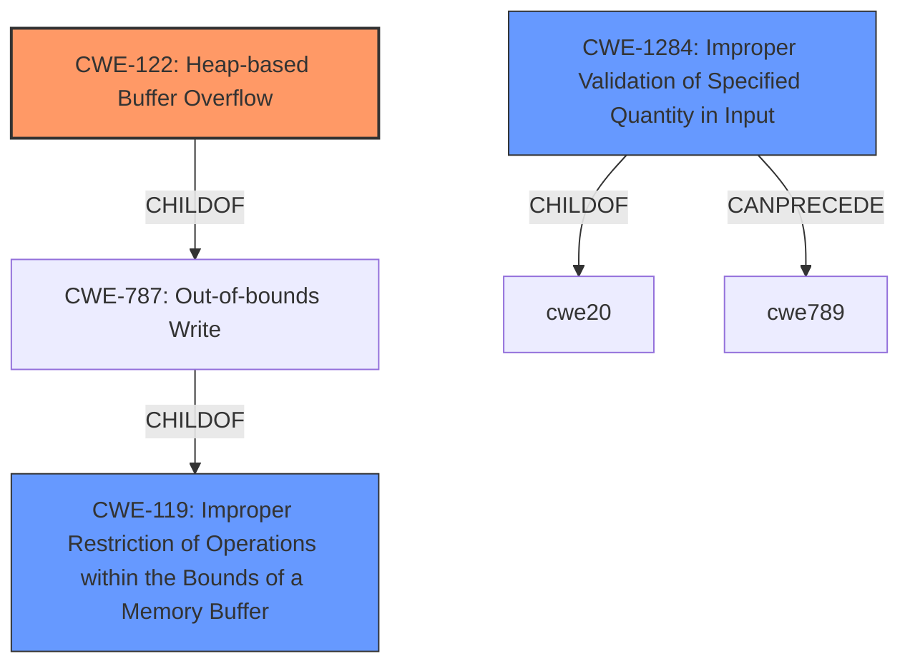

# Analysis Report for CVE-2021-35269

# Vulnerability Analysis Report: CVE-2021-35269

## Description


## Analysis (with Relationship Data)

# Summary
| CWE ID    | CWE Name                                                                  | Confidence | CWE Abstraction Level | CWE Vulnerability Mapping Label | CWE-Vulnerability Mapping Notes |
| :--------- | :------------------------------------------------------------------------ | :--------- | :-------------------- | :------------------------------ | :------------------------------ |
| CWE-122   | Heap-based Buffer Overflow                                                 | 0.9        | Variant               | Primary                         | Allowed                         |
| CWE-119   | Improper Restriction of Operations within the Bounds of a Memory Buffer | 0.6        | Class                | Secondary                       | Discouraged                     |
| CWE-1284  | Improper Validation of Specified Quantity in Input                       | 0.5        | Base                  | Secondary                       | Allowed                         |

## Evidence and Confidence

*   **Confidence Score:** 0.9
*   **Evidence Strength:** HIGH

## Relationship Analysis
The primary CWE is CWE-122 (Heap-based Buffer Overflow), a variant of CWE-787 (Out-of-bounds Write), which itself is a child of CWE-119 (Improper Restriction of Operations within the Bounds of a Memory Buffer). CWE-122 is chosen because the vulnerability description explicitly mentions a **heap buffer overflow**. CWE-119 is a more general class, and while applicable, CWE-122 provides a more specific classification.



## Vulnerability Chain
The vulnerability chain involves the following:
  1. **Root Cause:** **Improper validation** of a specially crafted NTFS attribute from the MFT, which can be represented by CWE-1284 (Improper Validation of Specified Quantity in Input)
  2. **Weakness:** This leads to a **heap buffer overflow**, represented by CWE-122.
  3. **Impact:** The **buffer overflow** allows for code execution and escalation of privileges.

## Summary of Analysis
Based on the vulnerability description and the CVE reference links content summary, the primary weakness is a **heap buffer overflow** (CWE-122) due to **improper validation** of a specially crafted NTFS attribute.

The evidence from the vulnerability description includes:
- "NTFS-3G versions < 2021.8.22, when a specially crafted NTFS attribute from the MFT is setup in the function ntfs_attr_setup_flag, a **heap buffer overflow** can occur allowing for code execution and escalation of privileges."
- "The vulnerability stems from **incorrect validation** of NTFS metadata, specifically when setting up a crafted NTFS attribute from the MFT (Master File Table) in the `ntfs_attr_setup_flag` function."
- "**Heap buffer overflow:** A specially crafted NTFS attribute, when processed by the vulnerable function, can cause a heap buffer overflow."

The retriever results and complete CWE specifications were reviewed. CWE-122 (Heap-based Buffer Overflow) is a Variant level CWE and accurately represents the specific type of buffer overflow. CWE-119 (Improper Restriction of Operations within the Bounds of a Memory Buffer) is a more general Class level CWE that encompasses buffer overflows, but lacks the specificity of CWE-122. CWE-1284 (Improper Validation of Specified Quantity in Input) describes the root cause that led to the overflow.

CWE-190, CWE-191, CWE-193, CWE-131, CWE-128, CWE-121, CWE-170, CWE-617, CWE-59, CWE-1339, CWE-120, CWE-195, and CWE-123 were considered but not used. These CWEs, while potentially related to buffer overflows or integer handling, do not specifically address the described **heap buffer overflow** caused by **improper input validation**. CWE-190 and CWE-191 relate to Integer Overflows and Underflows, respectively, which are not explicitly mentioned in the description. CWE-193 relates to Off-by-one Errors, which is also not the primary issue here.

The selected CWEs are at the optimal level of specificity, with CWE-122 being a Variant that directly addresses the **heap buffer overflow**, CWE-119 being a more general Class that encompasses buffer overflows, and CWE-1284, a Base that describes the root cause.
Relevant CWE Information:

# Enhanced Context (25 CWEs)
The following CWEs were identified as potentially relevant to this vulnerability:

## CWE-191: Integer Underflow (Wrap or Wraparound)
**Abstraction Level**: Base
**Similarity Score**: 0.81
**Source**: dense

**Description**:
The product subtracts one value from another, such that the result is less than the minimum allowable integer value, which produces a value that is not equal to the correct result.

**Mapping Guidance**:
- Usage: Allowed
- Rationale: This CWE entry is at the Base level of abstraction, which is a preferred level of abstraction for mapping to the root causes of vulnerabilities.


## CWE-131: Incorrect Calculation of Buffer Size
**Abstraction Level**: Base
**Similarity Score**: 0.79
**Source**: dense

**Description**:
The product does not correctly calculate the size to be used when allocating a buffer, which could lead to a buffer overflow.

**Mapping Guidance**:
- Usage: Allowed
- Rationale: This CWE entry is at the Base level of abstraction, which is a preferred level of abstraction for mapping to the root causes of vulnerabilities.


## CWE-805: Buffer Access with Incorrect Length Value
**Abstraction Level**: Base
**Similarity Score**: 0.77
**Source**: dense

**Description**:
The product uses a sequential operation to read or write a buffer, but it uses an incorrect length value that causes it to access memory that is outside of the bounds of the buffer.

**Mapping Guidance**:
- Usage: Allowed
- Rationale: This CWE entry is at the Base level of abstraction, which is a preferred level of abstraction for mapping to the root causes of vulnerabilities.


## CWE-197: Numeric Truncation Error
**Abstraction Level**: Base
**Similarity Score**: 0.77
**Source**: dense

**Description**:
Truncation errors occur when a primitive is cast to a primitive of a smaller size and data is lost in the conversion.

**Mapping Guidance**:
- Usage: Allowed
- Rationale: This CWE entry is at the Base level of abstraction, which is a preferred level of abstraction for mapping to the root causes of vulnerabilities.


## CWE-680: Integer Overflow to Buffer Overflow
**Abstraction Level**: Compound
**Similarity Score**: 0.77
**Source**: dense

**Description**:
The product performs a calculation to determine how much memory to allocate, but an integer overflow can occur that causes less memory to be allocated than expected, leading to a buffer overflow.

**Mapping Guidance**:
- Usage: Discouraged
- Rationale: This CWE entry is a named chain, which combines multiple weaknesses.


## CWE-124: Buffer Underwrite ('Buffer Underflow')
**Abstraction Level**: Base
**Similarity Score**: 0.77
**Source**: dense

**Description**:
The product writes to a buffer using an index or pointer that references a memory location prior to the beginning of the buffer.

**Mapping Guidance**:
- Usage: Allowed
- Rationale: This CWE entry is at the Base level of abstraction, which is a preferred level of abstraction for mapping to the root causes of vulnerabilities.


## CWE-681: Incorrect Conversion between Numeric Types
**Abstraction Level**: Base
**Similarity Score**: 0.77
**Source**: dense

**Description**:
When converting from one data type to another, such as long to integer, data can be omitted or translated in a way that produces unexpected values. If the resulting values are used in a sensitive context, then dangerous behaviors may occur.

**Mapping Guidance**:
- Usage: Allowed
- Rationale: This CWE entry is at the Base level of abstraction, which is a preferred level of abstraction for mapping to the root causes of vulnerabilities.


## CWE-190: Integer Overflow or Wraparound
**Abstraction Level**: Base
**Similarity Score**: 0.77
**Source**: dense

**


## CWE Relationship Analysis

Current CWEs represent these abstraction levels: .


### Vulnerability Chain Analysis

**Chain starting from CWE-787:**
- 787 (Out-of-bounds Write) - ROOT


**Chain starting from CWE-680:**
- 680 (Integer Overflow to Buffer Overflow) - ROOT


### CWE Relationship Diagram

```mermaid
graph TD
    classDef primary fill:#f96,stroke:#333,stroke-width:2px
    classDef secondary fill:#69f,stroke:#333
    classDef tertiary fill:#9e9,stroke:#333
```


*Report generated on 2025-04-02 11:40:32*
