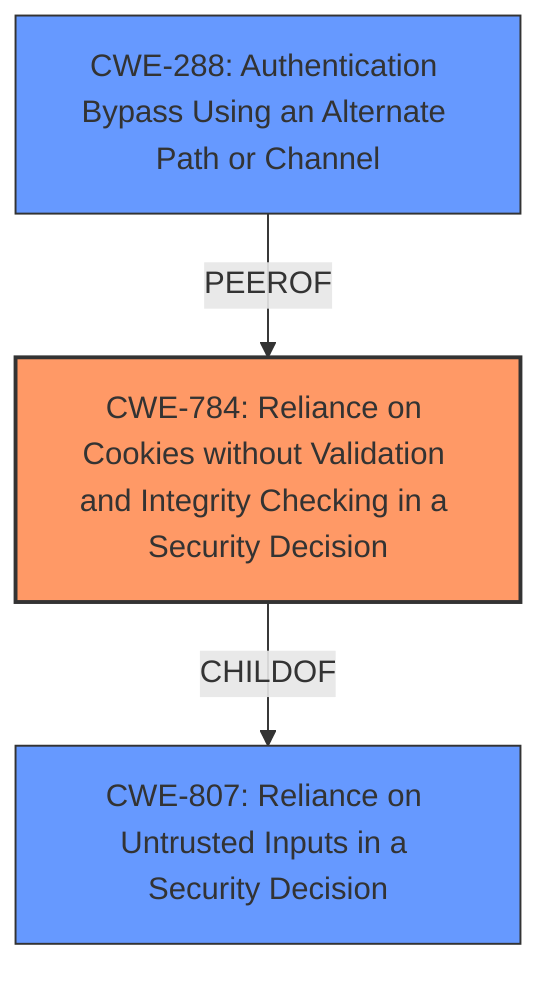

# Analysis for CVE-2021-35296

# Summary
| CWE ID    | CWE Name                                                                 | Confidence | CWE Abstraction Level | CWE Vulnerability Mapping Label | CWE-Vulnerability Mapping Notes |
| :-------- | :----------------------------------------------------------------------- | :--------- | :-------------------- | :------------------------------ | :------------------------------ |
| CWE-784   | Reliance on Cookies without Validation and Integrity Checking in a Security Decision | 0.80      | Variant             | Allowed                       | Primary CWE                    |
| CWE-807   | Reliance on Untrusted Inputs in a Security Decision                      | 0.60       | Base                | Allowed                       | Secondary CWE                   |
| CWE-288 | Authentication Bypass Using an Alternate Path or Channel | 0.50 | Base | Allowed | Secondary CWE |

## Evidence and Confidence

*   **Confidence Score:** 0.70
*   **Evidence Strength:** MEDIUM

## Relationship Analysis
The primary CWE identified is CWE-784, which is a Variant of CWE-807 (Reliance on Untrusted Inputs in a Security Decision). CWE-784 focuses specifically on the use of cookies without proper validation, while CWE-807 is a more general case. CWE-288 (Authentication Bypass Using an Alternate Path or Channel) is a peer of CWE-420 (Unprotected Alternate Channel). Since the vulnerability involves modification of cookie values to bypass authentication, CWE-784 is the most specific and relevant choice.

## Vulnerability Chain
The vulnerability chain begins with the **reliance on cookie values without validation** (CWE-784). This leads to the ability to **bypass authentication** by modifying these cookies.

## Summary of Analysis
The initial assessment, based on the vulnerability description, pointed towards authentication bypass by modifying cookie values. The Retriever results highlighted CWE-784, CWE-807, and CWE-288 as potential matches.

CWE-784 (Reliance on Cookies without Validation and Integrity Checking in a Security Decision) was selected as the primary CWE because it directly addresses the vulnerability's description of bypassing authentication through cookie modification. The "Vulnerability Description Key Phrases" explicitly mention "modification of the cookie value," and CWE-784's description aligns perfectly with this scenario.

CWE-807 (Reliance on Untrusted Inputs in a Security Decision) was considered as a more general case, as cookies are a form of input. However, CWE-784 provides more specific details.

CWE-288 (Authentication Bypass Using an Alternate Path or Channel) was considered but deemed less relevant, as the vulnerability doesn't explicitly state that there's an alternate path. The core issue is the **improper validation** of the cookie, not an alternate authentication mechanism.

The selection of CWE-784 is supported by its Variant abstraction level, indicating that it's specific. The evidence, while not extensive in the CVE Reference Links Content Summary, is sufficient to justify the mapping. The confidence score is 0.80 due to the direct match between the vulnerability description and the CWE's characteristics.

Relevant CWE Information:

# Enhanced Context (25 CWEs)
The following CWEs were identified as potentially relevant to this vulnerability:

## CWE-302: Authentication Bypass by Assumed-Immutable Data
**Abstraction Level**: Base
**Similarity Score**: 0.79
**Source**: dense

**Description**:
The authentication scheme or implementation uses key data elements that are assumed to be immutable, but can be controlled or modified by the attacker.

**Mapping Guidance**:
- Usage: Allowed
- Rationale: This CWE entry is at the Base level of abstraction, which is a preferred level of abstraction for mapping to the root causes of vulnerabilities.

## CWE-807: Reliance on Untrusted Inputs in a Security Decision
**Abstraction Level**: Base
**Similarity Score**: 0.79
**Source**: dense

**Description**:
The product uses a protection mechanism that relies on the existence or values of an input, but the input can be modified by an untrusted actor in a way that bypasses the protection mechanism.

**Mapping Guidance**:
- Usage: Allowed
- Rationale: This CWE entry is at the Base level of abstraction, which is a preferred level of abstraction for mapping to the root causes of vulnerabilities.

## CWE-294: Authentication Bypass by Capture-replay
**Abstraction Level**: Base
**Similarity Score**: 0.78
**Source**: dense

**Description**:
A capture-replay flaw exists when the design of the product makes it possible for a malicious user to sniff network traffic and bypass authentication by replaying it to the server in question to the same effect as the original message (or with minor changes).

**Mapping Guidance**:
- Usage: Allowed
- Rationale: This CWE entry is at the Base level of abstraction, which is a preferred level of abstraction for mapping to the root causes of vulnerabilities.

## CWE-288: Authentication Bypass Using an Alternate Path or Channel
**Abstraction Level**: Base
**Similarity Score**: 0.78
**Source**: dense

**Description**:
The product requires authentication, but the product has an alternate path or channel that does not require authentication.

**Mapping Guidance**:
- Usage: Allowed
- Rationale: This CWE entry is at the Base level of abstraction, which is a preferred level of abstraction for mapping to the root causes of vulnerabilities.

## CWE-303: Incorrect Implementation of Authentication Algorithm
**Abstraction Level**: Base
**Similarity Score**: 0.77
**Source**: dense

**Description**:
The requirements for the product dictate the use of an established authentication algorithm, but the implementation of the algorithm is incorrect.

**Mapping Guidance**:
- Usage: Allowed
- Rationale: This CWE entry is at the Base level of abstraction, which is a preferred level of abstraction for mapping to the root causes of vulnerabilities.

## CWE-1391: Use of Weak Credentials
**Abstraction Level**: Class
**Similarity Score**: 0.77
**Source**: dense

**Description**:
The product uses weak credentials (such as a default key or hard-coded password) that can be calculated, derived, reused, or guessed by an attacker.

**Mapping Guidance**:
- Usage: Allowed-with-Review
- Rationale: This CWE entry is a Class and might have Base-level children that would be more appropriate

## CWE-472: External Control of Assumed-Immutable Web Parameter
**Abstraction Level**: Base
**Similarity Score**: 0.77
**Source**: dense

**Description**:
The web application does not sufficiently verify inputs that are assumed to be immutable but are actually externally controllable, such as hidden form fields.

**Mapping Guidance**:
- Usage: Allowed
- Rationale: This CWE entry is at the Base level of abstraction, which is a preferred level of abstraction for mapping to the root causes of vulnerabilities.

## CWE-1390: Weak Authentication
**Abstraction Level**: Class
**Similarity Score**: 0.76
**Source**: dense

**Description**:
The product uses an authentication mechanism to restrict access to specific users or identities, but the mechanism does not sufficiently prove that the claimed identity is correct.

**Mapping Guidance**:
- Usage: Allowed-with-Review
- Rationale: This CWE entry is a Class and might have Base-level children that would be more appropriate

## CWE-305: Authentication Bypass by Primary Weakness
**Abstraction Level**: Base
**Similarity Score**: 0.76
**Source**: dense

**Description**:
The authentication algorithm is sound, but the implemented mechanism can be bypassed as the result of a separate weakness that is primary to the authentication error.

**Mapping Guidance**:
- Usage: Allowed
- Rationale: This CWE entry is at the Base level of abstraction, which is a preferred level of abstraction for mapping to the root causes of vulnerabilities.

## CWE-290: Authentication Bypass by Spoofing
**Abstraction Level**: Base
**Similarity Score**: 0.76
**Source**: dense

**Description**:
This attack-focused weakness is caused by incorrectly implemented authentication schemes that are subject to spoofing attacks.

**Mapping Guidance**:
- Usage: Allowed
- Rationale: This CWE entry is at the Base level of abstraction, which is a preferred level of abstraction for mapping to the root causes of vulnerabilities.

## CWE-472: External Control of Assumed-Immutable Web Parameter
**Abstraction Level**: Base
**Similarity Score**: 4508.56
**Source**: sparse

**Description**:
The web application does not sufficiently