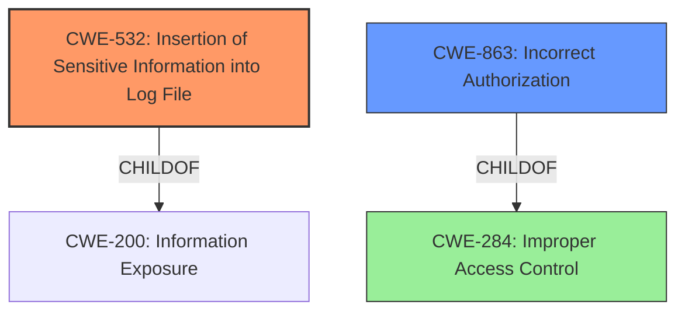

# Raw Analyzer Response for CVE-2021-35299

# Summary
| CWE ID | CWE Name | Confidence | CWE Abstraction Level | CWE Vulnerability Mapping Label | CWE-Vulnerability Mapping Notes |
|---|---|---|---|---|---|
| CWE-532 | Insertion of Sensitive Information into Log File | 1.0 | Base | Allowed | Primary CWE |
| CWE-863 | Incorrect Authorization | 0.7 | Class | Allowed-with-Review | Secondary Candidate |
| CWE-284 | Improper Access Control | 0.5 | Pillar | Discouraged | Secondary Candidate |

## Evidence and Confidence

*   **Confidence Score:** 0.8
*   **Evidence Strength:** HIGH

## Relationship Analysis
The primary relationship that influenced the CWE selection was the hierarchical relationship of CWE-532 as a child of CWE-200 (Information Exposure). Also, the relationship of CWE-863 as a child of CWE-284. The base level of CWE-532 better reflects the root cause than the higher level CWE-200. CWE-284 is too high level and is discouraged, and CWE-863 is a possible candidate.

## Vulnerability Chain
The vulnerability chain starts with the **incorrect access control**, leading to the logging of valid credentials in cleartext, and ultimately resulting in the exposure of sensitive information to attackers who gain access to the log file.

## Summary of Analysis
The initial analysis pointed towards **incorrect access control** as the root cause, but the details in the CVE Reference Links Content Summary clarified that the root cause was cleartext password logging. The vulnerability description states "**Incorrect Access Control** in Zammad 1.0.x up to 4.0.0 allows attackers to obtain sensitive information via email connection configuration probing." The CVE Reference Links Content Summary states that "Zammad's email connection probing functionality logs valid credentials to the application log file when a full probing of inbound and outbound connection configurations is successful," indicating the root cause of the vulnerability is due to the logging of credentials, and the impact is that "An attacker with access to the Zammad application log file can read the valid email credentials." Thus, CWE-532 is the most accurate primary mapping. Although **incorrect access control** is mentioned, the description focuses on the logging of sensitive information, so that should be secondary.

Relevant CWE Information:

# Enhanced Context (25 CWEs)
The following CWEs were identified as potentially relevant to this vulnerability:

## CWE-532: Insertion of Sensitive Information into Log File
**Abstraction:** Base
**Status:** Incomplete

### Description
The product writes sensitive information to a log file.

### Extended Description
Not provided

### Alternative Terms
None

### Relationships
ChildOf -> CWE-538
ChildOf -> CWE-200

### Mapping Guidance
**Usage:** Allowed
**Rationale:** This CWE entry is at the Base level of abstraction, which is a preferred level of abstraction for mapping to the root causes of vulnerabilities.
**Comments:** Carefully read both the name and description to ensure that this mapping is an appropriate fit. Do not try to 'force' a mapping to a lower-level Base/Variant simply to comply with this preferred level of abstraction.
**Reasons:**
- Acceptable-Use

### Observed Examples
- **CVE-2017-9615:** verbose logging stores admin credentials in a world-readable log file
- **CVE-2018-1999036:** SSH password for private key stored in build log

**Explanation:**
CWE-532 (Insertion of Sensitive Information into Log File) is selected as the primary CWE because the vulnerability involves the logging of valid email credentials in cleartext to the application log file. This aligns directly with the CWE's description, which states: "The product writes sensitive information to a log file." The impact of this weakness is that an attacker with access to the log file can read the credentials, leading to potential unauthorized access and data breaches.

The "Mapping Guidance" for CWE-532 states "This CWE entry is at the Base level of abstraction, which is a preferred level of abstraction for mapping to the root causes of vulnerabilities," and "Carefully read both the name and description to ensure that this mapping is an appropriate fit." This is an appropriate fit.

## CWE-863: Incorrect Authorization
**Abstraction:** Class
**Status:** Incomplete

### Description
The product performs an authorization check when an actor attempts to access a resource or perform an action, but it does not correctly perform the check.

### Extended Description
Not provided

### Alternative Terms
AuthZ: "AuthZ" is typically used as an abbreviation of "authorization" within the web application security community. It is distinct from "AuthN" (or, sometimes, "AuthC") which is an abbreviation of "authentication." The use of "Auth" as an abbreviation is discouraged, since it could be used for either authentication or authorization.

### Relationships
ChildOf -> CWE-285
ChildOf -> CWE-284

### Mapping Guidance
**Usage:** Allowed-with-Review
**Rationale:** This CWE entry is a Class and might have Base-level children that would be more appropriate
**Comments:** Examine children of this entry to see if there is a better fit
**Reasons:**
- Abstraction

### Additional Notes
**[Terminology]** 

Assuming a user with a given identity, authorization is the process of determining whether that user can access a given resource, based on the user's privileges and any permissions or other access-control specifications that apply to the resource.

### Observed Examples
- **CVE-2021-39155:** Chain: A microservice integration and management platform compares the hostname in the HTTP Host header in a case-sensitive way (CWE-178, CWE-1289), allowing bypass of the authorization policy (CWE-863) using a hostname with mixed case or other variations.
- **CVE-2019-15900:** Chain: sscanf() call is used to check if a username and group exists, but the return value of sscanf() call is not checked (CWE-252), causing an uninitialized variable to be checked (CWE-457), returning success to allow authorization bypass for executing a privileged (CWE-863).
- **CVE-2009-2213:** Gateway uses default "Allow" configuration for its authorization settings.

**Explanation:**
CWE-863 (Incorrect Authorization) is considered as a secondary candidate because the vulnerability description mentions **incorrect access control**. This suggests that the authorization mechanisms in place may not be functioning as intended, allowing unauthorized access to sensitive information. However, the primary issue is the exposure of the credentials in the log file (CWE-532) and not necessarily a flaw in the authorization logic itself.

The "Mapping Guidance" for CWE-863 is "Allowed-with-Review" because "This CWE entry is a Class and might have Base-level children that would be more appropriate."

## CWE-284: Improper Access Control
**Abstraction:** Pillar
**Status:** Incomplete

### Description
The product does not restrict or incorrectly restricts access to a resource from an unauthorized actor.

### Extended Description
Access control involves the use of several protection mechanisms such as:
  - Authentication (proving the identity of an actor)
  - Authorization (ensuring that a given actor can access a resource), and
  - Accountability (tracking of activities that were performed)
When any mechanism is not applied or otherwise fails, attackers can compromise the security of the product by gaining privileges, reading sensitive information, executing commands, evading detection, etc.
There are two distinct behaviors that can introduce access control weaknesses:
  - Specification: incorrect privileges, permissions, ownership, etc. are explicitly specified for either the user or the resource (for example, setting a password file to be world-writable, or giving administrator capabilities to a guest user). This action could be performed by the program or the administrator.
  - Enforcement: the mechanism contains errors that prevent it from properly enforcing the specified access control requirements (e.g., allowing the user to specify their own privileges, or allowing a syntactically-incorrect ACL to produce insecure settings). This problem occurs within the program itself, in that it does not actually enforce the intended security policy that the administrator specifies.

### Alternative Terms
Authorization: The terms "access control" and "authorization" are often used interchangeably, although many people have distinct definitions. The CWE usage of "access control" is intended as a general term for the various mechanisms that