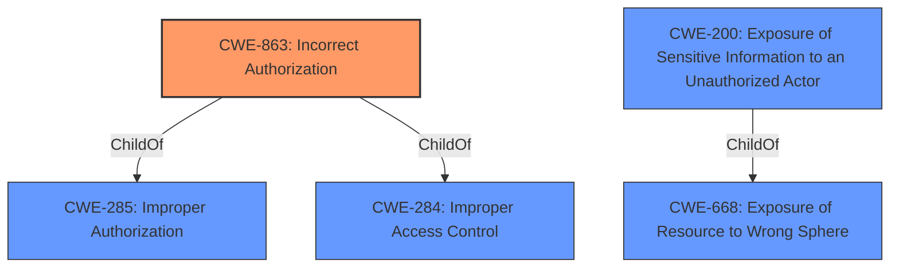

# Analysis for CVE-2021-35301

# Summary
| CWE ID | CWE Name | Confidence | CWE Abstraction Level | CWE Vulnerability Mapping Label | CWE-Vulnerability Mapping Notes |
|---|---|---|---|---|---|
| CWE-863 | Incorrect Authorization | 0.9 | Class | Primary | Allowed-with-Review |
| CWE-200 | Exposure of Sensitive Information to an Unauthorized Actor | 0.6 | Class | Secondary | Discouraged |

## Evidence and Confidence

*   **Confidence Score:** 0.75
*   **Evidence Strength:** MEDIUM

## Relationship Analysis
The primary CWE is CWE-863, which is a child of CWE-285 (Improper Authorization) and CWE-284 (Improper Access Control). CWE-863 is a class-level CWE, but it aligns well with the vulnerability description and available evidence. CWE-200 is a child of CWE-668 and represents the impact of the vulnerability.

## Vulnerability Chain
The vulnerability chain starts with **Incorrect Access Control** (CWE-related) leading to **exposure of an agent's email address to a customer**.

## Summary of Analysis
The initial assessment identified **Incorrect Access Control** as the root cause, leading to the **exposure of sensitive information**.

The primary CWE mapping is CWE-863 (Incorrect Authorization) because the vulnerability stems from the system performing an authorization check but doing it incorrectly, leading to the **exposure of an agent's email address to a customer**. The vulnerability description states "**Incorrect Access Control** in Zammad 1.0.x up to 4.0.0 allows remote attackers to obtain sensitive information via the Ticket Article detail view." The CVE Reference Links Content Summary elaborates that "In certain circumstances, the email address of an Agent was shown to a Customer instead of the email address of the current group the Ticket is in."

CWE-200 (Exposure of Sensitive Information to an Unauthorized Actor) is considered as a secondary CWE since it describes the impact of the vulnerability but not the root cause. According to the CWE specifications, CWE-200 is discouraged as a primary mapping because it represents the loss of confidentiality, which is a technical impact and not a root cause error.

The selected CWEs are at the optimal level of specificity, as CWE-863 directly addresses the **incorrect authorization** mechanism, while CWE-200 highlights the resulting **information exposure**.

Relevant CWE Information:

# Enhanced Context (25 CWEs)

## CWE-538: Insertion of Sensitive Information into Externally-Accessible File or Directory
**Abstraction Level**: Base
**Similarity Score**: 0.78
**Source**: dense
Not selected as it doesn't describe the root cause. The vulnerability is not due to inserting sensitive information into a file or directory but rather due to **incorrect authorization**.

## CWE-552: Files or Directories Accessible to External Parties
**Abstraction Level**: Base
**Similarity Score**: 0.77
**Source**: dense
Not selected as the vulnerability isn't about files or directories being accessible to external parties. The issue is about **incorrect authorization** leading to sensitive information exposure.

## CWE-497: Exposure of Sensitive System Information to an Unauthorized Control Sphere
**Abstraction Level**: Base
**Similarity Score**: 0.77
**Source**: dense
Not selected as the exposed information is not necessarily system-level information.

## CWE-668: Exposure of Resource to Wrong Sphere
**Abstraction Level**: Class
**Similarity Score**: 0.76
**Source**: dense
Not selected as it's too high-level. The vulnerability is better described by more specific CWEs like CWE-863.

## CWE-639: Authorization Bypass Through User-Controlled Key
**Abstraction Level**: Base
**Similarity Score**: 0.76
**Source**: dense
Not selected because there's no evidence that the authorization bypass is happening through a user-controlled key.

## CWE-226: Sensitive Information in Resource Not Removed Before Reuse
**Abstraction Level**: Base
**Similarity Score**: 0.76
**Source**: dense
Not selected as the vulnerability is not related to resource reuse but rather **incorrect authorization**.

## CWE-359: Exposure of Private Personal Information to an Unauthorized Actor
**Abstraction Level**: Base
**Similarity Score**: 0.76
**Source**: dense
While there is exposure of an agent's email address, the root cause is **incorrect authorization**.

## CWE-807: Reliance on Untrusted Inputs in a Security Decision
**Abstraction Level**: Base
**Similarity Score**: 0.76
**Source**: dense
Not selected as there is no evidence that the vulnerability stems from reliance on untrusted inputs in a security decision.

## CWE-212: Improper Removal of Sensitive Information Before Storage or Transfer
**Abstraction Level**: Base
**Similarity Score**: 0.76
**Source**: dense
Not selected as the vulnerability is not related to improper removal of sensitive information before storage or transfer.

## CWE-73: External Control of File Name or Path
**Abstraction Level**: Base
**Similarity Score**: 0.75
**Source**: dense
Not relevant as the vulnerability doesn't involve external control of file names or paths.

## CWE-425: Direct Request ('Forced Browsing')
**Abstraction Level**: Base
**Similarity Score**: 7148.67
**Source**: sparse
Not relevant as there is no evidence of direct request.

## CWE-285: Improper Authorization
**Abstraction Level**: Class
**Similarity Score**: 7100.28
**Source**: sparse
Not selected as it is too high-level, and CWE-863 is more specific.

## CWE-471: Modification of Assumed-Immutable Data (MAID)
**Abstraction Level**: base
**Similarity Score**: 4.33
**Source**: graph
Not selected as the vulnerability doesn't involve modification of assumed-immutable data.

## CWE-22: Improper Limitation of a Pathname to a Restricted Directory ('Path Traversal')
**Abstraction Level**: base
**Similarity Score**: 4.33
**Source**: graph
Not selected as the vulnerability doesn't involve path traversal.

## CWE-434: Unrestricted Upload of File with Dangerous Type
**Abstraction Level**: base
**Similarity Score**: 4.33
**Source**: graph
Not selected as the vulnerability doesn't involve unrestricted upload of files.

## CWE-98: Improper Control of Filename for Include/Require Statement in PHP Program ('PHP Remote File Inclusion')
**Abstraction Level**: variant
**Similarity Score**: 3.88
**Source**: graph
Not selected as the vulnerability doesn't involve PHP remote file inclusion.

## CWE-178: Improper Handling of Case Sensitivity
**Abstraction Level**: base
**Similarity Score**: 3.76
**Source**: graph
Not selected as the vulnerability doesn't involve case sensitivity.

## CWE-1289: Improper Validation of Unsafe Equivalence in Input
**Abstraction Level**: base
**Similarity Score**: 3.64
**Source**: graph
Not selected as the vulnerability doesn't involve improper validation of unsafe equivalence in input.

## CWE-41: Improper Resolution of Path Equivalence
**Abstraction Level**: Base
**Similarity Score**: 3.32
**Source**: graph
Not selected as the vulnerability doesn't involve path equivalence.

## CWE-386: Symbolic Name not Mapping to Correct Object
**Abstraction Level**: base
**Similarity Score**: 3.03
**Source**: graph
Not selected as the vulnerability doesn't involve symbolic name mapping issues.

## CWE-59: Improper Link Resolution Before File Access ('Link Following')
**Abstraction Level**: Base
**Similarity Score**: 2.89
**Source**: graph
Not selected as the vulnerability doesn't involve link following.