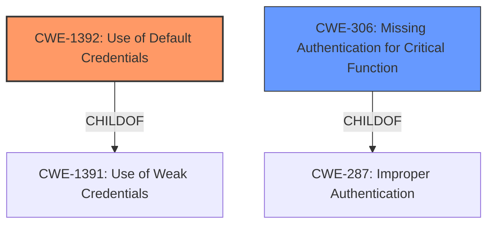

# Analysis Report for CVE-2021-35327

# Vulnerability Analysis Report: CVE-2021-35327

## Description


## Analysis (with Relationship Data)

# Summary
| CWE ID | CWE Name | Confidence | CWE Abstraction Level | CWE Vulnerability Mapping Label | CWE-Vulnerability Mapping Notes |
|---|---|---|---|---|---|
| CWE-1392 | Use of Default Credentials | 1 | Base | Allowed | Primary CWE |
| CWE-306 | Missing Authentication for Critical Function | 0.9 | Base | Allowed | Secondary Candidate |

## Evidence and Confidence

*   **Confidence Score:** 0.95
*   **Evidence Strength:** HIGH

## Relationship Analysis
The primary CWE is CWE-1392 Use of Default Credentials, a Base level CWE. It has a ChildOf relationship to CWE-1391 Weak Credentials, a Class level CWE.
CWE-306 Missing Authentication for Critical Function is also a Base level CWE and a ChildOf CWE-287 Improper Authentication.
These relationships indicate that the chosen CWEs are at a reasonably specific level of abstraction.



## Vulnerability Chain
The vulnerability chain starts with **missing authentication** to enable Telnet (CWE-306), followed by the **use of default credentials** (CWE-1392) to gain access. The chain highlights that bypassing authentication allows an attacker to then exploit the default credentials.

## Summary of Analysis
The initial analysis focused on the **root cause** of the vulnerability, which is the ability to start the Telnet service without authentication and then log in using default credentials.

The CVE Reference Links Content Summary states:
- "**Root cause of vulnerability:** The TOTOLINK A720R router has a vulnerability where the telnet service can be started without any prior authorization, and it uses a default username and password combination."
- "**Missing authorization:** Telnet service can be started without authentication"
- "**Default credentials:** The router uses a hardcoded username and password (`root:cs2012`) for telnet access."

The Retriever Results identified several candidate CWEs, including CWE-259 (Use of Hard-coded Password), CWE-1392 (Use of Default Credentials), and CWE-306 (Missing Authentication for Critical Function).

CWE-1392 (Use of Default Credentials) was selected as the primary CWE because it directly addresses the **root cause** of the vulnerability: the use of default credentials for Telnet access. The evidence clearly supports this: "The router uses a hardcoded username and password (`root:cs2012`) for telnet access." This allows remote attackers to gain shell access. The CWE description aligns perfectly with this scenario.

CWE-306 (Missing Authentication for Critical Function) was chosen as a secondary CWE. The telnet service can be started without authentication, which then allows the attacker to use the default credentials. This aspect is captured by the statement "Telnet service can be started without authentication".

CWE-259 (Use of Hard-coded Password) was considered but not selected as the primary because CWE-1392 is more specific than CWE-259. CWE-259 is a Variant of CWE-798 (Use of Hard-coded Credentials), whereas CWE-1392 is more precise, focusing on the use of *default* credentials, which is the case here.

The selected CWEs are at the optimal level of specificity because they accurately represent the weaknesses present in the vulnerability. The use of default credentials is the primary **root cause**, and the missing authentication allows exploitation of these credentials.
Relevant CWE Information:

# Enhanced Context (25 CWEs)
The following CWEs were identified as potentially relevant to this vulnerability:

## CWE-798: Use of Hard-coded Credentials
**Abstraction Level**: Base
**Similarity Score**: 0.80
**Source**: dense

**Description**:
The product contains hard-coded credentials, such as a password or cryptographic key.

**Mapping Guidance**:
- Usage: Allowed
- Rationale: This CWE entry is at the Base level of abstraction, which is a preferred level of abstraction for mapping to the root causes of vulnerabilities.


## CWE-1391: Use of Weak Credentials
**Abstraction Level**: Class
**Similarity Score**: 0.79
**Source**: dense

**Description**:
The product uses weak credentials (such as a default key or hard-coded password) that can be calculated, derived, reused, or guessed by an attacker.

**Mapping Guidance**:
- Usage: Allowed-with-Review
- Rationale: This CWE entry is a Class and might have Base-level children that would be more appropriate


## CWE-807: Reliance on Untrusted Inputs in a Security Decision
**Abstraction Level**: Base
**Similarity Score**: 0.78
**Source**: dense

**Description**:
The product uses a protection mechanism that relies on the existence or values of an input, but the input can be modified by an untrusted actor in a way that bypasses the protection mechanism.

**Mapping Guidance**:
- Usage: Allowed
- Rationale: This CWE entry is at the Base level of abstraction, which is a preferred level of abstraction for mapping to the root causes of vulnerabilities.


## CWE-1392: Use of Default Credentials
**Abstraction Level**: Base
**Similarity Score**: 0.78
**Source**: dense

**Description**:
The product uses default credentials (such as passwords or cryptographic keys) for potentially critical functionality.

**Mapping Guidance**:
- Usage: Allowed
- Rationale: This CWE entry is at the Base level of abstraction, which is a preferred level of abstraction for mapping to the root causes of vulnerabilities.


## CWE-303: Incorrect Implementation of Authentication Algorithm
**Abstraction Level**: Base
**Similarity Score**: 0.77
**Source**: dense

**Description**:
The requirements for the product dictate the use of an established authentication algorithm, but the implementation of the algorithm is incorrect.

**Mapping Guidance**:
- Usage: Allowed
- Rationale: This CWE entry is at the Base level of abstraction, which is a preferred level of abstraction for mapping to the root causes of vulnerabilities.


## CWE-1188: Initialization of a Resource with an Insecure Default
**Abstraction Level**: Base
**Similarity Score**: 0.77
**Source**: dense

**Description**:
The product initializes or sets a resource with a default that is intended to be changed by the administrator, but the default is not secure.

**Mapping Guidance**:
- Usage: Allowed
- Rationale: This CWE entry is at the Base level of abstraction, which is a preferred level of abstraction for mapping to the root causes of vulnerabilities.


## CWE-345: Insufficient Verification of Data Authenticity
**Abstraction Level**: Class
**Similarity Score**: 0.77
**Source**: dense

**Description**:
The product does not sufficiently verify the origin or authenticity of data, in a way that causes it to accept invalid data.

**Mapping Guidance**:
- Usage: Discouraged
- Rationale: This CWE entry is a level-1 Class (i.e., a child of a Pillar). It might have lower-level children that would be more appropriate


## CWE-74: Improper Neutralization of Special Elements in Output Used by a Downstream Component ('Injection')
**Abstraction Level**: Class
**Similarity Score**: 0.77
**Source**: dense

**Description**:
The product constructs all or part of a command, data structure, or record using externally-influenced input from an upstream component, but it does not neutralize or incorrectly neutralizes special elements that could modify how it is parsed or interpreted when it is sent to a downstream component.

**Mapping Guidance**:
- Usage: Discouraged
- Rationale: CWE-74 is high-level and often misused when lower-level weaknesses are more appropriate.


## CWE-259: Use of Hard-coded Password
**Abstraction Level**: Variant
**Similarity Score**: 0.76
**Source**: dense

**Description**:
The product contains a hard-coded password, which it uses for its own inbound authentication or for outbound communication to external components.

**Mapping Guidance**:
- Usage: Allowed
- Rationale: This CWE entry is at the Variant level of abstraction, which is a preferred level of abstraction for mapping to the root causes of vulnerabilities.


## CWE-319: Cleartext Transmission of Sensitive Information
**Abstraction Level**: Base
**Similarity Score**: 0.76
**Source**: dense

**Description**:
The product transmits sensitive or security-critical data in cleartext in a communication channel that can be sniffed by unauthorized actors.


## CWE Relationship Analysis

Current CWEs represent these abstraction levels: .


### Vulnerability Chain Analysis

**Chain starting from CWE-306:**
- 306 (Missing Authentication for Critical Function) - ROOT


**Chain starting from CWE-303:**
- 303 (Incorrect Implementation of Authentication Algorithm) - ROOT


### CWE Relationship Diagram

```mermaid
graph TD
    classDef primary fill:#f96,stroke:#333,stroke-width:2px
    classDef secondary fill:#69f,stroke:#333
    classDef tertiary fill:#9e9,stroke:#333
```


*Report generated on 2025-04-02 15:43:44*
