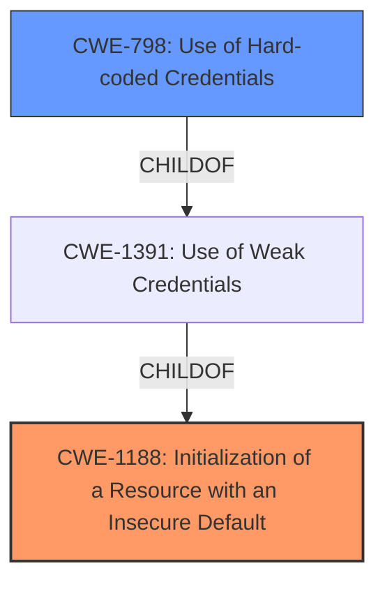

# Analysis Report for CVE-2021-35336

# Vulnerability Analysis Report: CVE-2021-35336

## Description


## Analysis (with Relationship Data)

# Summary
| CWE ID  | CWE Name                             | Confidence | CWE Abstraction Level | CWE Vulnerability Mapping Label | CWE-Vulnerability Mapping Notes |
| :-------- | :----------------------------------- | :--------- | :-------------------- | :------------------------------ | :------------------------------ |
| CWE-1188 | Initialization of a Resource with an Insecure Default | 1.0        | Base                | Allowed                       | Primary CWE                     |
| CWE-798 | Use of Hard-coded Credentials | 0.9        | Base                | Allowed                       | Secondary CWE                     |

## Evidence and Confidence

*   **Confidence Score:** 0.95
*   **Evidence Strength:** HIGH

## Relationship Analysis
The primary relationship that influenced my decision was the hierarchical relationship between CWE-798 (Use of Hard-coded Credentials) and CWE-1188 (Initialization of a Resource with an Insecure Default). CWE-798 can be a specific instance of CWE-1188 where the insecure default is a hard-coded credential. The vulnerability description highlights both an **incorrect access control** due to a default administrative account with username "admin" and password "password". This fits the definition of both CWE-1188 and CWE-798.



## Vulnerability Chain
The vulnerability chain starts with the **initialization of the Tieline Web Administrative Interface with an insecure default credential** (CWE-1188), specifically, a hard-coded username and password ("admin"/"password") (CWE-798). This **incorrect access control** allows an unauthenticated user to access a sensitive part of the system with a high privileged account, leading to unauthorized access and full control over the device.

## Summary of Analysis
Initially, the vulnerability description pointed to **incorrect access control**, which could have suggested a broader CWE. However, the CVE Reference Links Content Summary provided much more specific details about the **root cause**: the presence of a default administrative account with hard-coded credentials. This makes CWE-1188 (Initialization of a Resource with an Insecure Default) the most appropriate primary CWE, as it directly addresses the **root cause**. The existence of the hard-coded credential supports classifying CWE-798 (Use of Hard-coded Credentials) as a secondary CWE.

The evidence supporting this decision is primarily found in the "CVE Reference Links Content Summary": "The vulnerability stems from the presence of a default administrative account within the Tieline Web Administrative Interface. This account has the username 'admin' and the password 'password' set by default." This clearly indicates an insecure default configuration.

I considered other CWEs, particularly those related to **improper authorization** and **improper authentication**, such as CWE-284, CWE-285, CWE-287, CWE-863, and CWE-306. However, these CWEs describe situations where authorization or authentication mechanisms are either missing or incorrectly implemented. In this case, the authentication is functioning as designed (an attacker can log in with the default credentials), but the **default configuration is insecure**. Therefore, CWE-1188 and CWE-798 are more precise and accurate representations of the vulnerability.

The selection of CWE-1188 and CWE-798 is at the optimal level of specificity because they directly address the **root cause** of the vulnerability: the **insecure default configuration** and the **use of hard-coded credentials**. These are Base and Variant level CWEs, which are preferred for vulnerability mapping.

Relevant CWE Information:

# Enhanced Context (25 CWEs)
The following CWEs were identified as potentially relevant to this vulnerability:

## CWE-798: Use of Hard-coded Credentials
**Abstraction Level**: Base
**Similarity Score**: 0.77
**Source**: dense

**Description**:
The product contains hard-coded credentials, such as a password or cryptographic key.

**Mapping Guidance**:
- Usage: Allowed
- Rationale: This CWE entry is at the Base level of abstraction, which is a preferred level of abstraction for mapping to the root causes of vulnerabilities.

## CWE-1391: Use of Weak Credentials
**Abstraction Level**: Class
**Similarity Score**: 0.76
**Source**: dense

**Description**:
The product uses weak credentials (such as a default key or hard-coded password) that can be calculated, derived, reused, or guessed by an attacker.

**Mapping Guidance**:
- Usage: Allowed-with-Review
- Rationale: This CWE entry is a Class and might have Base-level children that would be more appropriate

## CWE-303: Incorrect Implementation of Authentication Algorithm
**Abstraction Level**: Base
**Similarity Score**: 0.76
**Source**: dense

**Description**:
The requirements for the product dictate the use of an established authentication algorithm, but the implementation of the algorithm is incorrect.

**Mapping Guidance**:
- Usage: Allowed
- Rationale: This CWE entry is at the Base level of abstraction, which is a preferred level of abstraction for mapping to the root causes of vulnerabilities.

## CWE-807: Reliance on Untrusted Inputs in a Security Decision
**Abstraction Level**: Base
**Similarity Score**: 0.76
**Source**: dense

**Description**:
The product uses a protection mechanism that relies on the existence or values of an input, but the input can be modified by an untrusted actor in a way that bypasses the protection mechanism.

**Mapping Guidance**:
- Usage: Allowed
- Rationale: This CWE entry is at the Base level of abstraction, which is a preferred level of abstraction for mapping to the root causes of vulnerabilities.

## CWE-280: Improper Handling of Insufficient Permissions or Privileges 
**Abstraction Level**: Base
**Similarity Score**: 0.76
**Source**: dense

**Description**:
The product does not handle or incorrectly handles when it has insufficient privileges to access resources or functionality as specified by their permissions. This may cause it to follow unexpected code paths that may leave the product in an invalid state.

**Mapping Guidance**:
- Usage: Allowed
- Rationale: This CWE entry is at the Base level of abstraction, which is a preferred level of abstraction for mapping to the root causes of vulnerabilities.

## CWE-274: Improper Handling of Insufficient Privileges
**Abstraction Level**: Base
**Similarity Score**: 0.76
**Source**: dense

**Description**:
The product does not handle or incorrectly handles when it has insufficient privileges to perform an operation, leading to resultant weaknesses.

**Mapping Guidance**:
- Usage: Discouraged
- Rationale: This CWE entry could be deprecated in a future version of CWE.

## CWE-1390: Weak Authentication
**Abstraction Level**: Class
**Similarity Score**: 0.75
**Source**: dense

**Description**:
The product uses an authentication mechanism to restrict access to specific users or identities, but the mechanism does not sufficiently prove that the claimed identity is correct.

**Mapping Guidance**:
- Usage: Allowed-with-Review
- Rationale: This CWE entry is a Class and might have Base-level children that would be more appropriate

## CWE-345: Insufficient Verification of Data Authenticity
**Abstraction Level**: Class
**Similarity Score**: 0.75
**Source**: dense

**Description**:
The product does not sufficiently verify the origin or authenticity of data, in a way that causes it to accept invalid data.

**Mapping Guidance**:
- Usage: Discouraged
- Rationale: This CWE entry is a level-1 Class (i.e., a child of a Pillar). It might have lower-level children that would be more appropriate

## CWE-668: Exposure of Resource to Wrong Sphere
**Abstraction Level**: Class
**Similarity Score**: 0.75
**Source**: dense

**Description**:
The product exposes a resource to the wrong control sphere, providing unintended actors with inappropriate access to the resource.

**Mapping Guidance**:
- Usage: Discouraged
- Rationale: CWE-668 is high-level and is often misused as a catch-all when lower-level CWE IDs might be applicable. It is sometimes used for low-information vulnerability reports [REF-1287]. It is a level-1 Class (i.e., a child of a Pillar). It is not useful for trend analysis.

## CWE-1220: Insufficient Granularity of Access Control
**Abstraction Level**: Base
**Similarity Score**: 0.75
**Source**: dense

**Description**:
The product implements access controls via a policy or other feature with the intention to disable or restrict accesses (reads and/or writes) to assets in a system


## CWE Relationship Analysis

Current CWEs represent these abstraction levels: .


### Vulnerability Chain Analysis

**Chain starting from CWE-306:**
- 306 (Missing Authentication for Critical Function) - ROOT


**Chain starting from CWE-303:**
- 303 (Incorrect Implementation of Authentication Algorithm) - ROOT


### CWE Relationship Diagram

```mermaid
graph TD
    classDef primary fill:#f96,stroke:#333,stroke-width:2px
    classDef secondary fill:#69f,stroke:#333
    classDef tertiary fill:#9e9,stroke:#333
```


*Report generated on 2025-04-01 23:35:17*
