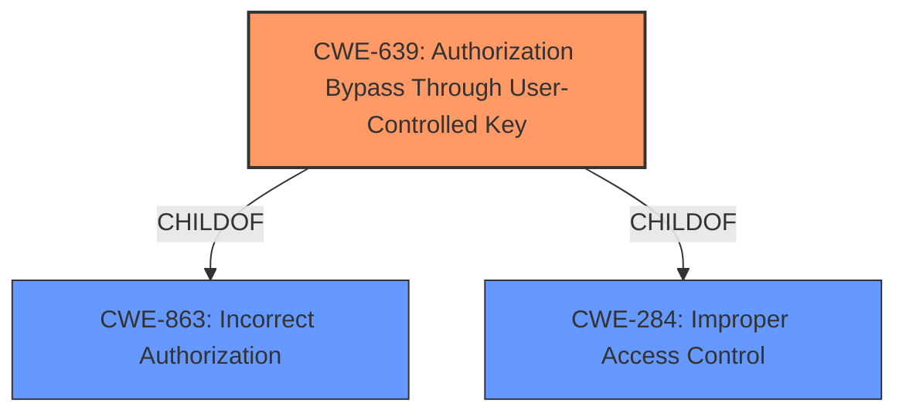

# Analysis for CVE-2021-35337

# Summary
| CWE ID | CWE Name | Confidence | CWE Abstraction Level | CWE Vulnerability Mapping Label | CWE-Vulnerability Mapping Notes |
|---|---|---|---|---|---|
| CWE-639 | Authorization Bypass Through User-Controlled Key | 1.0 | Base | Allowed | Primary CWE |

## Evidence and Confidence

*   **Confidence Score:** 1.0
*   **Evidence Strength:** HIGH

## Relationship Analysis
The primary relationship influencing the decision is that CWE-639 is a **Base** level CWE, which is the preferred level of abstraction. It is also a **ChildOf** CWE-863 (Incorrect Authorization) and CWE-284 (Improper Access Control), indicating it's a specific type of authorization issue.

## Vulnerability Chain
The vulnerability chain is straightforward:
  1. **Root Cause:** **Insecure Direct Object Reference** (IDOR), represented by CWE-639.
  2. **Impact:** An attacker can view sensitive information of other users.

## Summary of Analysis
The analysis is based on the provided evidence and the characteristics of the CWE entries.

The **Vulnerability Description Key Phrases** section indicates the **rootcause** as "**Insecure Direct Object Reference**," which is the main factor when assigning the CWE.
The **CVE Reference Links Content Summary** section states that "The application uses **insecure direct object references** (IDOR) in the 'Invoice.php' page." This confirms the presence of IDOR. The summary also mentions the ability of an attacker to view sensitive information by modifying the 'id' parameter.

The Retriever Results list CWE-639 (Authorization Bypass Through User-Controlled Key) as the top match. The description of CWE-639 aligns perfectly with the vulnerability description: "The system's authorization functionality does not prevent one user from gaining access to another user's data or record by modifying the key value identifying the data."

CWE-639 is at the Base level of abstraction, which is a preferred level. The mapping guidance for CWE-639 states "This CWE entry is at the Base level of abstraction, which is a preferred level of abstraction for mapping to the root causes of vulnerabilities."

Therefore, CWE-639 is the most appropriate and specific CWE for this vulnerability.

Other CWEs Considered but Not Used:

*   CWE-99 (Improper Control of Resource Identifiers ('Resource Injection')): While related to IDOR, it's a Class-level CWE and less specific than CWE-639.
*   CWE-425 (Direct Request ('Forced Browsing')): This CWE is more about accessing resources without proper authorization checks, but CWE-639 more accurately captures the manipulation of keys to bypass authorization.
*   CWE-79 (Improper Neutralization of Input During Web Page Generation ('Cross-site Scripting')): This is irrelevant as the vulnerability isn't about XSS.
*   CWE-94 (Improper Control of Generation of Code ('Code Injection')): This is irrelevant as the vulnerability isn't about code injection.