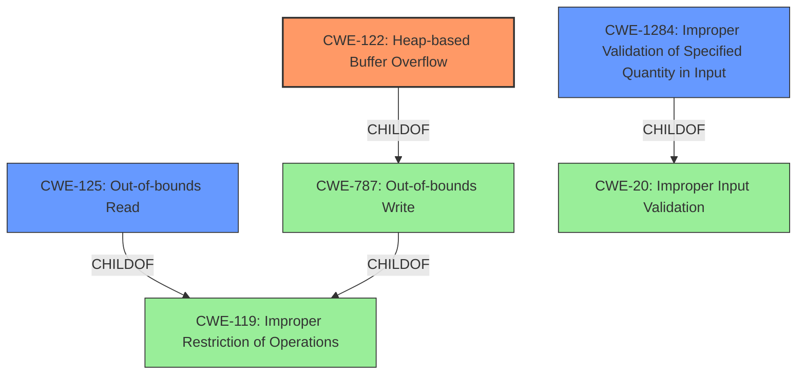

# Analysis Report for CVE-2021-35344

# Vulnerability Analysis Report: CVE-2021-35344

## Description


## Analysis (with Relationship Data)

# Summary
| CWE ID | CWE Name | Confidence | CWE Abstraction Level | CWE Vulnerability Mapping Label | CWE-Vulnerability Mapping Notes |
|---|---|---|---|---|---|
| CWE-122 | Heap-based Buffer Overflow | 1.0 | Variant | Primary | Allowed |
| CWE-125 | Out-of-bounds Read | 0.7 | Base | Secondary | Allowed |
| CWE-1284 | Improper Validation of Specified Quantity in Input | 0.6 | Base | Secondary | Allowed |

## Evidence and Confidence

*   **Confidence Score:** 0.9
*   **Evidence Strength:** HIGH

## Relationship Analysis
The primary relationship influencing the CWE selection is the parent-child relationship, specifically the child CWEs of CWE-119 (Improper Restriction of Operations within the Bounds of a Memory Buffer), which include CWE-122 (Heap-based Buffer Overflow) and CWE-125 (Out-of-bounds Read). The vulnerability description explicitly mentions a **heap-based buffer overflow**, making CWE-122 the most specific and accurate choice. CWE-125 is a potential secondary weakness if the overflow leads to reading beyond the buffer boundary. Also, CWE-1284 is considered because the size is not properly validated.



## Vulnerability Chain
The vulnerability chain starts with **improper input validation** or **insufficient bounds checking** (CWE-1284). This leads to a **heap-based buffer overflow** (CWE-122) when the `payloadSize` exceeds the actual bits remaining in the bitstream. A possible outcome is an **out-of-bounds read** (CWE-125) and a program crash or potential code execution.

## Summary of Analysis
The initial analysis focused on identifying the **root cause** of the vulnerability, which is explicitly stated as a **heap-based buffer overflow**. The evidence for this is strong, coming directly from the "Vulnerability Description Key Phrases" and the "CVE Reference Links Content Summary". The summary clearly indicates that the overflow occurs in the `BitStreamReader::getCurVal` function due to **insufficient bounds checking** of the `payloadSize` against the remaining bits in the bitstream.

The Retriever Results also listed CWE-122 as a candidate, further supporting this selection. The relationship analysis confirmed that CWE-122 is a variant of CWE-787 (Out-of-bounds Write), which is a child of CWE-119 (Improper Restriction of Operations within the Bounds of a Memory Buffer). Given the specific context of a heap-based overflow, CWE-122 is the most appropriate and specific choice.

I also considered CWE-125 (Out-of-bounds Read) as a secondary weakness. While the primary issue is the overflow, the overflow may lead to reading beyond the allocated buffer. This potential read access violation justifies including CWE-125 as a secondary CWE.

CWE-1284 (Improper Validation of Specified Quantity in Input) is a strong candidate, given the evidence of insufficient bounds checking. The `payloadSize` is not adequately checked against the remaining data in the buffer.

The final decision is based on the explicit mention of a **heap-based buffer overflow** and the evidence of **insufficient bounds checking**, making CWE-122, CWE-125, and CWE-1284 the most relevant CWEs. The chosen CWEs are at the optimal level of specificity, with CWE-122 as a Variant and CWE-125 and CWE-1284 as Base level CWEs, providing a detailed and accurate representation of the vulnerability.


## CWE Relationship Analysis

Current CWEs represent these abstraction levels: .


### Vulnerability Chain Analysis

**Chain starting from CWE-787:**
- 787 (Out-of-bounds Write) - ROOT


**Chain starting from CWE-122:**
- 122 (Heap-based Buffer Overflow) - ROOT


### CWE Relationship Diagram

```mermaid
graph TD
    classDef primary fill:#f96,stroke:#333,stroke-width:2px
    classDef secondary fill:#69f,stroke:#333
    classDef tertiary fill:#9e9,stroke:#333
```


*Report generated on 2025-04-01 19:14:44*
