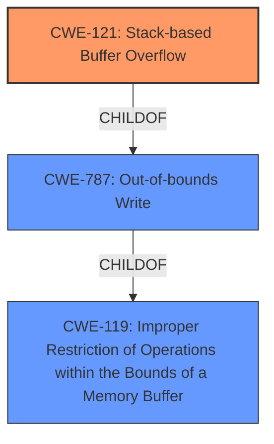

# Enhanced Analysis for CVE-2021-35393

# Summary
| CWE ID | CWE Name | Confidence | CWE Abstraction Level | CWE Vulnerability Mapping Label | CWE-Vulnerability Mapping Notes |
|---|---|---|---|---|---|
| CWE-121 | Stack-based Buffer Overflow | 0.9 | Variant | Primary | Allowed |
| CWE-119 | Improper Restriction of Operations within the Bounds of a Memory Buffer | 0.6 | Class | Secondary | Discouraged |

## Evidence and Confidence

*   **Confidence Score:** 0.9
*   **Evidence Strength:** HIGH

## Relationship Analysis
The primary CWE is CWE-121, a **Variant** of CWE-787 (Out-of-bounds Write), which in turn is a child of CWE-119 (Improper Restriction of Operations within the Bounds of a Memory Buffer). The relationship between CWE-121 and CWE-119 is hierarchical. CWE-121 is a more specific case of CWE-119. The decision to select CWE-121 is based on the fact that the buffer is allocated on the stack.



## Vulnerability Chain
The vulnerability chain starts with the **unsafe parsing of the UPnP SUBSCRIBE/UNSUBSCRIBE Callback header**, leading to a **stack buffer overflow**, which results in arbitrary code execution.

## Summary of Analysis
The initial assessment identified CWE-121 (Stack-based Buffer Overflow) as the primary candidate based on the vulnerability description. The description clearly states a "**stack buffer overflow** vulnerability that is present due to **unsafe parsing of the UPnP SUBSCRIBE/UNSUBSCRIBE Callback header**". The **rootcause** is the unsafe parsing. The **weakness** is a stack buffer overflow.

The retriever results also listed CWE-119 (Improper Restriction of Operations within the Bounds of a Memory Buffer) and CWE-787 (Out-of-bounds Write). While CWE-119 is a more general class, CWE-787 is a parent of CWE-121. CWE-121 is chosen as it more specifically describes the location of the buffer (stack).

The final decision is based on the specific evidence provided in the vulnerability description and the hierarchical relationships between the CWEs. CWE-121 is at the optimal level of specificity because it identifies both the type of buffer overflow and its location on the stack.

Relevant CWE Information:

# Enhanced Context (25 CWEs)
The following CWEs were identified as potentially relevant to this vulnerability:

## CWE-191: Integer Underflow (Wrap or Wraparound)
**Abstraction Level**: Base
**Similarity Score**: 0.77
**Source**: dense
*Not Selected*: Irrelevant to the described vulnerability

## CWE-131: Incorrect Calculation of Buffer Size
**Abstraction Level**: Base
**Similarity Score**: 0.76
**Source**: dense
*Not Selected*: The vulnerability is due to **unsafe parsing**, not incorrect calculation of buffer size.

## CWE-125: Out-of-bounds Read
**Abstraction Level**: Base
**Similarity Score**: 0.76
**Source**: dense
*Not Selected*: The vulnerability is a **stack buffer overflow**, which is a write, not a read.

## CWE-1289: Improper Validation of Unsafe Equivalence in Input
**Abstraction Level**: Base
**Similarity Score**: 0.76
**Source**: dense
*Not Selected*: Irrelevant to the described vulnerability

## CWE-126: Buffer Over-read
**Abstraction Level**: Variant
**Similarity Score**: 0.75
**Source**: dense
*Not Selected*: The vulnerability is a **stack buffer overflow**, which is a write, not a read.

## CWE-193: Off-by-one Error
**Abstraction Level**: Base
**Similarity Score**: 0.75
**Source**: dense
*Not Selected*: Irrelevant to the described vulnerability

## CWE-667: Improper Locking
**Abstraction Level**: Class
**Similarity Score**: 0.75
**Source**: dense
*Not Selected*: Irrelevant to the described vulnerability

## CWE-805: Buffer Access with Incorrect Length Value
**Abstraction Level**: Base
**Similarity Score**: 0.75
**Source**: dense
*Not Selected*: The vulnerability is due to **unsafe parsing**, not specifically incorrect length value.

## CWE-119: Improper Restriction of Operations within the Bounds of a Memory Buffer
**Abstraction Level**: Class
**Similarity Score**: 0.75
**Source**: dense
*Selected*: While this is a parent class of the more specific CWE-121, it is less descriptive of the vulnerability's root cause which is **stack buffer overflow**. It is a secondary consideration.

## CWE-197: Numeric Truncation Error
**Abstraction Level**: Base
**Similarity Score**: 0.74
**Source**: dense
*Not Selected*: Irrelevant to the described vulnerability

## CWE-190: Integer Overflow or Wraparound
**Abstraction Level**: Base
**Similarity Score**: 8257.93
**Source**: sparse
*Not Selected*: Irrelevant to the described vulnerability

## CWE-125: Out-of-bounds Read
**Abstraction Level**: Base
**Similarity Score**: 7746.90
**Source**: sparse
*Not Selected*: The vulnerability is a **stack buffer overflow**, which is a write, not a read.

## CWE-1284: Improper Validation of Specified Quantity in Input
**Abstraction Level**: Base
**Similarity Score**: 7584.67
**Source**: sparse
*Not Selected*: The vulnerability is due to **unsafe parsing**, not specifically improper validation of specified quantity.

## CWE-119: Improper Restriction of Operations within the Bounds of a Memory Buffer
**Abstraction Level**: Class
**Similarity Score**: 7569.08
**Source**: sparse
*Selected*: While this is a parent class of the more specific CWE-121, it is less descriptive of the vulnerability's root cause which is **stack buffer overflow**. It is a secondary consideration.

## CWE-193: Off-by-one Error
**Abstraction Level**: Base
**Similarity Score**: 7301.13
**Source**: sparse
*Not Selected*: Irrelevant to the described vulnerability

## CWE-128: Wrap-around Error
**Abstraction Level**: base
**Similarity Score**: 5.03
**Source**: graph
*Not Selected*: Irrelevant to the described vulnerability

## CWE-190: Integer Overflow or Wraparound
**Abstraction Level**: base
**Similarity Score**: 5.03
**Source**: graph
*Not Selected*: Irrelevant to the described vulnerability

## CWE-41: Improper Resolution of Path Equivalence
**Abstraction Level**: base
**Similarity Score**: 5.03
**Source**: graph
*Not Selected*: Irrelevant to the described vulnerability

## CWE-22: Improper Limitation of a Pathname to a Restricted Directory ('Path Traversal')
**Abstraction Level**: base
**Similarity Score**: 4.33
**Source**: graph
*Not Selected*: Irrelevant to the described vulnerability

## CWE-770: Allocation of Resources Without Limits or Throttling
**Abstraction Level**: base
**Similarity Score**: 4.33
**Source**: graph
*Not Selected*: Irrelevant to the described vulnerability

## CWE-73: External Control of File Name or Path
**Abstraction Level**: base
**Similarity Score**: 4.33
**Source**: graph
*Not Selected*: Irrelevant to the described vulnerability

## CWE-170: Improper Null Termination
**Abstraction Level**: base
**Similarity Score**: 4.33
**Source**: graph
*Not Selected*: Irrelevant to the described vulnerability

## CWE-1284: Improper Validation of Specified Quantity in Input
**Abstraction Level**: base
**Similarity Score**: 4.33
**Source**: graph
*Not Selected*: The vulnerability is due to **unsafe parsing**, not specifically improper validation of specified quantity.

## CWE-78: Improper Neutralization of Special Elements used in an OS Command ('OS Command Injection')
**Abstraction Level**: base
**Similarity Score**: 4.31
**Source**: graph
*Not Selected*: Irrelevant to the described vulnerability

## CWE-123: Write-what-where Condition
**Abstraction Level**: base
**Similarity Score**: 3.89
**Source**:


## CWE Relationship Analysis

Current CWEs represent these abstraction levels: .


### Vulnerability Chain Analysis

**Chain starting from CWE-787:**
- 787 (Out-of-bounds Write) - ROOT


**Chain starting from CWE-123:**
- 123 (Write-what-where Condition) - ROOT


### CWE Relationship Diagram

```mermaid
graph TD
    classDef primary fill:#f96,stroke:#333,stroke-width:2px
    classDef secondary fill:#69f,stroke:#333
    classDef tertiary fill:#9e9,stroke:#333
```