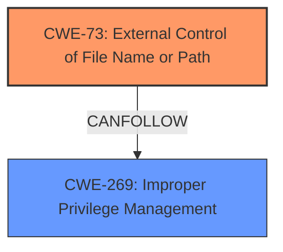

# Raw Analyzer Response for CVE-2021-35448

# Summary
| CWE ID  | CWE Name                                                        | Confidence | CWE Abstraction Level | CWE Vulnerability Mapping Label | CWE-Vulnerability Mapping Notes |
| ------- | --------------------------------------------------------------- | ---------- | --------------------- | ------------------------------- | ------------------------------- |
| CWE-73  | External Control of File Name or Path                           | 0.9        | Base                  | Primary CWE                    | Allowed                       |
| CWE-269 | Improper Privilege Management | 0.75        | Class                  | Secondary CWE                    | Allowed                       |

## Evidence and Confidence

*   **Confidence Score:** 0.8
*   **Evidence Strength:** HIGH

## Relationship Analysis
The primary CWE is CWE-73, which focuses on external control of file names or paths. This aligns well with the vulnerability description, where a user-controlled path is used to execute a command prompt with administrative privileges.

## Vulnerability Chain
The vulnerability chain starts with the **external control of the file name or path** (CWE-73), which allows the attacker to navigate to `cmd.exe`. This leads to **execution with unnecessary privileges** (CWE-269) because the application launches the command prompt with administrative rights.

## Summary of Analysis
The initial analysis focused on identifying the root cause of the vulnerability. The description highlights that the application allows the user to navigate to `cmd.exe` through the "Save As" dialog, which then executes the command prompt with elevated privileges. This directly points to CWE-73 (**External Control of File Name or Path**) because the application **fails** to properly restrict the file path, allowing arbitrary program execution.

The selection of CWE-73 is supported by the following evidence from the vulnerability description:

*   "Root cause of vulnerability: The application allows the user to select a custom directory for image transfers. When the "Change..." button is clicked, a "Save As" prompt appears, which allows the user to navigate the file system. By entering `C:\Windows\System32\cmd.exe` into the address bar of this prompt, the user can execute a command prompt with administrative privileges."
*   "Weaknesses/vulnerabilities present: Improper handling of file paths in the "Save As" dialog, leading to command execution. The application does not validate the selected path or sanitize the input, allowing an arbitrary program to be launched with elevated privileges."

CWE-269 (Improper Privilege Management) is a secondary concern because the application **fails** to properly manage the privileges associated with the executed command. While the primary issue is the lack of path validation, the impact is magnified by the elevated privileges granted to the executed command.

The retriever results also point to CWE-73 and related vulnerabilities, further supporting the selection. The abstraction level of CWE-73 is Base, which is preferred for root cause analysis.

I considered other CWEs, but they did not fully capture the essence of the vulnerability:

*   CWE-22 (**Improper Limitation of a Pathname to a Restricted Directory ('Path Traversal')**): While path traversal is a related concept, this vulnerability doesn't involve traversing directories outside of a restricted path; it involves executing a specific file.
*   CWE-427 (**Uncontrolled Search Path Element**): This CWE is related to search paths, but the vulnerability doesn't involve a search path; it directly specifies a path.

The selected CWEs are at the optimal level of specificity because they accurately represent the **root cause** (CWE-73) and the contributing factor (**improper privilege management** (CWE-269)).

Relevant CWE Information:

# Enhanced Context (25 CWEs)
The following CWEs were identified as potentially relevant to this vulnerability:

## CWE-668: Exposure of Resource to Wrong Sphere
**Abstraction Level**: Class
**Similarity Score**: 0.76
**Source**: dense

**Description**:
The product exposes a resource to the wrong control sphere, providing unintended actors with inappropriate access to the resource.

**Mapping Guidance**:
- Usage: Discouraged
- Rationale: CWE-668 is high-level and is often misused as a catch-all when lower-level CWE IDs might be applicable. It is sometimes used for low-information vulnerability reports [REF-1287]. It is a level-1 Class (i.e., a child of a Pillar). It is not useful for trend analysis.

*Not Used:* This is too high-level.

## CWE-59: Improper Link Resolution Before File Access ('Link Following')
**Abstraction Level**: Base
**Similarity Score**: 0.76
**Source**: dense

**Description**:
The product attempts to access a file based on the filename, but it does not properly prevent that filename from identifying a link or shortcut that resolves to an unintended resource.

**Mapping Guidance**:
- Usage: Allowed
- Rationale: This CWE entry is at the Base level of abstraction, which is a preferred level of abstraction for mapping to the root causes of vulnerabilities.

*Not Used:* This does not involve links/shortcuts.

## CWE-345: Insufficient Verification of Data Authenticity
**Abstraction Level**: Class
**Similarity Score**: 0.76
**Source**: dense

**Description**:
The product does not sufficiently verify the origin or authenticity of data, in a way that causes it to accept invalid data.

**Mapping Guidance**:
- Usage: Discouraged
- Rationale: This CWE entry is a level-1 Class (i.e., a child of a Pillar). It might have lower-level children that would be more appropriate

*Not Used:* This vulnerability does not involve data authenticity.

## CWE-41: Improper Resolution of Path Equivalence
**Abstraction Level**: Base
**Similarity Score**: 0.76
**Source**: dense

**Description**:
The product is vulnerable to file system contents disclosure through path equivalence. Path equivalence involves the use of special characters in file and directory names. The associated manipulations are intended to generate multiple names for the same object.

**Mapping Guidance**:
- Usage: Allowed
- Rationale: This CWE entry is at the Base level of abstraction, which is a preferred level of abstraction for mapping to the root causes of vulnerabilities.

*Not Used:* This vulnerability does not involve path equivalence.

## CWE-73: External Control of File Name or Path
**Abstraction Level**: Base
**Similarity Score**: 0.75
**Source**: dense

**Description**:
The product allows user input to control or influence paths or file names that are used in filesystem operations.

**Mapping Guidance**:
- Usage: Allowed
- Rationale: This CWE entry is at the Base level of abstraction, which is a preferred level of abstraction for mapping to the root causes of vulnerabilities.

*Used:* This is the primary CWE for this vulnerability.

## CWE-653: Improper Isolation or Compartmentalization
**Abstraction Level**: Class
**Similarity Score**: 0.75
**Source**: dense

**Description**:
The product does not properly compartmentalize or isolate functionality, processes, or resources that require different privilege levels, rights, or permissions.

**Mapping Guidance**:
- Usage: Allowed
- Rationale: This CWE entry is at the Base level of abstraction, which is a preferred level of abstraction for mapping to the root causes of vulnerabilities.

*Not Used:* While privilege separation might be a defense, it's not the core issue here.

## CWE-23: Relative Path Traversal
**Abstraction Level**: Base
**Similarity Score**: 0.75
**Source**: dense

**Description**:
The product uses external input to construct a pathname that should be within a restricted directory, but it does not properly neutralize sequences such as ".." that can resolve to a location that is outside of that directory.

**Mapping Guidance**:
- Usage: Allowed
- Rationale: This CWE entry is at the Base level of abstraction, which is a preferred level of abstraction for mapping to the root causes of vulnerabilities.

*Not Used:* This vulnerability does not involve relative path traversal.

## CWE-667: Improper Locking
**Abstraction Level**: Class
**Similarity Score**: 0.75
**Source**: dense

**Description**:
The product does not properly acquire or release a lock on a resource, leading to unexpected resource state changes and behaviors.

**Mapping Guidance**:
- Usage: Allowed-with-Review
- Rationale: This CWE entry is a Class and might have Base-level children that would be more appropriate

*Not Used:* This vulnerability does not involve locking.

## CWE-280: Improper Handling of Insufficient Permissions or Privileges
**Abstraction Level**: Base
**Similarity Score**: 0.75
**Source**: dense

**Description**:
The product does not handle or incorrectly handles when it has insufficient privileges to access resources or functionality as specified by their permissions. This may cause it to follow unexpected code paths that may leave the product in an invalid