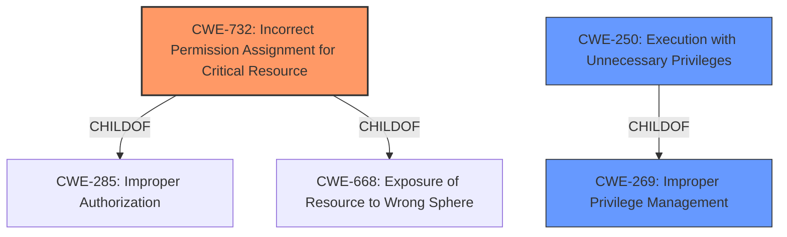

# Analysis for CVE-2021-35449

# Summary
| CWE ID | CWE Name | Confidence | CWE Abstraction Level | CWE Vulnerability Mapping Label | CWE-Vulnerability Mapping Notes |
|---|---|---|---|---|---|
| CWE-732 | Incorrect Permission Assignment for Critical Resource | 1 | Class | Allowed-with-Review | Primary CWE |
| CWE-269 | Improper Privilege Management | 0.7 | Class | Discouraged | Secondary Candidate |
| CWE-250 | Execution with Unnecessary Privileges | 0.6 | Base | Allowed | Secondary Candidate |

## Evidence and Confidence

*   **Confidence Score:** 0.9
*   **Evidence Strength:** HIGH

## Relationship Analysis
The primary CWE is CWE-732, which is a child of both CWE-285 (Improper Authorization) and CWE-668 (Exposure of Resource to Wrong Sphere). CWE-269 (Improper Privilege Management) is a parent of CWE-250 (Execution with Unnecessary Privileges). The relationship analysis shows a hierarchy where a broader class like Improper Privilege Management (CWE-269) can lead to more specific issues such as Incorrect Permission Assignment for Critical Resource (CWE-732) or Execution with Unnecessary Privileges (CWE-250).

## Vulnerability Chain
The vulnerability chain starts with the **incorrect permission assignment** for a critical resource (CWE-732), which allows a low-privileged user to load an arbitrary DLL. This leads to **execution with unnecessary privileges** (CWE-250), ultimately resulting in **privilege escalation** to SYSTEM.

## Summary of Analysis
The initial assessment, based on the vulnerability description and the CVE reference, points to an issue related to improper handling of DLL loading during the printer installation process. The key phrase "privilege escalation" and the ability of a low-privileged user to execute a DLL of their choosing strongly suggest an authorization or permission-related weakness. The retriever results confirm that CWE-732 is a strong candidate, and the CVE reference content summary explicitly mentions CWE-732 (Incorrect Permission Assignment for Critical Resource) as a weakness.

The selection of CWE-732 is based on the evidence that the driver allows a low-privileged user to load an arbitrary DLL, leading to privilege escalation. The CVE Reference Links Content Summary supports this mapping by explicitly stating that the driver fails to enforce proper restrictions or validate the source or content of DLLs it loads.

CWE-269 (Improper Privilege Management) was considered, but it is a higher-level class and is often misused when more specific CWEs are applicable. While it's true that the vulnerability involves privilege escalation, the root cause is more accurately described by the incorrect permission assignment, making CWE-732 a better fit. The MITRE mapping guidance discourages the use of CWE-269 when only phrases such as "privilege escalation" are available.

CWE-250 (Execution with Unnecessary Privileges) was also considered as the low-privileged user can run code with SYSTEM privileges. However, the more direct cause is the permission issue that allows this execution, so CWE-732 is the primary weakness.

The selected CWE, CWE-732, is at the Class level of abstraction, which is appropriate as it directly represents the **incorrect permission assignment** for the critical resource (DLL loading). This is more specific than the Pillar level (e.g., CWE-284) and more accurately captures the root cause than a more general class like CWE-269.

Relevant CWE Information:

# Enhanced Context (25 CWEs)
The following CWEs were identified as potentially relevant to this vulnerability:

## CWE-59: Improper Link Resolution Before File Access ('Link Following')
**Abstraction Level**: Base
**Similarity Score**: 0.77
**Source**: dense

**Description**:
The product attempts to access a file based on the filename, but it does not properly prevent that filename from identifying a link or shortcut that resolves to an unintended resource.

**Mapping Guidance**:
- Usage: Allowed
- Rationale: This CWE entry is at the Base level of abstraction, which is a preferred level of abstraction for mapping to the root causes of vulnerabilities.

## CWE-667: Improper Locking
**Abstraction Level**: Class
**Similarity Score**: 0.76
**Source**: dense

**Description**:
The product does not properly acquire or release a lock on a resource, leading to unexpected resource state changes and behaviors.

**Mapping Guidance**:
- Usage: Allowed-with-Review
- Rationale: This CWE entry is a Class and might have Base-level children that would be more appropriate

## CWE-668: Exposure of Resource to Wrong Sphere
**Abstraction Level**: Class
**Similarity Score**: 0.75
**Source**: dense

**Description**:
The product exposes a resource to the wrong control sphere, providing unintended actors with inappropriate access to the resource.

**Mapping Guidance**:
- Usage: Discouraged
- Rationale: CWE-668 is high-level and is often misused as a catch-all when lower-level CWE IDs might be applicable. It is sometimes used for low-information vulnerability reports [REF-1287]. It is a level-1 Class (i.e., a child of a Pillar). It is not useful for trend analysis.

## CWE-41: Improper Resolution of Path Equivalence
**Abstraction Level**: Base
**Similarity Score**: 0.75
**Source**: dense

**Description**:
The product is vulnerable to file system contents disclosure through path equivalence. Path equivalence involves the use of special characters in file and directory names. The associated manipulations are intended to generate multiple names for the same object.

**Mapping Guidance**:
- Usage: Allowed
- Rationale: This CWE entry is at the Base level of abstraction, which is a preferred level of abstraction for mapping to the root causes of vulnerabilities.

## CWE-653: Improper Isolation or Compartmentalization
**Abstraction Level**: Class
**Similarity Score**: 0.75
**Source**: dense

**Description**:
The product does not properly compartmentalize or isolate functionality, processes, or resources that require different privilege levels, rights, or permissions.

**Mapping Guidance**:
- Usage: Allowed
- Rationale: This CWE entry is at the Base level of abstraction, which is a preferred level of abstraction for mapping to the root causes of vulnerabilities.

## CWE-404: Improper Resource Shutdown or Release
**Abstraction Level**: Class
**Similarity Score**: 0.74
**Source**: dense

**Description**:
The product does not release or incorrectly releases a resource before it is made available for re-use.

**Mapping Guidance**:
- Usage: Allowed-with-Review
- Rationale: This CWE entry is a Class and might have Base-level children that would be more appropriate

## CWE-274: Improper Handling of Insufficient Privileges
**Abstraction Level**: Base
**Similarity Score**: 0.74
**Source**: dense

**Description**:
The product does not handle or incorrectly handles when it has insufficient privileges to perform an operation, leading to resultant weaknesses.

**Mapping Guidance**:
- Usage: Discouraged
- Rationale: This CWE entry could be deprecated in a future version of CWE.

## CWE-266: Incorrect Privilege Assignment
**Abstraction Level**: Base
**Similarity Score**: 0.74
**Source**: dense

**Description**:
A product incorrectly assigns a privilege to a particular actor, creating an unintended sphere of control for that actor.

**Mapping Guidance**:
- Usage: Allowed
- Rationale: This CWE entry is at the Base level of abstraction, which is a preferred level of abstraction for mapping to the root causes of vulnerabilities.

## CWE-754: Improper Check for Unusual or Exceptional Conditions
**Abstraction Level**: Class
**Similarity Score**: 0.74
**Source**: dense

**Description**:
The product does not check or incorrectly checks for unusual or exceptional conditions that are not expected to occur frequently during day to day operation of the product.

**Mapping Guidance**:
- Usage: Allowed-with-Review
- Rationale: This CWE entry is a Class and might have Base-level children that would be more appropriate

## CWE-280: Improper Handling of Insufficient Permissions or Privileges
**Abstraction Level**: Base
**