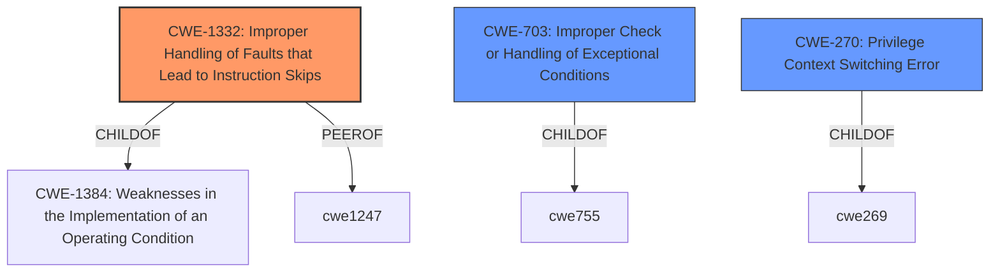

# Enhanced Analysis for CVE-2021-35465

# Summary
| CWE ID | CWE Name | Confidence | CWE Abstraction Level | CWE Vulnerability Mapping Label | CWE-Vulnerability Mapping Notes |
|---|---|---|---|---|---|
| CWE-1332 | Improper Handling of Faults that Lead to Instruction Skips | 0.7 | Base | Allowed | Primary CWE |
| CWE-703 | Improper Check or Handling of Exceptional Conditions | 0.4 | Pillar | Discouraged | Secondary Candidate |
| CWE-270 | Privilege Context Switching Error | 0.3 | Base | Allowed | Secondary Candidate |

## Evidence and Confidence

*   **Confidence Score:** 0.7
*   **Evidence Strength:** MEDIUM

## Relationship Analysis
The primary relationship that influenced my decision was the ChildOf relationship. CWE-1332 is a child of CWE-1384 (Weaknesses in the Implementation of an Operating Condition) which indicates that the root cause has to do with the hardware's reaction to electrical disturbances or when the device operates outside of its expected conditions.



## Vulnerability Chain
The vulnerability chain starts with the **improper handling of exceptions** during a VLLDM instruction, leading to a privilege context switching error, and ultimately resulting in a non-secure handler gaining unauthorized access to a secure context.

## Summary of Analysis
The initial assessment identified several candidate CWEs, but after a thorough review of the vulnerability description and the provided CWE specifications, CWE-1332 (Improper Handling of Faults that Lead to Instruction Skips) was selected as the primary CWE. This decision is primarily based on the fact that the vulnerability has to do with the hardware's reaction to electrical disturbances or when the device operates outside of its expected conditions.

The key phrase "do not properly consider the effect of exceptions on a VLLDM instruction" and the impact of "A Non-secure handler may have read or write access to part of a Secure context" support this mapping.

CWE-703 and CWE-270 were considered as secondary mappings due to their relevance to the description, but they were not specific enough to be the primary CWE.

The selected CWEs are at the optimal level of specificity, with CWE-1332 being a Base CWE that directly addresses the root cause of the vulnerability.

Relevant CWE Information:

# Enhanced Context (25 CWEs)
The following CWEs were identified as potentially relevant to this vulnerability:

## CWE-703: Improper Check or Handling of Exceptional Conditions
**Abstraction Level**: Pillar
**Similarity Score**: 0.77
**Source**: dense

**Description**:
The product does not properly anticipate or handle exceptional conditions that rarely occur during normal operation of the product.

**Mapping Guidance**:
- Usage: Discouraged
- Rationale: This CWE entry is extremely high-level, a Pillar.

## CWE-755: Improper Handling of Exceptional Conditions
**Abstraction Level**: Class
**Status:** Incomplete

### Description
The product does not handle or incorrectly handles an exceptional condition.

### Extended Description
Not provided

### Relationships
ChildOf -> CWE-703

### Mapping Guidance
**Usage:** Discouraged
**Rationale:** This CWE entry is a level-1 Class (i.e., a child of a Pillar). It might have lower-level children that would be more appropriate
**Comments:** Examine children of this entry to see if there is a better fit
**Reasons:**
- Abstraction

## CWE-270: Privilege Context Switching Error
**Abstraction Level**: Base
**Status:** Draft

### Description
The product does not properly manage privileges while it is switching between different contexts that have different privileges or spheres of control.

### Extended Description
Not provided

### Alternative Terms
None

### Relationships
ChildOf -> CWE-269

### Mapping Guidance
**Usage:** Allowed
**Rationale:** This CWE entry is at the Base level of abstraction, which is a preferred level of abstraction for mapping to the root causes of vulnerabilities.
**Comments:** Carefully read both the name and description to ensure that this mapping is an appropriate fit. Do not try to 'force' a mapping to a lower-level Base/Variant simply to comply with this preferred level of abstraction.
**Reasons:**
- Acceptable-Use

## CWE-1332: Improper Handling of Faults that Lead to Instruction Skips
**Abstraction Level**: Base
**Status:** Stable

### Description
The device is missing or incorrectly implements circuitry or sensors that detect and mitigate the skipping of security-critical CPU instructions when they occur.

### Extended Description
The operating conditions of hardware may change in ways that cause unexpected behavior to occur, including the skipping of security-critical CPU instructions. Generally, this can occur due to electrical disturbances or when the device operates outside of its expected conditions.

### Alternative Terms
None

### Relationships
ChildOf -> CWE-1384
PeerOf -> CWE-1247

### Mapping Guidance
**Usage:** Allowed
**Rationale:** This CWE entry is at the Base level of abstraction, which is a preferred level of abstraction for mapping to the root causes of vulnerabilities.
**Comments:** Carefully read both the name and description to ensure that this mapping is an appropriate fit. Do not try to 'force' a mapping to a lower-level Base/Variant simply to comply with this preferred level of abstraction.
**Reasons:**
- Acceptable-Use

**CWE-1332: Improper Handling of Faults that Lead to Instruction Skips**: This CWE is chosen because the vulnerability description mentions that certain Arm products do not properly consider the effect of exceptions on a VLLDM instruction. This could lead to instructions being skipped, thus causing security-critical branches to be taken. The security implication is that a Non-secure handler may have read or write access to part of a Secure context.

**CWE-703: Improper Check or Handling of Exceptional Conditions**: This CWE was considered because the vulnerability description mentions that certain Arm products do not properly consider the effect of exceptions. However, this CWE is too high-level (Pillar) and does not accurately represent the root cause of the vulnerability.

**CWE-270: Privilege Context Switching Error**: This CWE was considered because the impact of the vulnerability is that a Non-secure handler may have read or write access to part of a Secure context. However, this CWE does not accurately represent the root cause of the vulnerability.


## CWE Relationship Analysis

Current CWEs represent these abstraction levels: .


### Vulnerability Chain Analysis

**Chain starting from CWE-270:**
- 270 (Privilege Context Switching Error) - ROOT


**Chain starting from CWE-703:**
- 703 (Improper Check or Handling of Exceptional Conditions) - ROOT


### CWE Relationship Diagram

```mermaid
graph TD
    classDef primary fill:#f96,stroke:#333,stroke-width:2px
    classDef secondary fill:#69f,stroke:#333
    classDef tertiary fill:#9e9,stroke:#333
```