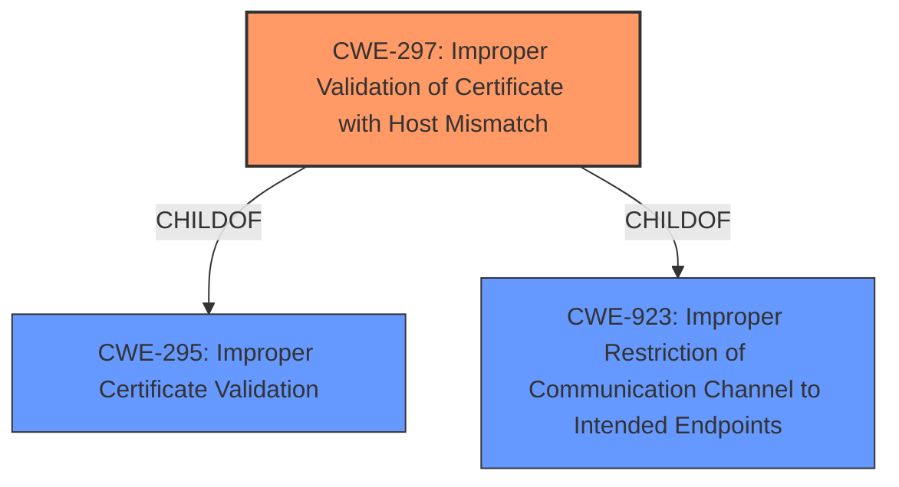

# Raw Analyzer Response for CVE-2021-3547

# Summary
| CWE ID | CWE Name | Confidence | CWE Abstraction Level | CWE Vulnerability Mapping Label | CWE-Vulnerability Mapping Notes |
|---|---|---|---|---|---|
| CWE-297 | Improper Validation of Certificate with Host Mismatch | 0.9 | Variant | Allowed | Primary CWE |
| CWE-295 | Improper Certificate Validation | 0.7 | Base | Allowed | Secondary Candidate |

## Evidence and Confidence

*   **Confidence Score:** 0.9
*   **Evidence Strength:** HIGH

## Relationship Analysis
The primary CWE selected is CWE-297, a **Variant** of CWE-295. CWE-297 is a child of both CWE-923 and CWE-295, indicating a specific type of certificate validation issue related to hostname verification within a broader class of communication channel restrictions and general certificate validation problems. The choice of CWE-297 over CWE-295 reflects the **hostname mismatch** aspect described in the vulnerability.

## Vulnerability Chain
The vulnerability chain starts with the **improper validation of the certificate's hostname**, leading to a **bypass of certificate authentication** and ultimately enabling a **man-in-the-middle attack**.

## Summary of Analysis
The analysis is based on the vulnerability description which states that a man-in-the-middle attacker can bypass certificate authentication by issuing an unrelated server certificate using the same hostname found in the `verify-x509-name` option.

The key phrase is: "man-in-the-middle attacker to **bypass the certificate authentication** by issuing an unrelated server certificate using the **same hostname** found in the `verify-x509-name` option". This indicates the core issue lies in how the OpenVPN 3 Core Library validates the certificate against the expected hostname.

The retriever results suggest CWE-295 (Improper Certificate Validation) as the top candidate, but CWE-297 (Improper Validation of Certificate with Host Mismatch) is a more specific **Variant** that better captures the essence of the vulnerability, which involves validating the certificate's hostname.

CWE-297's description aligns perfectly: "The product communicates with a host that provides a certificate, but the product does not properly ensure that the certificate is actually associated with that host." This is exactly what's happening in the described vulnerability.

Therefore, CWE-297 is chosen as the primary CWE, while CWE-295 is considered as a secondary candidate due to its broader nature.

Relevant CWE Information:

# Enhanced Context (25 CWEs)

## CWE-1391: Use of Weak Credentials
**Abstraction Level**: Class
**Similarity Score**: 0.78
**Source**: dense

**Description**:
The product uses weak credentials (such as a default key or hard-coded password) that can be calculated, derived, reused, or guessed by an attacker.

**Mapping Guidance**:
- Usage: Allowed-with-Review
- Rationale: This CWE entry is a Class and might have Base-level children that would be more appropriate

This CWE is not applicable as the vulnerability is about certificate validation, not weak credentials.

## CWE-345: Insufficient Verification of Data Authenticity
**Abstraction Level**: Class
**Similarity Score**: 0.78
**Source**: dense

**Description**:
The product does not sufficiently verify the origin or authenticity of data, in a way that causes it to accept invalid data.

**Mapping Guidance**:
- Usage: Discouraged
- Rationale: This CWE entry is a level-1 Class (i.e., a child of a Pillar). It might have lower-level children that would be more appropriate

This is a higher level description and CWE-297 and CWE-295 are more applicable.

## CWE-295: Improper Certificate Validation
**Abstraction Level**: Base
**Similarity Score**: 0.78
**Source**: dense

**Description**:
The product does not validate, or incorrectly validates, a certificate.

**Mapping Guidance**:
- Usage: Allowed
- Rationale: This CWE entry is at the Base level of abstraction, which is a preferred level of abstraction for mapping to the root causes of vulnerabilities.

This is applicable but CWE-297 is more specific.

## CWE-319: Cleartext Transmission of Sensitive Information
**Abstraction Level**: Base
**Similarity Score**: 0.77
**Source**: dense

**Description**:
The product transmits sensitive or security-critical data in cleartext in a communication channel that can be sniffed by unauthorized actors.

**Mapping Guidance**:
- Usage: Allowed
- Rationale: This CWE entry is at the Base level of abstraction, which is a preferred level of abstraction for mapping to the root causes of vulnerabilities.

This is not relevant as the vulnerability is about certificate validation and not about cleartext transmission.

## CWE-297: Improper Validation of Certificate with Host Mismatch
**Abstraction Level**: Variant
**Similarity Score**: 0.77
**Source**: dense

**Description**:
The product communicates with a host that provides a certificate, but the product does not properly ensure that the certificate is actually associated with that host.

**Mapping Guidance**:
- Usage: Allowed
- Rationale: This CWE entry is at the Variant level of abstraction, which is a preferred level of abstraction for mapping to the root causes of vulnerabilities.

This is the primary CWE as it captures the **hostname mismatch**.

## CWE-300: Channel Accessible by Non-Endpoint
**Abstraction Level**: Class
**Similarity Score**: 0.77
**Source**: dense

**Description**:
The product does not adequately verify the identity of actors at both ends of a communication channel, or does not adequately ensure the integrity of the channel, in a way that allows the channel to be accessed or influenced by an actor that is not an endpoint.

**Mapping Guidance**:
- Usage: Discouraged
- Rationale: CWE-300 is commonly misused for vulnerabilities in which the prerequisites for exploitation require the adversary to be in a privileged "in-the-middle" position.

While a man-in-the-middle attack is involved, the root cause is not the accessibility of the channel but the improper certificate validation, so this is not the primary CWE.

## CWE-303: Incorrect Implementation of Authentication Algorithm
**Abstraction Level**: Base
**Similarity Score**: 0.77
**Source**: dense

**Description**:
The requirements for the product dictate the use of an established authentication algorithm, but the implementation of the algorithm is incorrect.

**Mapping Guidance**:
- Usage: Allowed
- Rationale: This CWE entry is at the Base level of abstraction, which is a preferred level of abstraction for mapping to the root causes of vulnerabilities.

This is not relevant as the vulnerability is about certificate validation, not a specific authentication algorithm.

## CWE-1390: Weak Authentication
**Abstraction Level**: Class
**Similarity Score**: 0.77
**Source**: dense

**Description**:
The product uses an authentication mechanism to restrict access to specific users or identities, but the mechanism does not sufficiently prove that the claimed identity is correct.

**Mapping Guidance**:
- Usage: Allowed-with-Review
- Rationale: This CWE entry is a Class and might have Base-level children that would be more appropriate

This is a higher-level description of authentication and CWE-297 is more specific.

## CWE-1240: Use of a Cryptographic Primitive with a Risky Implementation
**Abstraction Level**: Base
**Similarity Score**: 0.76
**Source**: dense

**Description**:
To fulfill the need for a cryptographic primitive, the product implements a cryptographic algorithm using a non-standard, unproven, or disallowed/non-compliant cryptographic implementation.

**Mapping Guidance**:
- Usage: Allowed
- Rationale: This CWE entry is at the Base level of abstraction, which is a preferred level of abstraction for mapping to the root causes of vulnerabilities.

This is not about a risky cryptographic implementation.

## CWE-330: Use of Insufficiently Random Values
**Abstraction Level**: Class
**Similarity Score**: 0.76
**Source**: dense

**Description**:
The product uses insufficiently random numbers or values in a security context that depends on unpredictable numbers.

**Mapping Guidance**:
- Usage: Discouraged
- Rationale: This CWE entry is a level-1 Class (i.e., a child of a Pillar). It might have lower-level children that would be more appropriate

This is not about randomness.

## CWE-295: Improper Certificate Validation
**Abstraction Level**: Base
**Similarity Score**: 59