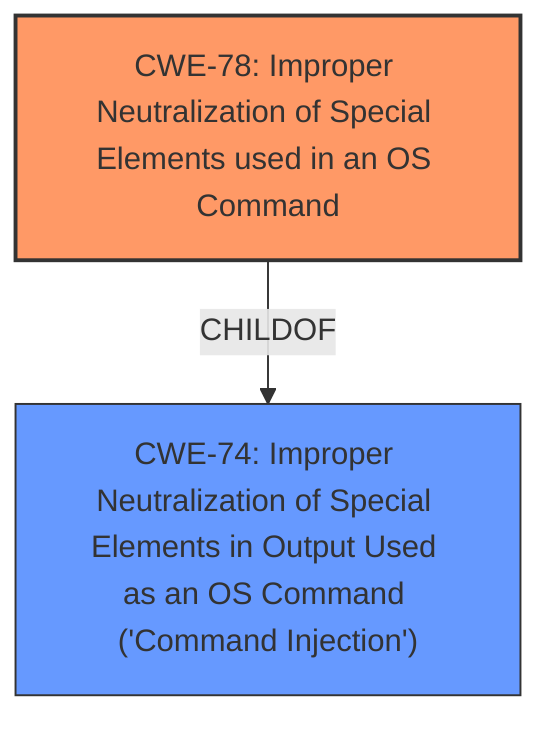

# Analysis Report for CVE-2021-35504

# Vulnerability Analysis Report: CVE-2021-35504

## Description


## Analysis (with Relationship Data)

# Summary
| CWE ID | CWE Name | Confidence | CWE Abstraction Level | CWE Vulnerability Mapping Label | CWE-Vulnerability Mapping Notes |
|---|---|---|---|---|---|
| CWE-78 | Improper Neutralization of Special Elements used in an OS Command ('OS Command Injection') | 1.0 | Base | Allowed | Primary CWE |
| CWE-74 | Improper Neutralization of Special Elements in Output Used as an OS Command ('Command Injection') | 0.8 | Class | Allowed | Secondary Candidate |

## Evidence and Confidence

*   **Confidence Score:** 0.9
*   **Evidence Strength:** HIGH

## Relationship Analysis
The primary relationship influencing my decision is that CWE-78 [Improper Neutralization of Special Elements used in an OS Command] is a child of CWE-74 [Improper Neutralization of Special Elements in Output Used as an OS Command ('Command Injection')]. This indicates that CWE-78 is a more specific type of command injection, focusing on the improper handling of special elements in OS commands. Given the vulnerability description's focus on command injection within the context of an OS command, CWE-78 is the more appropriate and specific choice. The evidence strongly suggests that the vulnerability involves the injection of OS commands, thus the child relationship helps refine the selection.



## Vulnerability Chain
The vulnerability chain starts with the lack of proper input validation, leading to the execution of arbitrary commands.

1.  **Root Cause:** **Insecure** implementation of the `checkFFmpeg` action.
2.  **Weakness:** **Improper** neutralization of special elements in the `path` parameter.
3.  **Impact:** Remote Code Execution.

## Summary of Analysis
The initial assessment pointed towards CWE-74 [Improper Neutralization of Special Elements in Output Used as an OS Command ('Command Injection')] due to the presence of command injection. However, a closer look at the vulnerability details, especially the CVE Reference Links Content Summary, reveals that the vulnerability specifically involves the injection of OS commands via the `path` parameter. Therefore, the more specific CWE-78 [Improper Neutralization of Special Elements used in an OS Command ('OS Command Injection')] is a better fit.

The "CVE Reference Links Content Summary" states: "The `checkFFmpeg` action, intended to verify the FFmpeg installation, allows the injection of arbitrary commands. Specifically the path parameter is not properly sanitized allowing command injection via the pipe operator." This statement directly supports the selection of CWE-78.

The relationship graph influenced the decision by highlighting the parent-child relationship between CWE-74 and CWE-78. While CWE-74 is a broader category, CWE-78 specifically addresses the OS command injection, making it the more accurate and specific classification.

Relevant CWE Information:

# Enhanced Context (25 CWEs)

## CWE-73: External Control of File Name or Path
## CWE-41: Improper Resolution of Path Equivalence
## CWE-59: Improper Link Resolution Before File Access ('Link Following')
## CWE-668: Exposure of Resource to Wrong Sphere
## CWE-552: Files or Directories Accessible to External Parties
## CWE-280: Improper Handling of Insufficient Permissions or Privileges
## CWE-23: Relative Path Traversal
## CWE-267: Privilege Defined With Unsafe Actions
## CWE-274: Improper Handling of Insufficient Privileges
## CWE-266: Incorrect Privilege Assignment
## CWE-22: Improper Limitation of a Pathname to a Restricted Directory ('Path Traversal')
## CWE-184: Incomplete List of Disallowed Inputs
## CWE-95: Improper Neutralization of Directives in Dynamically Evaluated Code ('Eval Injection')
## CWE-125: Out-of-bounds Read
## CWE-190: Integer Overflow or Wraparound
## CWE-78: Improper Neutralization of Special Elements used in an OS Command ('OS Command Injection')
## CWE-434: Unrestricted Upload of File with Dangerous Type
## CWE-98: Improper Control of Filename for Include/Require Statement in PHP Program ('PHP Remote File Inclusion')
## CWE-94: Improper Control of Generation of Code ('Code Injection')
## CWE-22: Improper Limitation of a Pathname to a Restricted Directory ('Path Traversal')
## CWE-190: Integer Overflow or Wraparound
## CWE-170: Improper Null Termination
## CWE-125: Out-of-bounds Read
## CWE-787: Out-of-bounds Write
## CWE-195: Signed to Unsigned Conversion Error

### CWE Selection Details
#### CWE-78: Improper Neutralization of Special Elements used in an OS Command ('OS Command Injection')
*   **Explanation:** The vulnerability description clearly states that the `path` parameter is not properly sanitized, allowing command injection via the pipe operator. This aligns perfectly with CWE-78, which focuses on the improper neutralization of special elements used in an OS command. The attacker can inject arbitrary commands, leading to remote code execution.
*   **Security Implications:** This vulnerability can lead to complete compromise of the server, including data exfiltration, system manipulation, and further attacks.
*   **Relationships:** CWE-78 is a child of CWE-74, indicating that it's a specific type of command injection related to OS commands.
*   **Primary/Secondary:** Primary.
*   **MITRE Mapping Guidance:** The usage is "Allowed," and the rationale states that it's at the Base level of abstraction, which is preferred.
*   **Confidence:** 1.0

#### CWE-74: Improper Neutralization of Special Elements in Output Used as an OS Command ('Command Injection')
*   **Explanation:** CWE-74 is a broader category that covers command injection vulnerabilities. While the vulnerability does involve command injection, CWE-78 is a more specific fit because it directly addresses OS command injection.
*   **Security Implications:** Similar to CWE-78, this can lead to remote code execution and server compromise.
*   **Relationships:** CWE-74 is the parent of CWE-78.
*   **Primary/Secondary:** Secondary.
*   **MITRE Mapping Guidance:** The usage is "Allowed," and it is a Class level of abstraction.
*   **Confidence:** 0.8

#### Other CWEs Considered But Not Used:

*   **CWE-22 [Improper Limitation of a Pathname to a Restricted Directory ('Path Traversal')] and CWE-73 [External Control of File Name or Path]:** These were considered because the vulnerability involves a `path` parameter. However, the core issue isn't path traversal or external control of the file path itself, but rather the ability to inject OS commands through the path.
*   **CWE-95 [Improper Neutralization of Directives in Dynamically Evaluated Code ('Eval Injection')]:** While code execution is the impact, the root cause is not related to dynamic evaluation of code but rather direct OS command injection.
*   **CWE-434 [Unrestricted Upload of File with Dangerous Type]:** This is irrelevant as there is no file upload involved.
*   **CWE-125 [Out-of-bounds Read] and CWE-787 [Out-of-bounds Write]:** This is irrelevant, as the issue is not related to buffer overflows or out-of-bounds access.
*   **CWE-732: Incorrect Permission Assignment for Critical Resource:** The problem isn't the permission assignment, but rather command injection due to missing sanitization of the `path` parameter.


## CWE Relationship Analysis

Current CWEs represent these abstraction levels: .


### Vulnerability Chain Analysis

**Chain starting from CWE-787:**
- 787 (Out-of-bounds Write) - ROOT


**Chain starting from CWE-434:**
- 434 (Unrestricted Upload of File with Dangerous Type) - ROOT


### CWE Relationship Diagram

```mermaid
graph TD
    classDef primary fill:#f96,stroke:#333,stroke-width:2px
    classDef secondary fill:#69f,stroke:#333
    classDef tertiary fill:#9e9,stroke:#333
```


*Report generated on 2025-04-02 09:27:43*
