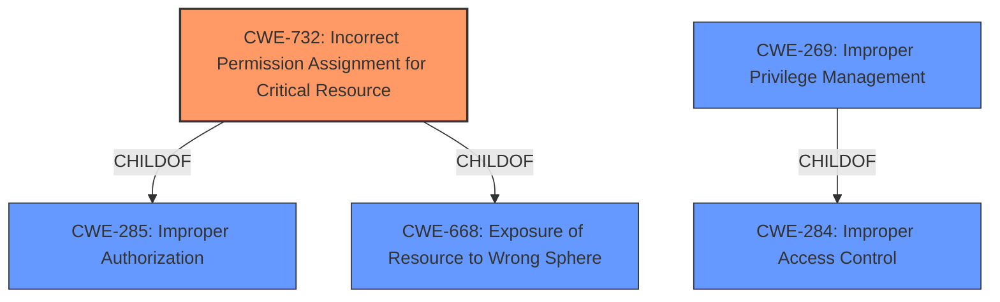

# Analysis Report for CVE-2021-35508

# Vulnerability Analysis Report: CVE-2021-35508

## Description


## Analysis (with Relationship Data)

# Summary
| CWE ID | CWE Name | Confidence | CWE Abstraction Level | CWE Vulnerability Mapping Label | CWE-Vulnerability Mapping Notes |
|---|---|---|---|---|---|
| CWE-732 | Incorrect Permission Assignment for Critical Resource | 0.9 | Class | Allowed-with-Review | Primary CWE |
| CWE-269 | Improper Privilege Management | 0.7 | Class | Discouraged | Secondary Candidate |

## Evidence and Confidence

*   **Confidence Score:** 0.8
*   **Evidence Strength:** HIGH

## Relationship Analysis
The primary CWE is CWE-732 Incorrect Permission Assignment for Critical Resource, a class-level CWE. It is a child of CWE-285 Improper Authorization and CWE-668 Exposure of Resource to Wrong Sphere. CWE-269 Improper Privilege Management is also a class-level CWE and a child of CWE-284 Improper Access Control. The relationships suggest that the vulnerability stems from inadequate control over resource access, but the provided information focuses on the **incorrect assignment** rather than a complete lack of authorization.



## Vulnerability Chain
The chain of events starts with **weak Windows service permissions** (CWE-732). This allows a low-privileged user to **modify the service configuration or overwrite the binary** that the service launches. The final impact is that a low-privileged user can **execute arbitrary code with SYSTEM privileges.**

## Summary of Analysis
The initial assessment focuses on the root cause described in the CVE summary: "Weak Windows service permissions on the service NMSAccess32.exe, allowing low-privileged users to modify the service configuration and overwrite the binary that the service launches." This directly indicates **incorrect permission assignment**, making CWE-732 the most appropriate primary CWE.

The retriever results support this with CWE-732 having the highest score. While CWE-269 Improper Privilege Management is also a candidate, the description of CWE-732 is more precise.

The "CVE Reference Links Content Summary" provides strong evidence: "A low-privileged user can execute arbitrary code with SYSTEM privileges by overwriting the service binary or changing the service binary path to a malicious one." This clearly demonstrates the impact of the **incorrect permissions**.

The evidence strongly supports CWE-732 as the primary weakness, representing the **root cause** of the vulnerability: the **incorrect permission assignment** on the service binary, which then allows privilege escalation.

CWE-732 is at the Class level. According to the mapping guidance for CWE-732, "Closely analyze the specific mistake that is allowing the resource to be exposed, and perform a CWE mapping for that mistake." There isn't a more specific CWE available, so CWE-732 at the Class level is the optimal level of specificity.

Relevant CWE Information:

# Enhanced Context (25 CWEs)

## CWE-59: Improper Link Resolution Before File Access ('Link Following')
**Abstraction Level**: Base
**Similarity Score**: 0.79
**Source**: dense

**Description**:
The product attempts to access a file based on the filename, but it does not properly prevent that filename from identifying a link or shortcut that resolves to an unintended resource.
*Not Used:* This CWE doesn't apply, because there is no mention of symlinks or link resolution in the vulnerability description.

## CWE-367: Time-of-check Time-of-use (TOCTOU) Race Condition
**Abstraction Level**: Base
**Similarity Score**: 0.79
**Source**: dense

**Description**:
The product checks the state of a resource before using that resource, but the resource's state can change between the check and the use in a way that invalidates the results of the check. This can cause the product to perform invalid actions when the resource is in an unexpected state.
*Not Used:* There is no evidence of a race condition.

## CWE-41: Improper Resolution of Path Equivalence
**Abstraction Level**: Base
**Similarity Score**: 0.78
**Source**: dense

**Description**:
The product is vulnerable to file system contents disclosure through path equivalence. Path equivalence involves the use of special characters in file and directory names. The associated manipulations are intended to generate multiple names for the same object.
*Not Used:* This is not relevant as there is no mention of path equivalence or special characters.

## CWE-668: Exposure of Resource to Wrong Sphere
**Abstraction Level**: Class
**Similarity Score**: 0.77
**Source**: dense

**Description**:
The product exposes a resource to the wrong control sphere, providing unintended actors with inappropriate access to the resource.
*Not Used:* While technically applicable, CWE-732 is a more specific child of this CWE and is a better fit.

## CWE-73: External Control of File Name or Path
**Abstraction Level**: Base
**Similarity Score**: 0.77
**Source**: dense

**Description**:
The product allows user input to control or influence paths or file names that are used in filesystem operations.
*Not Used:* This is not relevant as the vulnerability is not due to external control of file paths.

## CWE-427: Uncontrolled Search Path Element
**Abstraction Level**: Base
**Similarity Score**: 0.77
**Source**: dense

**Description**:
The product uses a fixed or controlled search path to find resources, but one or more locations in that path can be under the control of unintended actors.
*Not Used:* There is no evidence that this vulnerability is related to an uncontrolled search path element.

## CWE-23: Relative Path Traversal
**Abstraction Level**: Base
**Similarity Score**: 0.77
**Source**: dense

**Description**:
The product uses external input to construct a pathname that should be within a restricted directory, but it does not properly neutralize sequences such as ".." that can resolve to a location that is outside of that directory.
*Not Used:* This is not relevant as there is no mention of path traversal.

## CWE-404: Improper Resource Shutdown or Release
**Abstraction Level**: Class
**Similarity Score**: 0.77
**Source**: dense

**Description**:
The product does not release or incorrectly releases a resource before it is made available for re-use.
*Not Used:* This is not relevant as there is no mention of resource shutdown or release issues.

## CWE-667: Improper Locking
**Abstraction Level**: Class
**Similarity Score**: 0.77
**Source**: dense

**Description**:
The product does not properly acquire or release a lock on a resource, leading to unexpected resource state changes and behaviors.
*Not Used:* This is not relevant as there is no mention of locking issues.

## CWE-754: Improper Check for Unusual or Exceptional Conditions
**Abstraction Level**: Class
**Similarity Score**: 0.76
**Source**: dense

**Description**:
The product does not check or incorrectly checks for unusual or exceptional conditions that are not expected to occur frequently during day to day operation of the product.
*Not Used:* This is not relevant as there is no mention of checks for unusual conditions.

## CWE-427: Uncontrolled Search Path Element
**Abstraction Level**: Base
**Similarity Score**: 7747.86
**Source**: sparse

**Description**:
The product uses a fixed or controlled search path to find resources, but one or more locations in that path can be under the control of unintended actors.
*Not Used:* There is no evidence that this vulnerability is related to an uncontrolled search path element.

## CWE-59: Improper Link Resolution Before File Access ('Link Following')
**Abstraction Level**: Base
**Similarity Score**: 7074.09
**Source**: sparse

**Description**:
The product attempts to access a file based on the filename, but it does not properly prevent that filename from identifying a link or shortcut that resolves to an unintended resource.
*Not Used:* This CWE doesn't apply, because there is no mention of symlinks or link resolution in the vulnerability description.

## CWE-367: Time-of-check Time-of-use (TOCTOU) Race Condition
**Abstraction Level**: Base
**Similarity Score**: 6856.65
**Source**: sparse

**Description**:
The product checks the


## CWE Relationship Analysis

Current CWEs represent these abstraction levels: .


### Vulnerability Chain Analysis

**Chain starting from CWE-732:**
- 732 (Incorrect Permission Assignment for Critical Resource) - ROOT


**Chain starting from CWE-667:**
- 667 (Improper Locking) - ROOT


### CWE Relationship Diagram

```mermaid
graph TD
    classDef primary fill:#f96,stroke:#333,stroke-width:2px
    classDef secondary fill:#69f,stroke:#333
    classDef tertiary fill:#9e9,stroke:#333
```


*Report generated on 2025-04-02 02:15:28*
