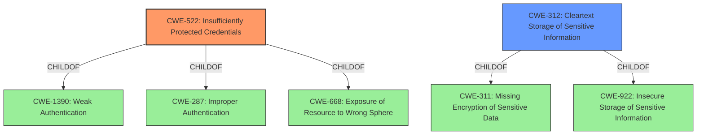

# Analysis for CVE-2021-35529

# Summary
| CWE ID | CWE Name | Confidence | CWE Abstraction Level | CWE Vulnerability Mapping Label | CWE-Vulnerability Mapping Notes |
|---|---|---|---|---|---|
| CWE-522 | Insufficiently Protected Credentials | 1 | Class | Primary | Allowed-with-Review |
| CWE-312 | Cleartext Storage of Sensitive Information | 0.8 | Base | Secondary | Allowed |

## Evidence and Confidence

*   **Confidence Score:** 0.9
*   **Evidence Strength:** HIGH

## Relationship Analysis
The primary CWE is CWE-522, a Class-level weakness describing the general problem of insufficiently protected credentials. CWE-312, a Base-level weakness, specifies a common way that credentials can be insufficiently protected, namely, storing them in cleartext. CWE-522 is a child of CWE-1390 (Weak Authentication), CWE-287 (Improper Authentication) and CWE-668 (Exposure of Resource to Wrong Sphere).

## Vulnerability Chain
The vulnerability chain begins with **insufficiently protected credentials**, which leads to an attacker gaining access to database credentials. This access allows the attacker to shut down the product, access or alter data.
  - The root cause is **Insufficiently Protected Credentials**.
  - The impact is access to database credentials, the ability to shut down the product, and the ability to access or alter data.

## Summary of Analysis
The initial analysis identified **Insufficiently Protected Credentials** as the primary weakness, which aligns with the vulnerability description and the CVE reference. The vulnerability description explicitly states "**Insufficiently Protected Credentials** vulnerability". The CVE reference link confirms this, stating: "Root cause of vulnerability: Insufficiently Protected Credentials. The application stores database credentials in a way that is accessible to an attacker who has gained access to an authorized user's computer" and "Weaknesses/vulnerabilities present: Credentials for the database are not sufficiently protected."

CWE-522 is the primary candidate and the best fit, as it directly addresses the **insufficient protection of credentials**. However, it is a Class-level CWE, and the mapping guidance suggests examining children for a better fit.

CWE-312 (Cleartext Storage of Sensitive Information) is a potential secondary CWE, as it's a common method of **insufficiently protecting credentials**. The CVE description doesn't explicitly mention cleartext storage, but the description "The application stores database credentials in a way that is accessible to an attacker" implies that the credentials might be stored in a way that's easily readable, such as cleartext.

Therefore, CWE-522 is the primary CWE, representing the core weakness, and CWE-312 is a secondary CWE that describes a likely method of **insufficient protection**.

The selection of CWE-522 and CWE-312 is at the optimal level of specificity, given the provided information. While it is possible that other more specific weaknesses could be present, such as weak encryption, the current evidence does not support those classifications.

# Relevant CWE Information:

## CWE-522: Insufficiently Protected Credentials
**Abstraction:** Class
**Status:** Incomplete

### Description
The product transmits or stores authentication credentials, but it uses an insecure method that is susceptible to unauthorized interception and/or retrieval.

### Extended Description
Not provided

### Alternative Terms
None

### Relationships
ChildOf -> CWE-1390
ChildOf -> CWE-287
ChildOf -> CWE-668

### Mapping Guidance
**Usage:** Allowed-with-Review
**Rationale:** This CWE entry is a Class and might have Base-level children that would be more appropriate
**Comments:** Examine children of this entry to see if there is a better fit
**Reasons:**
- Abstraction

### Observed Examples
- **CVE-2022-30018:** A messaging platform serializes all elements of User/Group objects, making private information available to adversaries
- **CVE-2022-29959:** Initialization file contains credentials that can be decoded using a "simple string transformation"
- **CVE-2022-35411:** Python-based RPC framework enables pickle functionality by default, allowing clients to unpickle untrusted data.

## CWE-312: Cleartext Storage of Sensitive Information
**Abstraction:** Base
**Status:** Draft

### Description
The product stores sensitive information in cleartext within a resource that might be accessible to another control sphere.

### Extended Description
Because the information is stored in cleartext (i.e., unencrypted), attackers could potentially read it. Even if the information is encoded in a way that is not human-readable, certain techniques could determine which encoding is being used, then decode the information.
When organizations adopt cloud services, it can be easier for attackers to access the data from anywhere on the Internet.
In some systems/environments such as cloud, the use of "double encryption" (at both the software and hardware layer) might be required, and the developer might be solely responsible for both layers, instead of shared responsibility with the administrator of the broader system/environment.

### Alternative Terms
None

### Relationships
ChildOf -> CWE-311
ChildOf -> CWE-311
ChildOf -> CWE-922

### Mapping Guidance
**Usage:** Allowed
**Rationale:** This CWE entry is at the Base level of abstraction, which is a preferred level of abstraction for mapping to the root causes of vulnerabilities.
**Comments:** Carefully read both the name and description to ensure that this mapping is an appropriate fit. Do not try to 'force' a mapping to a lower-level Base/Variant simply to comply with this preferred level of abstraction.
**Reasons:**
- Acceptable-Use

### Additional Notes
**[Terminology]** Different people use "cleartext" and "plaintext" to mean the same thing: the lack of encryption. However, within cryptography, these have more precise meanings. Plaintext is the information just before it is fed into a cryptographic algorithm, including already-encrypted text. Cleartext is any information that is unencrypted, although it might be in an encoded form that is not easily human-readable (such as base64 encoding).

### Observed Examples
- **CVE-2022-30275:** Remote Terminal Unit (RTU) uses a driver that relies on a password stored in plaintext.
- **CVE-2009-2272:** password and username stored in cleartext in a cookie
- **CVE-2009-1466:** password stored in cleartext in a file with insecure permissions