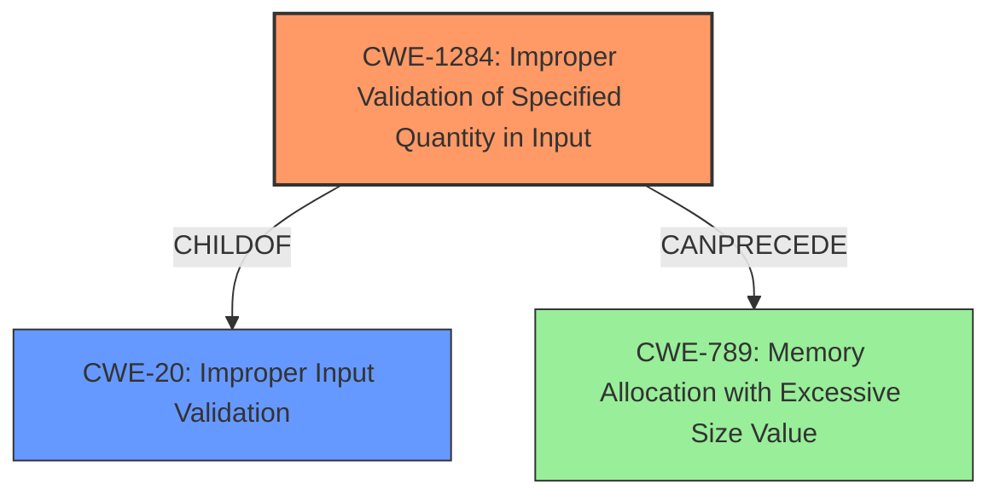

# Raw Analyzer Response for CVE-2021-35533

# Summary
| CWE ID  | CWE Name                                         | Confidence | CWE Abstraction Level | CWE Vulnerability Mapping Label | CWE-Vulnerability Mapping Notes |
| :------- | :----------------------------------------------- | :--------- | :---------------------- | :------------------------------ | :------------------------------ |
| CWE-1284 | Improper Validation of Specified Quantity in Input | 0.85       | Base                    | Primary                       | Allowed                       |
| CWE-20   | Improper Input Validation                        | 0.65       | Class                   | Secondary                     | Discouraged                    |

## Evidence and Confidence

*   **Confidence Score:** 0.8
*   **Evidence Strength:** MEDIUM

## Relationship Analysis
The primary relationship that influenced the selection was the ChildOf relationship between CWE-1284 and CWE-20. Since the vulnerability stems from **improper input validation** related to a specified quantity, CWE-1284 is the more specific and appropriate choice. Although CWE-20 is a parent, it is discouraged for use when more specific options are available. CWE-1284 can precede CWE-789 (Memory Allocation with Excessive Size Value), indicating a potential for resource exhaustion if the improperly validated quantity is related to memory allocation, but the description only indicates reboot.

## Vulnerability Chain
The vulnerability chain starts with the **improper input validation** of a specified quantity, which leads to a specially crafted message causing the RTU500 CMU to reboot.
  - Root Cause: **Improper Input Validation** (CWE-1284)
  - Impact: Reboot (Denial of Service)

## Summary of Analysis
The initial assessment focused on the **improper input validation** aspect of the vulnerability. The description clearly states that the vulnerability lies in the "APDU parser in the Bidirectional Communication Interface (BCI) IEC 60870-5-104 function" due to **improper input validation**. The key phrase "receiving RTU500 CMU of which the BCI is enabled to reboot when receiving a specially crafted message" supports the impact of the vulnerability.

The retriever results indicated several potential CWEs, with CWE-1284 (Improper Validation of Specified Quantity in Input) and CWE-20 (Improper Input Validation) being the most relevant. Given the available information, the decision was made to map the vulnerability to CWE-1284 as the primary CWE because it represents the specific type of **improper input validation** that leads to the vulnerability. CWE-20 is a more general class, and while it applies, CWE-1284 provides a more precise characterization of the flaw.

Evidence from the vulnerability description: "**Improper Input Validation** vulnerability in the APDU parser in the Bidirectional Communication Interface (BCI) IEC 60870-5-104 function of Hitachi Energy RTU500 series allows an attacker to cause the receiving RTU500 CMU of which the BCI is enabled to reboot when receiving a specially crafted message."

The selection of CWE-1284 is at the optimal level of specificity because it directly addresses the root cause, which is the **improper validation** of a "specified quantity" within the input, leading to a reboot.

Relevant CWE Information:

# Enhanced Context (25 CWEs)

## CWE-1284: Improper Validation of Specified Quantity in Input
**CWE-1284: Improper Validation of Specified Quantity in Input** is the primary CWE. The product receives input that is expected to specify a quantity, but it does not validate or incorrectly validates that the quantity has the required properties. The vulnerability description indicates that a specially crafted message leads to a reboot, implying that a quantity within the message is not properly validated, leading to the crash.
   - How the vulnerability's details match the CWE's characteristics: The RTU500 CMU reboots upon receiving a specially crafted message, indicating that a specific quantity within the message (e.g., length, size, or number of operations) is not properly validated, triggering the vulnerability.
   - The security implications and potential impact: The security implication is a denial-of-service (DoS) condition, as the attacker can cause the RTU500 CMU to reboot.
   - Any parent-child relationships or chain patterns that influenced your mapping: CWE-1284 is a child of CWE-20 (Improper Input Validation).
   - Whether the weakness is primary or secondary in the vulnerability: The weakness is primary.
   - How the official MITRE mapping guidance influenced your decision: The MITRE mapping guidance allows the usage of CWE-1284, as it is at the Base level of abstraction.

## CWE-20: Improper Input Validation
**CWE-20: Improper Input Validation** was considered but not used as the primary because CWE-1284 is more specific. CWE-20 is a class-level CWE, and while it broadly applies to the vulnerability, it lacks the specificity of CWE-1284. The vulnerability description highlights **improper input validation**, but it is the "specified quantity" aspect that is the root cause.
   - How the vulnerability's details match the CWE's characteristics: The Hitachi Energy RTU500 series CMU reboots due to **improper input validation** in the APDU parser.
   - The security implications and potential impact: The security implication is a denial-of-service (DoS) condition, as the attacker can cause the RTU500 CMU to reboot.
   - Any parent-child relationships or chain patterns that influenced your mapping: CWE-20 is a parent of CWE-1284.
   - Whether the weakness is primary or secondary in the vulnerability: The weakness is secondary.
   - How the official MITRE mapping guidance influenced your decision: The MITRE mapping guidance discourages the usage of CWE-20 when lower-level CWEs are available.

Other CWEs Considered:
- CWE-274: Improper Handling of Insufficient Privileges - This was not selected because the vulnerability does not relate to privileges.
- CWE-347: Improper Verification of Cryptographic Signature - This was not selected because the vulnerability does not relate to cryptographic signatures.
- CWE-287: Improper Authentication - This was not selected because the vulnerability does not relate to authentication.
- CWE-291: Reliance on IP Address for Authentication - This was not selected because the vulnerability does not relate to authentication.
- CWE-613: Insufficient Session Expiration - This was not selected because the vulnerability does not relate to session management.
- CWE-400: Uncontrolled Resource Consumption - This was not selected because the description specifies reboot, not just resource consumption.
- CWE-1285: Improper Validation of Specified Index, Position, or Offset in Input - This was considered but not selected as the description specified "specially crafted message" implying quantities were not validated.
- CWE-306: Missing Authentication for Critical Function - This was not selected because the vulnerability does not relate to authentication.