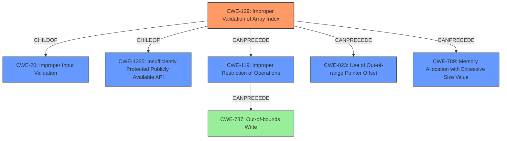

# Enhanced Analysis for CVE-2021-35594

# Summary
| CWE ID | CWE Name | Confidence | CWE Abstraction Level | CWE Vulnerability Mapping Label | CWE-Vulnerability Mapping Notes |
|---|---|---|---|---|---|
| CWE-129 | Improper Validation of Array Index | 0.8 | Variant | Allowed | Primary CWE |
| CWE-787 | Out-of-bounds Write | 0.6 | Base | Allowed | Secondary Candidate |

## Evidence and Confidence

*   **Confidence Score:** 0.7
*   **Evidence Strength:** MEDIUM

## Relationship Analysis
The primary CWE is CWE-129 (Improper Validation of Array Index), a variant of CWE-20 (Improper Input Validation) and CWE-1285 (Insufficiently Protected Publicly Available API). It can precede CWE-119 (Improper Restriction of Operations within the Bounds of a Memory Buffer), CWE-823 (Use of Out-of-range Pointer Offset), and CWE-789 (Memory Allocation with Excessive Size Value). CWE-787 (Out-of-bounds Write) is considered a secondary candidate as it is a common consequence of CWE-129.



## Vulnerability Chain
The vulnerability chain starts with the **improper validation of user-supplied data** (CWE-129) which results in a write past the end of an array, leading to a potential out-of-bounds write (CWE-787), and finally code execution in the context of the service account.

## Summary of Analysis
The analysis indicates that the root cause of the vulnerability lies in the **improper validation of user-supplied data**, specifically how it relates to array indices within the Oracle MySQL Cluster. The "CVE Reference Links Content Summary" states: "Root cause: Improper validation of user-supplied data within the processing of Data Node jobs in Oracle MySQL Cluster." and "Weaknesses: The issue results from the lack of proper validation of user-supplied data, which can result in a write past the end of an array."

The primary CWE match from the provided data is CWE-NVD-noinfo. However, this is not a true CWE, and more specific CWEs should be identified. The "Top CWEs" list includes CWE-129 (Improper Validation of Array Index) and CWE-787 (Out-of-bounds Write). The retriever results also list CWE-129 as the top result.

CWE-129 is chosen as the primary CWE because the root cause is the lack of proper validation of the array index. The description of CWE-129 precisely matches this: "The product uses untrusted input when calculating or using an array index, but the product does not validate or incorrectly validates the index to ensure the index references a valid position within the array." The mapping guidance for CWE-129 indicates "Usage: Allowed" and "Rationale: This CWE entry is at the Variant level of abstraction, which is a preferred level of abstraction for mapping to the root causes of vulnerabilities."

CWE-787 is a potential consequence of CWE-129 and is listed as a secondary candidate.

Other CWEs were considered but ultimately deemed less appropriate:

*   CWE-285 (Improper Authorization), CWE-287 (Improper Authentication), and CWE-306 (Missing Authentication for Critical Function) were considered since the vulnerability involves access control; however, the root cause is not a failure in authentication or authorization mechanisms, but the improper validation of input that leads to memory corruption.
*   CWE-89 (Improper Neutralization of Special Elements used in an SQL Command ('SQL Injection')) was considered, but the vulnerability is not related to SQL injection.

The selected CWEs are at the optimal level of specificity, with CWE-129 being a Variant that directly addresses the **improper validation** issue and CWE-787 being a common result of that vulnerability.

Relevant CWE Information:

# Enhanced Context (25 CWEs)
The following CWEs were identified as potentially relevant to this vulnerability:

## CWE-280: Improper Handling of Insufficient Permissions or Privileges
**Abstraction Level**: Base
**Similarity Score**: 0.78
**Source**: dense

**Description**:
The product does not handle or incorrectly handles when it has insufficient privileges to access resources or functionality as specified by their permissions. This may cause it to follow unexpected code paths that may leave the product in an invalid state.

**Mapping Guidance**:
- Usage: Allowed
- Rationale: This CWE entry is at the Base level of abstraction, which is a preferred level of abstraction for mapping to the root causes of vulnerabilities.

## CWE-274: Improper Handling of Insufficient Privileges
**Abstraction Level**: Base
**Similarity Score**: 0.78
**Source**: dense

**Description**:
The product does not handle or incorrectly handles when it has insufficient privileges to perform an operation, leading to resultant weaknesses.

**Mapping Guidance**:
- Usage: Discouraged
- Rationale: This CWE entry could be deprecated in a future version of CWE.

## CWE-266: Incorrect Privilege Assignment
**Abstraction Level**: Base
**Similarity Score**: 0.77
**Source**: dense

**Description**:
A product incorrectly assigns a privilege to a particular actor, creating an unintended sphere of control for that actor.

**Mapping Guidance**:
- Usage: Allowed
- Rationale: This CWE entry is at the Base level of abstraction, which is a preferred level of abstraction for mapping to the root causes of vulnerabilities.

## CWE-303: Incorrect Implementation of Authentication Algorithm
**Abstraction Level**: Base
**Similarity Score**: 0.77
**Source**: dense

**Description**:
The requirements for the product dictate the use of an established authentication algorithm, but the implementation of the algorithm is incorrect.

**Mapping Guidance**:
- Usage: Allowed
- Rationale: This CWE entry is at the Base level of abstraction, which is a preferred level of abstraction for mapping to the root causes of vulnerabilities.

## CWE-807: Reliance on Untrusted Inputs in a Security Decision
**Abstraction Level**: Base
**Similarity Score**: 0.77
**Source**: dense

**Description**:
The product uses a protection mechanism that relies on the existence or values of an input, but the input can be modified by an untrusted actor in a way that bypasses the protection mechanism.

**Mapping Guidance**:
- Usage: Allowed
- Rationale: This CWE entry is at the Base level of abstraction, which is a preferred level of abstraction for mapping to the root causes of vulnerabilities.

## CWE-267: Privilege Defined With Unsafe Actions
**Abstraction Level**: Base
**Similarity Score**: 0.77
**Source**: dense

**Description**:
A particular privilege, role, capability, or right can be used to perform unsafe actions that were not intended, even when it is assigned to the correct entity.

**Mapping Guidance**:
- Usage: Allowed
- Rationale: This CWE entry is at the Base level of abstraction, which is a preferred level of abstraction for mapping to the root causes of vulnerabilities.

## CWE-639: Authorization Bypass Through User-Controlled Key
**Abstraction Level**: Base
**Similarity Score**: 0.77
**Source**: dense

**Description**:
The system's authorization functionality does not prevent one user from gaining access to another user's data or record by modifying the key value identifying the data.

**Mapping Guidance**:
- Usage: Allowed
- Rationale: This CWE entry is at the Base level of abstraction, which is a preferred level of abstraction for mapping to the root causes of vulnerabilities.

## CWE-668: Exposure of Resource to Wrong Sphere
**Abstraction Level**: Class
**Similarity Score**: 0.76
**Source**:


## CWE Relationship Analysis

Current CWEs represent these abstraction levels: .


### Vulnerability Chain Analysis

**Chain starting from CWE-787:**
- 787 (Out-of-bounds Write) - ROOT


**Chain starting from CWE-266:**
- 266 (Incorrect Privilege Assignment) - ROOT


### CWE Relationship Diagram

```mermaid
graph TD
    classDef primary fill:#f96,stroke:#333,stroke-width:2px
    classDef secondary fill:#69f,stroke:#333
    classDef tertiary fill:#9e9,stroke:#333
```