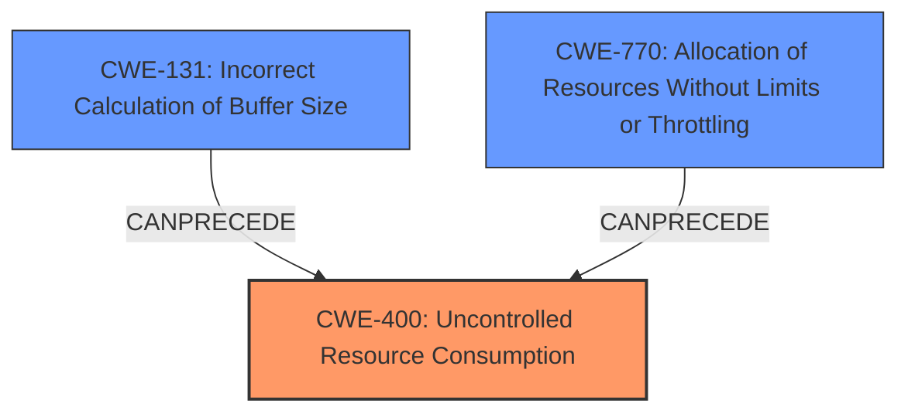

# Analysis for CVE-2021-35611

# Summary
| CWE ID | CWE Name | Confidence | CWE Abstraction Level | CWE Vulnerability Mapping Label | CWE-Vulnerability Mapping Notes |
|---|---|---|---|---|---|
| CWE-400 | Uncontrolled Resource Consumption | 0.9 | Base | Allowed | Primary CWE - The vulnerability leads to memory exhaustion, which is a form of uncontrolled resource consumption. |

## Evidence and Confidence

*   **Confidence Score:** 0.9
*   **Evidence Strength:** HIGH

## Relationship Analysis
The primary relationship that influenced the decision was the parent-child relationship between CWE-400 and its potential causes or related weaknesses. While other CWEs like CWE-131 (Incorrect Calculation of Buffer Size) or CWE-770 (Allocation of Resources Without Limits or Throttling) could be contributing factors, the description and CVE summary primarily indicate the impact of resource consumption without explicit mention of those root causes. Therefore, selecting the base CWE-400 accurately reflects the core issue.

## Vulnerability Chain
The chain of events for this vulnerability starts with the **lack of proper validation** of the `Content-Length` HTTP header. This **improper input validation** then leads to a memory exhaustion condition, resulting in a denial-of-service.

CWE-400 represents the final impact in this chain:

1.  **Root Cause:** Lack of Input Validation
2.  **Weakness:** Memory Exhaustion
3.  **Impact:** Denial of Service

## Summary of Analysis
The analysis is primarily based on the provided CVE Reference Links Content Summary. The key phrase is: "The vulnerability stems from a **lack of proper validation** of user-supplied data within the processing of the `Content-Length` HTTP header. This inadequate validation leads to a memory exhaustion condition."

Given this evidence, CWE-400 (Uncontrolled Resource Consumption) is the most appropriate CWE. The description explicitly mentions memory exhaustion, which directly falls under the umbrella of uncontrolled resource consumption.

Other CWEs considered but not chosen:

*   CWE-131 (Incorrect Calculation of Buffer Size): While a possibility, the description doesn't explicitly mention incorrect size calculation, only memory exhaustion.
*   CWE-129 (Improper Validation of Array Index): Not relevant as there's no mention of array indices.
*   CWE-200 (Exposure of Sensitive Information to an Unauthorized Actor): Not relevant as the vulnerability leads to denial of service, not information exposure.
*   CWE-306 (Missing Authentication for Critical Function): Authentication is required, so this is not the primary issue.
*   CWE-611 (Improper Restriction of XML External Entity Reference): Not relevant as the vulnerability is not related to XML External Entities.
*   CWE-790 (Improper Filtering of Special Elements): While improper filtering might be a contributing factor, the primary impact is resource consumption, making CWE-400 a better fit.

CWE-400 is at the appropriate level of specificity because it directly addresses the core issue of uncontrolled resource consumption leading to a denial of service.