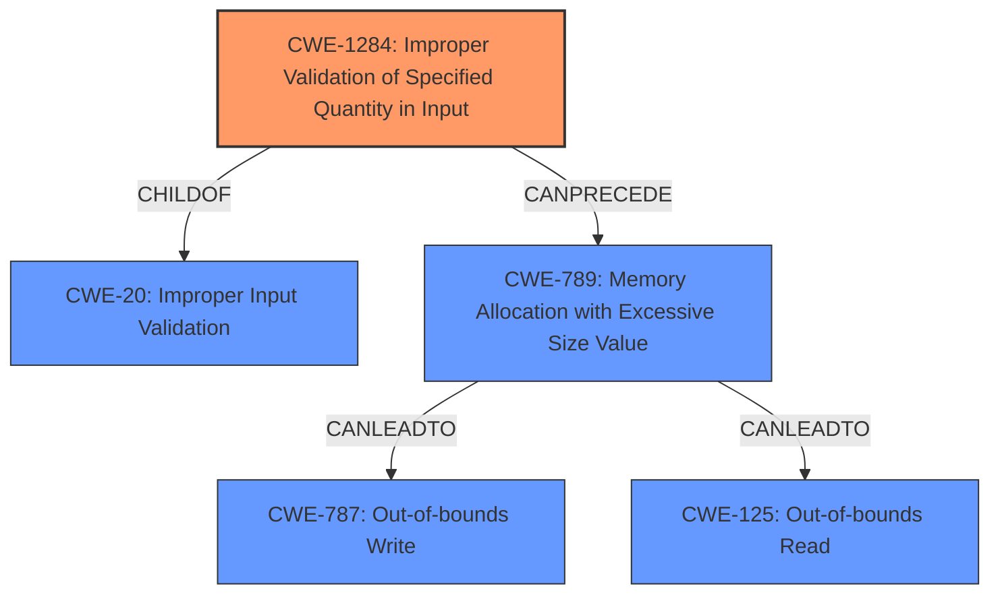

# Analysis for CVE-2021-3570

# Summary
| CWE ID | CWE Name | Confidence | CWE Abstraction Level | CWE Vulnerability Mapping Label | CWE-Vulnerability Mapping Notes |
|---|---|---|---|---|---|
| CWE-1284 | Improper Validation of Specified Quantity in Input | 0.9 | Base | Allowed | Primary CWE |
| CWE-787 | Out-of-bounds Write | 0.7 | Base | Allowed | Secondary Candidate |
| CWE-125 | Out-of-bounds Read | 0.6 | Base | Allowed | Secondary Candidate |

## Evidence and Confidence

*   **Confidence Score:** 0.8
*   **Evidence Strength:** HIGH

## Relationship Analysis
The primary CWE, CWE-1284, is a child of CWE-20 (Improper Input Validation), indicating that the **missing length check** is a specific case of failing to validate input. CWE-1284 can precede CWE-789 (Memory Allocation with Excessive Size Value), which can lead to out-of-bounds write (CWE-787) or read (CWE-125). The relationship analysis shows a chain of events starting from **improper validation** leading to potential buffer overflows.

## Vulnerability Chain
The vulnerability chain starts with the **missing length check** (CWE-1284) in the PTP message, potentially leading to excessive memory allocation (CWE-789), and eventually resulting in an out-of-bounds write (CWE-787) or out-of-bounds read (CWE-125). The impact includes information leak, crash, and potential remote code execution.

## Summary of Analysis
The initial analysis identified **missing length check** as the primary weakness. The retriever results and vulnerability description support this. The final decision is based on the evidence from the vulnerability description and CVE reference, which clearly states a **missing length check** that allows an attacker to cause a denial of service, information leak, or potentially remote code execution. The selected CWEs are at the optimal level of specificity, as they accurately represent the root cause and potential consequences of the vulnerability.

"A flaw was found in the ptp4l program of the linuxptp package. A **missing length check** when forwarding a PTP message between ports allows a remote attacker to cause an information leak, crash, or potentially remote code execution."

"The `messageLength` field from a received PTP message is used without proper validation, leading to potential buffer overflows."

*   **CWE-1284: Improper Validation of Specified Quantity in Input**: This is the primary CWE because the root cause is a **missing length check** which falls under the category of improper validation of a specified quantity (the length of the message). The vulnerability description explicitly mentions the **missing length check**, making this the most direct and accurate mapping.
*   **CWE-787: Out-of-bounds Write**: This is a secondary CWE because the **missing length check** can lead to a buffer overflow, resulting in an out-of-bounds write. The CVE reference summary mentions potential buffer overflows due to the lack of validation of the `messageLength` field.
*   **CWE-125: Out-of-bounds Read**: This is a secondary CWE because the **missing length check** can also potentially lead to an out-of-bounds read.

CWEs considered but not used:

*   CWE-119: Improper Restriction of Operations within the Bounds of a Memory Buffer: This is a more general CWE, and the evidence supports more specific CWEs like CWE-787 and CWE-125. Also, its usage is discouraged.
*   CWE-20: Improper Input Validation: While the root cause is indeed related to input validation, CWE-1284 is a more specific and appropriate choice as it directly addresses the validation of a specified quantity.
*   CWE-190: Integer Overflow or Wraparound: While possible, there is no direct evidence to suggest integer overflow is involved.
*   CWE-401: Missing Release of Memory after Effective Lifetime: This CWE is not relevant as the vulnerability is related to improper input validation and buffer overflows, not memory leaks.
*   CWE-754: Improper Check for Unusual or Exceptional Conditions: This is a more general class of errors, and the specific issue is the **missing length check**, making CWE-1284 a better fit.
*   CWE-825: Expired Pointer Dereference: Not relevant as the vulnerability is related to buffer overflows, not pointer issues.
*   CWE-789: Memory Allocation with Excessive Size Value: There is no direct evidence to suggest excessive size value.