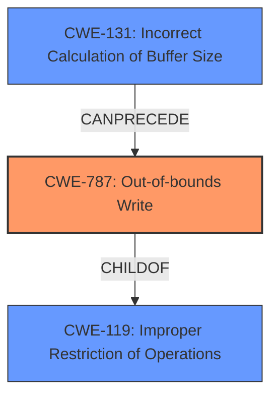

# Analysis for CVE-2021-3571

# Summary
| CWE ID    | CWE Name                                                         | Confidence | CWE Abstraction Level | CWE Vulnerability Mapping Label | CWE-Vulnerability Mapping Notes |
| :-------- | :--------------------------------------------------------------- | :--------- | :---------------------- | :------------------------------ | :------------------------------ |
| CWE-787   | Out-of-bounds Write                                              | 0.9        | Base                    | Primary CWE                     | Allowed                       |
| CWE-131 | Incorrect Calculation of Buffer Size | 0.8 | Base | Secondary Candidate | Allowed |

## Evidence and Confidence

*   **Confidence Score:** 0.85
*   **Evidence Strength:** HIGH

## Relationship Analysis
The primary weakness is CWE-787 (Out-of-bounds Write), which occurs due to an incorrect length calculation (CWE-131). CWE-787 is a child of CWE-119 (Improper Restriction of Operations within the Bounds of a Memory Buffer), but CWE-787 is more specific and provides better detail about the vulnerability. CWE-131 leads to the out-of-bounds write.

## Vulnerability Chain
The vulnerability chain starts with **incorrect length calculation** (CWE-131), which then leads to an **out-of-bounds write** (CWE-787). The impact is an information leak or crash.

## Summary of Analysis
The analysis is based on the provided evidence, specifically the "CVE Reference Links Content Summary" section. Multiple sources clearly state that the root cause is an **improper length calculation** leading to an **out-of-bounds write**.

The vulnerability occurs when the `ptp4l` program, operating as a PTP transparent clock on a little-endian architecture, generates a follow-up message with an **incorrect length**, causing it to write past the message buffer. This is a classic case of CWE-787 (Out-of-bounds Write) because the program writes data beyond the intended buffer boundary. The **incorrect length calculation** is a clear indicator of CWE-131.

The selected CWEs are at the optimal level of specificity because they directly address the root cause (**incorrect length calculation**) and the immediate consequence (**out-of-bounds write**).

Relevant CWE Information:

# Enhanced Context (25 CWEs)
The following CWEs were identified as potentially relevant to this vulnerability:

## CWE-404: Improper Resource Shutdown or Release
**Abstraction Level**: Class
**Similarity Score**: 0.79

## CWE-824: Access of Uninitialized Pointer
**Abstraction Level**: Base
**Similarity Score**: 0.79

## CWE-667: Improper Locking
**Abstraction Level**: Class
**Similarity Score**: 0.79

## CWE-226: Sensitive Information in Resource Not Removed Before Reuse
**Abstraction Level**: Base
**Similarity Score**: 0.79

## CWE-131: Incorrect Calculation of Buffer Size
**Abstraction Level**: Base
**Similarity Score**: 0.79

## CWE-125: Out-of-bounds Read
**Abstraction Level**: Base
**Similarity Score**: 0.78

## CWE-754: Improper Check for Unusual or Exceptional Conditions
**Abstraction Level**: Class
**Similarity Score**: 0.78

## CWE-823: Use of Out-of-range Pointer Offset
**Abstraction Level**: Base
**Similarity Score**: 0.77

## CWE-191: Integer Underflow (Wrap or Wraparound)
**Abstraction Level**: Base
**Similarity Score**: 0.77

## CWE-909: Missing Initialization of Resource
**Abstraction Level**: Class
**Similarity Score**: 0.77

## CWE-125: Out-of-bounds Read
**Abstraction Level**: Base
**Similarity Score**: 7170.30

## CWE-823: Use of Out-of-range Pointer Offset
**Abstraction Level**: Base
**Similarity Score**: 6892.11

## CWE-190: Integer Overflow or Wraparound
**Abstraction Level**: Base
**Similarity Score**: 6844.55

## CWE-119: Improper Restriction of Operations within the Bounds of a Memory Buffer
**Abstraction Level**: Class
**Similarity Score**: 6815.08

## CWE-1284: Improper Validation of Specified Quantity in Input
**Abstraction Level**: Base
**Similarity Score**: 6788.43

## CWE-787: Out-of-bounds Write
**Abstraction Level**: base
**Similarity Score**: 4.33

## CWE-190: Integer Overflow or Wraparound
**Abstraction Level**: base
**Similarity Score**: 4.33

## CWE-770: Allocation of Resources Without Limits or Throttling
**Abstraction Level**: base
**Similarity Score**: 4.33

## CWE-1284: Improper Validation of Specified Quantity in Input
**Abstraction Level**: base
**Similarity Score**: 4.33

## CWE-617: Reachable Assertion
**Abstraction Level**: base
**Similarity Score**: 3.89

## CWE-416: Use After Free
**Abstraction Level**: variant
**Similarity Score**: 3.75

## CWE-123: Write-what-where Condition
**Abstraction Level**: base
**Similarity Score**: 3.36

## CWE-1325: Improperly Controlled Sequential Memory Allocation
**Abstraction Level**: Base
**Similarity Score**: 3.32

## CWE-789: Memory Allocation with Excessive Size Value
**Abstraction Level**: Variant
**Similarity Score**: 3.02

## CWE-824: Access of Uninitialized Pointer
**Abstraction Level**: Base
**Similarity Score**: 2.91

**CWE Justifications:**

*   **CWE-787 (Out-of-bounds Write):** This is the primary weakness. The vulnerability involves writing data beyond the intended buffer boundary due to an **incorrect length calculation**.
    *   Evidence: "When `ptp4l` operates as a PTP transparent clock on a little-endian architecture, it generates a follow-up message with an **incorrect length** when forwarding a one-step sync message, leading to an **out-of-bounds write**." (from CVE Reference Links Content Summary)
    *   Confidence: 0.9
*   **CWE-131 (Incorrect Calculation of Buffer Size):** This is a secondary weakness that precedes CWE-787. The **improper length calculation** is the root cause of the out-of-bounds write.
    *   Evidence: "The linuxptp package had a flaw where the **length** of a one-step follow-up message in a transparent clock was **calculated incorrectly**." (from CVE Reference Links Content Summary)
    *   Confidence: 0.8

**CWE Considerations (Not Used and Why):**

*   **CWE-119 (Improper Restriction of Operations within the Bounds of a Memory Buffer):** While this is a parent of CWE-787, it's too general. CWE-787 provides a more specific description of the vulnerability.
*   **CWE-125 (Out-of-bounds Read):** The vulnerability is primarily about writing out of bounds, not reading.
*   **CWE-401 (Missing Release of Memory after Effective Lifetime):** There is no evidence of a memory leak in the description.
*   **CWE-362 (Concurrent Execution using Shared Resource with Improper Synchronization ('Race Condition')):** There is no indication of concurrent execution or race conditions in the provided information.
*   **CWE-789 (Memory Allocation with Excessive Size Value):** The issue is not related to excessive memory allocation but rather writing beyond buffer boundaries due to **incorrect length calculation**.
*   **CWE-824 (Access of Uninitialized Pointer):** There is no mention of uninitialized pointers in the description.
*   **CWE-121 (Stack-based Buffer Overflow):** While the crash may be related to a stack overflow, the description does not mention where the buffer is located. We only know it is an out-of-bounds write due to an incorrect length calculation.
*   **CWE-823 (Use of Out-of-range Pointer Offset):** The out-of-bounds write is due to an incorrect calculation