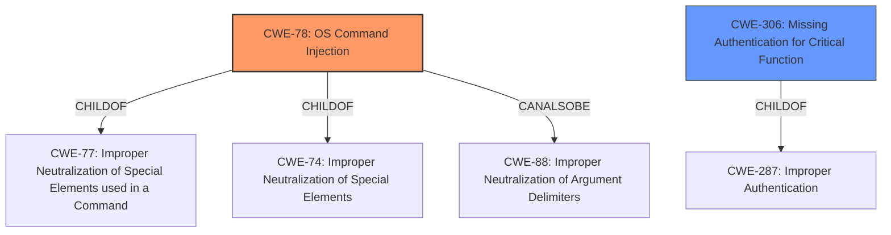

# Analysis for CVE-2021-3577

# Summary
| CWE ID | CWE Name | Confidence | CWE Abstraction Level | CWE Vulnerability Mapping Label | CWE-Vulnerability Mapping Notes |
|---|---|---|---|---|---|
| CWE-78 | Improper Neutralization of Special Elements used in an OS Command ('OS Command Injection') | 0.8 | Base | Primary | Allowed |
| CWE-306 | Missing Authentication for Critical Function | 0.6 | Base | Secondary | Allowed |

## Evidence and Confidence

*   **Confidence Score:** 0.7
*   **Evidence Strength:** MEDIUM

## Relationship Analysis
The primary CWE is CWE-78 (**Improper Neutralization of Special Elements used in an OS Command ('OS Command Injection')**), which is a base-level CWE. CWE-78 is a child of CWE-77 (**Improper Neutralization of Special Elements used in a Command**) and CWE-74 (**Improper Neutralization of Special Elements in Output Used by a Downstream Component ('Injection')**). It can also be related to CWE-88 (**Improper Neutralization of Argument Delimiters in a Command ('Argument Injection')**).
The secondary CWE is CWE-306 (**Missing Authentication for Critical Function**), a base-level CWE and a child of CWE-287 (**Improper Authentication**).

## Vulnerability Chain
The vulnerability chain starts with missing authentication (CWE-306), which then allows an attacker to inject OS commands (CWE-78), leading to remote code execution.

## Summary of Analysis
The initial analysis strongly points to CWE-78 (**Improper Neutralization of Special Elements used in an OS Command ('OS Command Injection')**) as the primary weakness, given the description of remote code execution and the ability for an attacker to gain unauthorized access. However, the fact that this is unauthenticated points to a missing authentication issue, CWE-306 (**Missing Authentication for Critical Function**).

The evidence for CWE-78 is based on the "Root cause of vulnerability: An unauthenticated remote code execution vulnerability exists in the Binatone Hubble Cameras." and "Weaknesses/vulnerabilities present: Unauthenticated remote code execution.". The evidence for CWE-306 is based on the phrase "unauthenticated remote code execution".

Other CWEs were considered but deemed less appropriate. CWE-94 (**Improper Control of Generation of Code ('Code Injection')**) was considered because of the remote code execution, but the description doesn't fit as well as CWE-78. CWE-287 (**Improper Authentication**) is too high-level; CWE-306 (**Missing Authentication for Critical Function**) is more specific. CWE-321 (**Use of Hard-coded Cryptographic Key**) and CWE-522 (**Insufficiently Protected Credentials**) do not fit the description. CWE-424 (**Improper Protection of Alternate Path**) and CWE-1299 (**Missing Protection Mechanism for Alternate Hardware Interface**) are not strongly supported by the description. CWE-532 (**Insertion of Sensitive Information into Log File**) is irrelevant. CWE-285 (**Improper Authorization**) is too general.

The final decision is to map CWE-78 as the primary CWE since it explains the mechanism of code execution, and CWE-306 as a secondary CWE since the vulnerability is unauthenticated. These CWEs are at the optimal level of specificity, being base-level CWEs.

Relevant CWE Information:

# Enhanced Context (25 CWEs)

## CWE-807: Reliance on Untrusted Inputs in a Security Decision
**Abstraction Level**: Base
**Similarity Score**: 0.77
**Source**: dense

**Description**:
The product uses a protection mechanism that relies on the existence or values of an input, but the input can be modified by an untrusted actor in a way that bypasses the protection mechanism.

**Mapping Guidance**:
- Usage: Allowed
- Rationale: This CWE entry is at the Base level of abstraction, which is a preferred level of abstraction for mapping to the root causes of vulnerabilities.

## CWE-280: Improper Handling of Insufficient Permissions or Privileges
**Abstraction Level**: Base
**Similarity Score**: 0.77
**Source**: dense

**Description**:
The product does not handle or incorrectly handles when it has insufficient privileges to access resources or functionality as specified by their permissions. This may cause it to follow unexpected code paths that may leave the product in an invalid state.

**Mapping Guidance**:
- Usage: Allowed
- Rationale: This CWE entry is at the Base level of abstraction, which is a preferred level of abstraction for mapping to the root causes of vulnerabilities.

## CWE-1220: Insufficient Granularity of Access Control
**Abstraction Level**: Base
**Similarity Score**: 0.77
**Source**: dense

**Description**:
The product implements access controls via a policy or other feature with the intention to disable or restrict accesses (reads and/or writes) to assets in a system from untrusted agents. However, implemented access controls lack required granularity, which renders the control policy too broad because it allows accesses from unauthorized agents to the security-sensitive assets.

**Mapping Guidance**:
- Usage: Allowed
- Rationale: This CWE entry is at the Base level of abstraction, which is a preferred level of abstraction for mapping to the root causes of vulnerabilities.

## CWE-274: Improper Handling of Insufficient Privileges
**Abstraction Level**: Base
**Similarity Score**: 0.76
**Source**: dense

**Description**:
The product does not handle or incorrectly handles when it has insufficient privileges to perform an operation, leading to resultant weaknesses.

**Mapping Guidance**:
- Usage: Discouraged
- Rationale: This CWE entry could be deprecated in a future version of CWE.

## CWE-345: Insufficient Verification of Data Authenticity
**Abstraction Level**: Class
**Similarity Score**: 0.76
**Source**: dense

**Description**:
The product does not sufficiently verify the origin or authenticity of data, in a way that causes it to accept invalid data.

**Mapping Guidance**:
- Usage: Discouraged
- Rationale: This CWE entry is a level-1 Class (i.e., a child of a Pillar). It might have lower-level children that would be more appropriate

## CWE-303: Incorrect Implementation of Authentication Algorithm
**Abstraction Level**: Base
**Similarity Score**: 0.76
**Source**: dense

**Description**:
The requirements for the product dictate the use of an established authentication algorithm, but the implementation of the algorithm is incorrect.

**Mapping Guidance**:
- Usage: Allowed
- Rationale: This CWE entry is at the Base level of abstraction, which is a preferred level of abstraction for mapping to the root causes of vulnerabilities.

## CWE-653: Improper Isolation or Compartmentalization
**Abstraction Level**: Class
**Similarity Score**: 0.76
**Source**: dense

**Description**:
The product does not properly compartmentalize or isolate functionality, processes, or resources that require different privilege levels, rights, or permissions.

**Mapping Guidance**:
- Usage: Allowed
- Rationale: This CWE entry is at the Base level of abstraction, which is a preferred level of abstraction for mapping to the root causes of vulnerabilities.

## CWE-1391: Use of Weak Credentials
**Abstraction Level**: Class
**Similarity Score**: 0.76
**Source**: dense

**Description**:
The product uses weak credentials (such as a default key or hard-coded password) that can be calculated, derived, reused, or guessed by an attacker.

**Mapping Guidance**:
- Usage: Allowed-with-Review
- Rationale: This CWE entry is a Class and might have Base-level children that would be more appropriate

## CWE-74: Improper Neutralization of Special Elements in Output Used by a Downstream Component ('Injection')
**Abstraction Level**: Class
**Similarity Score**: 0.76
**Source**: dense

**Description**:
The product constructs all or part of a command, data structure, or record using externally-influenced input from an upstream component, but it does not neutralize or incorrectly neutralizes special elements that could modify how it is parsed or interpreted when it is sent to a downstream component.

**Mapping Guidance**:
- Usage: Discouraged
- Rationale: CWE-74 is high