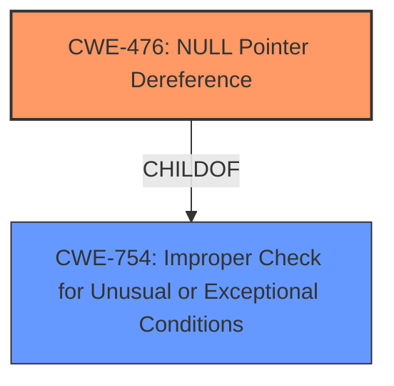

# Analysis for CVE-2021-3580

# Summary
| CWE ID | CWE Name | Confidence | CWE Abstraction Level | CWE Vulnerability Mapping Label | CWE-Vulnerability Mapping Notes |
|---|---|---|---|---|---|
| CWE-476 | NULL Pointer Dereference | 0.8 | Base | Allowed | Primary CWE |
| CWE-754 | Improper Check for Unusual or Exceptional Conditions | 0.6 | Class | Allowed | Secondary Candidate |

## Evidence and Confidence

*   **Confidence Score:** 0.8
*   **Evidence Strength:** HIGH

## Relationship Analysis
The primary relationship influencing the decision is the ChildOf relationship between CWE-476 and CWE-754. The vulnerability results in a crash due to the **improper handling** of a specially crafted ciphertext, eventually leading to a NULL pointer dereference. CWE-754, being a parent Class, is a broader category. The more specific Base CWE-476 accurately captures the actual mechanism of the crash.



## Vulnerability Chain
The chain of events is as follows:
1.  A specially crafted ciphertext is provided as input.
2.  The RSA decryption functions in Nettle **fail to properly handle** this ciphertext.
3.  This leads to a NULL pointer dereference, causing an application crash and denial of service.

The root cause is the **improper handling** of the ciphertext during RSA decryption, and the impact is the NULL pointer dereference which leads to the crash.

## Summary of Analysis
The initial assessment pointed towards a range of potential CWEs related to buffer overflows and integer handling due to the manipulated ciphertext. However, after a thorough review of the vulnerability description and, more importantly, the "CVE Reference Links Content Summary," the root cause was identified as a **failure to properly handle** specially crafted ciphertext, leading to a NULL pointer dereference. This aligns directly with CWE-476.

Evidence:
*   "The root cause of the vulnerability is a flaw in how Nettle's RSA decryption functions handle specially crafted ciphertext."
*   "The vulnerability lies in the **improper handling** of specific ciphertexts during RSA decryption."
*   "An attacker could use this flaw to provide a manipulated ciphertext leading to application crash and denial of service."
*   "A remote attacker can cause a crash in RSA decryption functions by supplying specially crafted ciphertext."

The selection of CWE-476 is based on the fact that the vulnerability ultimately results in the product dereferencing a pointer that it expects to be valid but is NULL. This is the direct cause of the application crash. The related content highlights the vulnerability stemming from **improper handling** of crafted ciphertexts. While other CWEs like those related to buffer overflows could be indirectly related, they are not the direct cause of the crash as documented.

CWE-754 was considered as a broader classification, since **improper handling** of a crafted ciphertext could be considered an "Improper Check for Unusual or Exceptional Conditions". However, CWE-476 provides more specificity and is a better fit given the available information.

Relevant CWE Information:

# Enhanced Context (25 CWEs)

## CWE-191: Integer Underflow (Wrap or Wraparound)
**Abstraction Level**: Base
**Similarity Score**: 0.79
**Source**: dense

**Description**:
The product subtracts one value from another, such that the result is less than the minimum allowable integer value, which produces a value that is not equal to the correct result.

**Mapping Guidance**:
- Usage: Allowed
- Rationale: This CWE entry is at the Base level of abstraction, which is a preferred level of abstraction for mapping to the root causes of vulnerabilities.

## CWE-197: Numeric Truncation Error
**Abstraction Level**: Base
**Similarity Score**: 0.77
**Source**: dense

**Description**:
Truncation errors occur when a primitive is cast to a primitive of a smaller size and data is lost in the conversion.

**Mapping Guidance**:
- Usage: Allowed
- Rationale: This CWE entry is at the Base level of abstraction, which is a preferred level of abstraction for mapping to the root causes of vulnerabilities.

## CWE-190: Integer Overflow or Wraparound
**Abstraction Level**: Base
**Similarity Score**: 0.76
**Source**: dense

**Description**:
The product performs a calculation that can
         produce an integer overflow or wraparound when the logic
         assumes that the resulting value will always be larger than
         the original value. This occurs when an integer value is
         incremented to a value that is too large to store in the
         associated representation. When this occurs, the value may
         become a very small or negative number.

**Mapping Guidance**:
- Usage: Allowed
- Rationale: This CWE entry is at the Base level of abstraction, which is a preferred level of abstraction for mapping to the root causes of vulnerabilities.

## CWE-131: Incorrect Calculation of Buffer Size
**Abstraction Level**: Base
**Similarity Score**: 0.76
**Source**: dense

**Description**:
The product does not correctly calculate the size to be used when allocating a buffer, which could lead to a buffer overflow.

**Mapping Guidance**:
- Usage: Allowed
- Rationale: This CWE entry is at the Base level of abstraction, which is a preferred level of abstraction for mapping to the root causes of vulnerabilities.

## CWE-681: Incorrect Conversion between Numeric Types
**Abstraction Level**: Base
**Similarity Score**: 0.75
**Source**: dense

**Description**:
When converting from one data type to another, such as long to integer, data can be omitted or translated in a way that produces unexpected values. If the resulting values are used in a sensitive context, then dangerous behaviors may occur.

**Mapping Guidance**:
- Usage: Allowed
- Rationale: This CWE entry is at the Base level of abstraction, which is a preferred level of abstraction for mapping to the root causes of vulnerabilities.

## CWE-680: Integer Overflow to Buffer Overflow
**Abstraction Level**: Compound
**Similarity Score**: 0.75
**Source**: dense

**Description**:
The product performs a calculation to determine how much memory to allocate, but an integer overflow can occur that causes less memory to be allocated than expected, leading to a buffer overflow.

**Mapping Guidance**:
- Usage: Discouraged
- Rationale: This CWE entry is a named chain, which combines multiple weaknesses.

## CWE-124: Buffer Underwrite ('Buffer Underflow')
**Abstraction Level**: Base
**Similarity Score**: 0.75
**Source**: dense

**Description**:
The product writes to a buffer using an index or pointer that references a memory location prior to the beginning of the buffer.

**Mapping Guidance**:
- Usage: Allowed
- Rationale: This CWE entry is at the Base level of abstraction, which is a preferred level of abstraction for mapping to the root causes of vulnerabilities.

## CWE-125: Out-of-bounds Read
**Abstraction Level**: Base
**Similarity Score**: 0.75
**Source**: dense

**Description**:
The product reads data past the end, or before the beginning, of the intended buffer.

**Mapping Guidance**:
- Usage: Allowed
- Rationale: This CWE entry is at the Base level of abstraction, which is a preferred level of abstraction for mapping to the root causes of vulnerabilities.

## CWE-789: Memory Allocation with Excessive Size Value
**Abstraction Level**: Variant
**Similarity Score**: 0.74
**Source**: dense

**Description**:
The product allocates memory based on an untrusted, large size value, but it does not ensure that the size is within expected limits, allowing arbitrary amounts of memory to be allocated.

**Mapping Guidance**:
- Usage: Allowed
- Rationale: This CWE entry is at the Variant level of abstraction, which is a preferred level of abstraction for mapping to the root causes of vulnerabilities.

## CWE-126: Buffer Over-read
**Abstraction Level**: Variant
**Similarity Score**: 0.74
**Source**: dense

**Description**:
The product reads from a buffer using buffer access mechanisms such as indexes or pointers that reference memory locations after the targeted buffer.

**Mapping Guidance**:
- Usage: Allowed
- Rationale: This CWE entry is at the Variant level of abstraction, which is a preferred level of abstraction for mapping to the root causes of vulnerabilities.

## CWE-190: Integer Overflow or Wraparound
**Abstraction Level**: Base
**Similarity Score**: 8171.02
**Source**: sparse

**Description**:
The product performs a calculation that can
         produce an integer overflow or wraparound when the logic
         assumes that the resulting value will always be larger than
         the original value. This occurs when an integer value is
         incremented to a value that is too large to store in the

# Enhanced Query for CVE-2021-3580

## Vulnerability Description
A flaw was found in the way nettles RSA decryption functions handled specially crafted ciphertext. An attacker could use this flaw to provide a manipulated ciphertext leading to application crash and denial of service.

### Vulnerability Description Key Phrases
- **impact:** application crash and denial of service
- **vector:** specially crafted ciphertext
- **attacker:** attacker
- **product:** nettles
- **component:** RSA decryption functions

## CVE Reference Links Content Summary
```json
{
  "CVE_data": {
    "Primary_content": {
      "related_to_CVE": true,
      "response": "The provided content pertains to CVE-2021-3580, detailing a denial-of-service vulnerability in the Nettle library, which affects some NetApp products.",
      "information": {
        "root_cause": "The root cause of the vulnerability is a flaw in how Nettle's RSA decryption functions handle specially crafted ciphertext.",
        "weaknesses": [
          "The vulnerability lies in the improper handling of specific ciphertexts during RSA decryption.",
        ],
        "impact": "Successful exploitation could lead to a denial-of-service (DoS) condition, causing affected applications to crash.",
         "attack_vectors": [
          "The attack vector is network-based. An attacker can send specially crafted ciphertext.",
        ],
        "attacker_capabilities": "The attacker requires no special privileges, position or user interaction and can perform the attack remotely."
      }
    },
     "Secondary_content": [
    {
      "related_to_CVE": true,
      "response": "This content provides information about the vulnerability, affected NetApp products, and remediation, and also includes a Gentoo Security Advisory related to CVE-2021-3580.",
      "information": {
         "root_cause": "The vulnerability stems from a flaw in the way Nettle's RSA decryption functions handle specially crafted ciphertexts.",
        "weaknesses": [
          "Improper handling of specially crafted ciphertexts within Nettle's RSA decryption functions.",
           "A flaw in the way nettle's RSA decryption functions handled specially crafted ciphertext."
        ],
        "impact": "Successful exploitation can lead to application crashes and denial-of-service (DoS).",
        "attack_vectors": [
          "Attackers can exploit this vulnerability by providing manipulated ciphertexts.",
           "Remote exploitation is possible"
        ],
         "attacker_capabilities": "An attacker can remotely exploit this vulnerability to cause a denial of service. No specific attacker privileges or user interaction is required.",
          "additional_details": "The vulnerability is present in Nettle versions prior to 3.7.3. NetApp is aware of public discussions regarding this vulnerability. The affected NetApp products include NetApp Cloud Backup and ONTAP Select Deploy administration utility. There are no workarounds currently known. The remediation is to upgrade to the specified version. NetApp has provided links for obtaining software fixes from the NetApp Support website."
      }
    },
      {
      "related_to_CVE": true,
      "response": "This content is a Gentoo Security Advisory regarding CVE-2021-3580 and another CVE affecting Nettle.",
       "information":{
          "root_cause": "The vulnerability lies in how Nettle's RSA decryption functions process specially crafted ciphertexts.",
         "weaknesses": [
           "Specially crafted ciphertext can cause a crash",
            "Improper handling of RSA decryption of manipulated ciphertext"
          ],
         "impact": "An attacker can manipulate the ciphertext, leading to application crashes and denial of service.",
        "attack_vectors": [
          "A remote attacker can provide manipulated ciphertext"
        ],
         "attacker_capabilities":"An attacker can remotely exploit this vulnerability to cause a denial of service. No specific attacker privileges or user interaction is required."
       }
    },
      {
      "related_to_CVE": true,
      "response": "This content provides a list of NetApp security advisories, including one for CVE-2021-3580. However, this entry is only present in a listing of advisories and does not provide specific details.",
        "information": {
        "root_cause": "N/A",
         "weaknesses": [
          "N/A"
        ],
          "impact":"N/A",
        "attack_vectors": [
          "N/A"
        ],
        "attacker_capabilities":"N/A"
      }
    },
      {
      "related_to_CVE": false,
      "response": "This content is unrelated to CVE-2021-3580. It provides general information about security resources from NetApp, focusing on various products and solutions, but does not mention the specific CVE.",
       "information":{
          "root_cause": "N/A",
         "weaknesses": [
           "N/A"
          ],
         "impact": "N/A",
        "attack_vectors": [
          "N/A"
         ],
        "attacker_capabilities":"N/A"
       }
    },
      {
      "related_to_CVE": false,
      "response": "This content is unrelated to CVE-2021-3580. It is a Red Hat login page and does not contain any vulnerability information.",
       "information":{
           "root_cause": "N/A",
        "weaknesses": [
          "N/A"
        ],
          "impact":"N/A",
        "attack_vectors": [
          "N/A"
        ],
        "attacker_capabilities":"N/A"
      }
    },
      {
      "related_to_CVE": false,
      "response": "This content is a general Red Hat Customer Portal page and is not related to CVE-2021-3580. It provides links to different Red Hat resources but does not contain specific vulnerability information.",
       "information": {
           "root_cause": "N/A",
        "weaknesses": [
          "N/A"
        ],
          "impact":"N/A",
        "attack_vectors": [
          "N/A"
        ],
        "attacker_capabilities":"N/A"
      }
    },
    {
     "related_to_CVE": true,
      "response": "This content is a Debian LTS advisory related to CVE-2021-3580 and CVE-2021-20305, providing information on the vulnerabilities discovered in the `nettle` package.",
       "information": {
          "root_cause": "The root cause of the vulnerability is a flaw in how nettle handles specially crafted ciphertexts during RSA decryption.",
         "weaknesses": [
           "Vulnerabilities in how nettle's RSA decryption functions handle specially crafted ciphertext.",
          "Failure to perform proper input sanitization resulting in remote crash."
          ],
         "impact": "The impact of exploitation is a denial of service (remote crash in RSA decryption).",
        "attack_vectors": [
           "A remote attacker can cause a crash in RSA decryption functions by supplying specially crafted ciphertext."
         ],
        "attacker_capabilities":"A remote attacker can trigger a denial-of-service condition by providing manipulated ciphertext. No specific attacker privileges or user interaction is required."
       }
    },
  {
      "related_to_CVE": false,
      "response": "This content is a NetApp page for product security resources. It lists various security resources such as data sheets, hardening guides, and threat-related resources. It does not provide specific details for CVE-2021-3580.",
      "information":{
           "root_cause": "N/A",
        "weaknesses": [
          "N/A"
        ],
          "impact":"N/A",
        "attack_vectors": [
          "N/A"
        ],
        "attacker_capabilities":"N/A"
      }
    },
    {
      "related_to_CVE": false,
      "response":"This content is a Red Hat login page and does not contain any vulnerability information.",
       "information":{
           "root_cause": "N/A",
        "weaknesses": [
          "N/A"
        ],
          "impact":"N/A",
        "attack_vectors": [
          "N/A"
        ],
        "attacker_capabilities":"N/A"
       }
    },
  {
      "related_to_CVE": false,
      "response": "This content is a Red Hat Customer Portal page and does not contain specific vulnerability information. Instead it provides navigation links to various products, documentation, and security resources.",
        "information":{
            "root_cause": "N/A",
        "weaknesses": [
           "N/A"
          ],
          "impact":"N/A",
        "attack_vectors": [
          "N/A"
        ],
        "attacker_capabilities":"N/A"
       }
    },
      {
    "related_to_CVE": true,
      "response": "This content is a NetApp advisory for CVE-2021-3580 and provides details of the vulnerability, affected products, and remediation steps.",
     "information": {
          "root_cause": "The root cause of this vulnerability is in how Nettle's RSA decryption functions handle specially crafted ciphertexts.",
          "weaknesses": [
          "The weakness is in the Nettle library's RSA decryption, which does not properly handle specific types of ciphertexts, leading to a crash.",
          "Improper input validation of ciphertexts in the RSA decryption process"
        ],
          "impact":"The impact of the vulnerability is a denial of service due to a crash.",
          "attack_vectors": [
             "The vulnerability can be exploited remotely by sending manipulated ciphertexts."
        ],
          "attacker_capabilities": "A remote, unauthenticated attacker can trigger a denial-of-service condition by sending a manipulated ciphertext. No specific attacker privileges or user interaction is required.",
         "additional_details": "The advisory lists affected NetApp products, including NetApp Cloud Backup and ONTAP Select Deploy administration utility, and those not affected. A fix is available for ONTAP Select Deploy administration utility. NetApp Cloud Backup (formerly AltaVault) has been moved to a 'Won't Fix' status."
     }
     },
     {
      "related_to_CVE": false,
      "response": "This Red Hat Bugzilla entry is related to CVE-2021-3580 but does not provide technical details about the vulnerability itself. The entry is a tracking issue for Red Hat's internal handling of the vulnerability and its resolution in their products.",
     "information": {
           "root_cause": "N/A",
        "weaknesses": [
          "N/A"
        ],
          "impact":"N/A",
        "attack_vectors": [
          "N/A"
        ],
        "attacker_capabilities":"N/A"
      }
    },
    {
       "related_to_CVE": false,
      "response": "This content is a NetApp Product Security page that links to various security resources. There is no specific mention of CVE-2021-3580 on this page.",
      "information":{
        "root_cause": "N/A",
        "weaknesses": [
          "N/A"
        ],
        "impact":"N/A",
        "attack_vectors": [
          "N/A"
         ],
        "attacker_capabilities":"N/A"
      }
    },
  {
    "related_to_CVE": true,
      "response": "This content contains a commit message from the Nettle project, where the fix for CVE-2021-3580 was made.",
      "information": {
           "root_cause": "The root cause was a consistency issue with _rsa_sec_compute_root, and a bug with zero input.",
           "weaknesses": [
            "Inconsistent input size handling with _rsa_sec_compute_root",
             "Bug with zero-input"
             ],
             "impact":"N/A",
        "attack_vectors": [
          "N/A"
         ],
        "attacker_capabilities":"N/A",
            "additional_details": "This commit fixes the identified bug by modifying the _rsa_sec_compute_root_tr function to take a fix input size, which improves consistency and addresses the zero-input issue."
         }
    },
  {
      "related_to_CVE": true,
      "response": "This content contains a commit message from the Nettle project, where the fix for CVE-2021-3580 was made.",
     "information": {
          "root_cause": "The root cause of the vulnerability is a lack of input validation in rsa_decrypt family of functions",
         "weaknesses": [
          "Missing input check in rsa_decrypt family of functions"
          ],
          "impact":"N/A",
          "attack_vectors": [
          "N/A"
         ],
          "attacker_capabilities":"N/A",
          "additional_details":"This commit adds input validation to the rsa_decrypt family of functions, addressing the vulnerability."
         }
     },
    {
    "related_to_CVE": false,
       "response": "This content is a Red Hat advisory that does contain a fix for CVE-2021-3580 in gnutls and nettle, but the text is not included here. The content lists products affected, which implies that the CVE is relevant to those products.",
       "information": {
           "root_cause": "N/A",
          "weaknesses": [
            "N/A"
           ],
           "impact": "N/A",
          "attack_vectors": [
            "N/A"
         ],
          "attacker_capabilities":"N/A",
          "additional_details": "This document is an advisory describing how Red Hat has resolved CVE-2021-3580 along with other CVEs in gnutls and nettle libraries. It also includes the affected products, and a link to apply the updates."
       }
     },
  {
        "related_to_CVE": false,
      "response": "This content is a Red Hat Customer Portal page and does not contain specific vulnerability information. Instead it provides navigation links to various products, documentation, and security resources.",
      "information":{
            "root_cause": "N/A",
        "weaknesses": [
           "N/A"
         ],
          "impact":"N/A",
        "attack_vectors": [
         "N/A"
         ],
          "attacker_capabilities":"N/A"
      }
    }

  ]
  }
}
```

## Retriever Results

### Top Combined Results

| Rank | CWE ID | Name | Abstraction | Usage  | Retrievers | Individual Scores |
|------|--------|------|-------------|-------|------------|-------------------|
| 1 | 203 | Observable Discrepancy | Base | Allowed | sparse | 0.079 |
| 2 | 119 | Improper Restriction of Operations within the Bounds of a Memory Buffer | Class | Discouraged | sparse | 0.069 |
| 3 | 125 | Out-of-bounds Read | Base | Allowed | sparse | 0.069 |
| 4 | 787 | Out-of-bounds Write | Base | Allowed | sparse | 0.068 |
| 5 | 121 | Stack-based Buffer Overflow | Variant | Allowed | sparse | 0.066 |
| 6 | 476 | NULL Pointer Dereference | Base | Allowed | dense | 0.559 |
| 7 | 822 | Untrusted Pointer Dereference | Base | Allowed | graph | 0.003 |
| 8 | 835 | Loop with Unreachable Exit Condition ('Infinite Loop') | Base | Allowed | sparse | 0.066 |
| 9 | 415 | Double Free | Variant | Allowed | sparse | 0.066 |
| 10 | 190 | Integer Overflow or Wraparound | Base | Allowed | sparse | 0.066 |


# Complete CWE Specifications


## CWE-203: Observable Discrepancy
**Abstraction:** Base
**Status:** Incomplete

### Description
The product behaves differently or sends different responses under different circumstances in a way that is observable to an unauthorized actor, which exposes security-relevant information about the state of the product, such as whether a particular operation was successful or not.

### Extended Description
Discrepancies can take many forms, and variations may be detectable in timing, control flow, communications such as replies or requests, or general behavior. These discrepancies can reveal information about the product's operation or internal state to an unauthorized actor. In some cases, discrepancies can be used by attackers to form a side channel.

### Alternative Terms
Side Channel Attack: Observable Discrepancies are at the root of side channel attacks.

### Relationships
ChildOf -> CWE-200
ChildOf -> CWE-200

### Mapping Guidance
**Usage:** Allowed
**Rationale:** This CWE entry is at the Base level of abstraction, which is a preferred level of abstraction for mapping to the root causes of vulnerabilities.
**Comments:** Carefully read both the name and description to ensure that this mapping is an appropriate fit. Do not try to 'force' a mapping to a lower-level Base/Variant simply to comply with this preferred level of abstraction.
**Reasons:**
- Acceptable-Use


### Observed Examples
- **CVE-2020-8695:** Observable discrepancy in the RAPL interface for some Intel processors allows information disclosure.
- **CVE-2019-14353:** Crypto hardware wallet's power consumption relates to total number of pixels illuminated, creating a side channel in the USB connection that allows attackers to determine secrets displayed such as PIN numbers and passwords
- **CVE-2019-10071:** Java-oriented framework compares HMAC signatures using String.equals() instead of a constant-time algorithm, causing timing discrepancies


## CWE-119: Improper Restriction of Operations within the Bounds of a Memory Buffer
**Abstraction:** Class
**Status:** Stable

### Description
The product performs operations on a memory buffer, but it reads from or writes to a memory location outside the buffer's intended boundary. This may result in read or write operations on unexpected memory locations that could be linked to other variables, data structures, or internal program data.

### Extended Description
Not provided

### Alternative Terms
Buffer Overflow: This term has many different meanings to different audiences. From a CWE mapping perspective, this term should be avoided where possible. Some researchers, developers, and tools intend for it to mean "write past the end of a buffer," whereas others use the same term to mean "any read or write outside the boundaries of a buffer, whether before the beginning of the buffer or after the end of the buffer." Others could mean "any action after the end of a buffer, whether it is a read or write." Since the term is commonly used for exploitation and for vulnerabilities, it further confuses things.
buffer overrun: Some prominent vendors and researchers use the term "buffer overrun," but most people use "buffer overflow." See the alternate term for "buffer overflow" for context.
memory safety: Generally used for techniques that avoid weaknesses related to memory access, such as those identified by CWE-119 and its descendants. However, the term is not formal, and there is likely disagreement between practitioners as to which weaknesses are implicitly covered by the "memory safety" term.

### Relationships
ChildOf -> CWE-118
ChildOf -> CWE-20

### Mapping Guidance
**Usage:** Discouraged
**Rationale:** CWE-119 is commonly misused in low-information vulnerability reports when lower-level CWEs could be used instead, or when more details about the vulnerability are available.
**Comments:** Look at CWE-119's children and consider mapping to CWEs such as CWE-787: Out-of-bounds Write, CWE-125: Out-of-bounds Read, or others.
**Reasons:**
- Frequent Misuse


### Additional Notes
**[Applicable Platform]** 

It is possible in any programming languages without memory management support to attempt an operation outside of the bounds of a memory buffer, but the consequences will vary widely depending on the language, platform, and chip architecture.


### Observed Examples
- **CVE-2021-22991:** Incorrect URI normalization in application traffic product leads to buffer overflow, as exploited in the wild per CISA KEV.
- **CVE-2020-29557:** Buffer overflow in Wi-Fi router web interface, as exploited in the wild per CISA KEV.
- **CVE-2009-2550:** Classic stack-based buffer overflow in media player using a long entry in a playlist


## CWE-125: Out-of-bounds Read
**Abstraction:** Base
**Status:** Draft

### Description
The product reads data past the end, or before the beginning, of the intended buffer.

### Extended Description
Not provided

### Alternative Terms
OOB read: Shorthand for "Out of bounds" read

### Relationships
ChildOf -> CWE-119
ChildOf -> CWE-119
ChildOf -> CWE-119
ChildOf -> CWE-119

### Mapping Guidance
**Usage:** Allowed
**Rationale:** This CWE entry is at the Base level of abstraction, which is a preferred level of abstraction for mapping to the root causes of vulnerabilities.
**Comments:** Carefully read both the name and description to ensure that this mapping is an appropriate fit. Do not try to 'force' a mapping to a lower-level Base/Variant simply to comply with this preferred level of abstraction.
**Reasons:**
- Acceptable-Use


### Observed Examples
- **CVE-2023-1018:** The reference implementation code for a Trusted Platform Module does not implement length checks on data, allowing for an attacker to read 2 bytes past the end of a buffer.
- **CVE-2020-11899:** Out-of-bounds read in IP stack used in embedded systems, as exploited in the wild per CISA KEV.
- **CVE-2014-0160:** Chain: "Heartbleed" bug receives an inconsistent length parameter (CWE-130) enabling an out-of-bounds read (CWE-126), returning memory that could include private cryptographic keys and other sensitive data.


## CWE-787: Out-of-bounds Write
**Abstraction:** Base
**Status:** Draft

### Description
The product writes data past the end, or before the beginning, of the intended buffer.

### Extended Description
Not provided

### Alternative Terms
Memory Corruption: Often used to describe the consequences of writing to memory outside the bounds of a buffer, or to memory that is otherwise invalid.

### Relationships
ChildOf -> CWE-119
ChildOf -> CWE-119
ChildOf -> CWE-119
ChildOf -> CWE-119

### Mapping Guidance
**Usage:** Allowed
**Rationale:** This CWE entry is at the Base level of abstraction, which is a preferred level of abstraction for mapping to the root causes of vulnerabilities.
**Comments:** Carefully read both the name and description to ensure that this mapping is an appropriate fit. Do not try to 'force' a mapping to a lower-level Base/Variant simply to comply with this preferred level of abstraction.
**Reasons:**
- Acceptable-Use


### Observed Examples
- **CVE-2023-1017:** The reference implementation code for a Trusted Platform Module does not implement length checks on data, allowing for an attacker to write 2 bytes past the end of a buffer.
- **CVE-2021-21220:** Chain: insufficient input validation (CWE-20) in browser allows heap corruption (CWE-787), as exploited in the wild per CISA KEV.
- **CVE-2021-28664:** GPU kernel driver allows memory corruption because a user can obtain read/write access to read-only pages, as exploited in the wild per CISA KEV.


## CWE-121: Stack-based Buffer Overflow
**Abstraction:** Variant
**Status:** Draft

### Description
A stack-based buffer overflow condition is a condition where the buffer being overwritten is allocated on the stack (i.e., is a local variable or, rarely, a parameter to a function).

### Extended Description
Not provided

### Alternative Terms
Stack Overflow: "Stack Overflow" is often used to mean the same thing as stack-based buffer overflow, however it is also used on occasion to mean stack exhaustion, usually a result from an excessively recursive function call. Due to the ambiguity of the term, use of stack overflow to describe either circumstance is discouraged.

### Relationships
ChildOf -> CWE-788
ChildOf -> CWE-787

### Mapping Guidance
**Usage:** Allowed
**Rationale:** This CWE entry is at the Variant level of abstraction, which is a preferred level of abstraction for mapping to the root causes of vulnerabilities.
**Comments:** Carefully read both the name and description to ensure that this mapping is an appropriate fit. Do not try to 'force' a mapping to a lower-level Base/Variant simply to comply with this preferred level of abstraction.
**Reasons:**
- Acceptable-Use


### Additional Notes
**[Other]** Stack-based buffer overflows can instantiate in return address overwrites, stack pointer overwrites or frame pointer overwrites. They can also be considered function pointer overwrites, array indexer overwrites or write-what-where condition, etc.


### Observed Examples
- **CVE-2021-35395:** Stack-based buffer overflows in SFK for wifi chipset used for IoT/embedded devices, as exploited in the wild per CISA KEV.


## CWE-476: NULL Pointer Dereference
**Abstraction:** Base
**Status:** Stable

### Description
The product dereferences a pointer that it expects to be valid but is NULL.

### Extended Description
Not provided

### Alternative Terms
NPD: Common abbreviation for Null Pointer Dereference
null deref: Common abbreviation for Null Pointer Dereference
NPE: Common abbreviation for Null Pointer Exception
nil pointer dereference: used for access of nil in Go programs

### Relationships
ChildOf -> CWE-710
ChildOf -> CWE-754
ChildOf -> CWE-754

### Mapping Guidance
**Usage:** Allowed
**Rationale:** This CWE entry is at the Base level of abstraction, which is a preferred level of abstraction for mapping to the root causes of vulnerabilities.
**Comments:** Carefully read both the name and description to ensure that this mapping is an appropriate fit. Do not try to 'force' a mapping to a lower-level Base/Variant simply to comply with this preferred level of abstraction.
**Reasons:**
- Acceptable-Use


### Observed Examples
- **CVE-2005-3274:** race condition causes a table to be corrupted if a timer activates while it is being modified, leading to resultant NULL dereference; also involves locking.
- **CVE-2002-1912:** large number of packets leads to NULL dereference
- **CVE-2005-0772:** packet with invalid error status value triggers NULL dereference


## CWE-822: Untrusted Pointer Dereference
**Abstraction:** Base
**Status:** Incomplete

### Description
The product obtains a value from an untrusted source, converts this value to a pointer, and dereferences the resulting pointer.

### Extended Description


An attacker can supply a pointer for memory locations that the product is not expecting. If the pointer is dereferenced for a write operation, the attack might allow modification of critical state variables, cause a crash, or execute code. If the dereferencing operation is for a read, then the attack might allow reading of sensitive data, cause a crash, or set a variable to an unexpected value (since the value will be read from an unexpected memory location).


There are several variants of this weakness, including but not necessarily limited to:


  - The untrusted value is directly invoked as a function call.

  - In OS kernels or drivers where there is a boundary between "userland" and privileged memory spaces, an untrusted pointer might enter through an API or system call (see CWE-781 for one such example).

  - Inadvertently accepting the value from an untrusted control sphere when it did not have to be accepted as input at all. This might occur when the code was originally developed to be run by a single user in a non-networked environment, and the code is then ported to or otherwise exposed to a networked environment.


### Alternative Terms
None

### Relationships
ChildOf -> CWE-119
ChildOf -> CWE-119
ChildOf -> CWE-119
CanPrecede -> CWE-125
CanPrecede -> CWE-787

### Mapping Guidance
**Usage:** Allowed
**Rationale:** This CWE entry is at the Base level of abstraction, which is a preferred level of abstraction for mapping to the root causes of vulnerabilities.
**Comments:** Carefully read both the name and description to ensure that this mapping is an appropriate fit. Do not try to 'force' a mapping to a lower-level Base/Variant simply to comply with this preferred level of abstraction.
**Reasons:**
- Acceptable-Use


### Additional Notes
**[Maintenance]** There are close relationships between incorrect pointer dereferences and other weaknesses related to buffer operations. There may not be sufficient community agreement regarding these relationships. Further study is needed to determine when these relationships are chains, composites, perspective/layering, or other types of relationships. As of September 2010, most of the relationships are being captured as chains.

**[Terminology]** Many weaknesses related to pointer dereferences fall under the general term of "memory corruption" or "memory safety." As of September 2010, there is no commonly-used terminology that covers the lower-level variants.


### Observed Examples
- **CVE-2007-5655:** message-passing framework interprets values in packets as pointers, causing a crash.
- **CVE-2010-2299:** labeled as a "type confusion" issue, also referred to as a "stale pointer." However, the bug ID says "contents are simply interpreted as a pointer... renderer ordinarily doesn't supply this pointer directly". The "handle" in the untrusted area is replaced in one function, but not another - thus also, effectively, exposure to wrong sphere (CWE-668).
- **CVE-2009-1719:** Untrusted dereference using undocumented constructor.


## CWE-835: Loop with Unreachable Exit Condition ('Infinite Loop')
**Abstraction:** Base
**Status:** Incomplete

### Description
The product contains an iteration or loop with an exit condition that cannot be reached, i.e., an infinite loop.

### Extended Description
Not provided

### Alternative Terms
None

### Relationships
ChildOf -> CWE-834
ChildOf -> CWE-834

### Mapping Guidance
**Usage:** Allowed
**Rationale:** This CWE entry is at the Base level of abstraction, which is a preferred level of abstraction for mapping to the root causes of vulnerabilities.
**Comments:** Carefully read both the name and description to ensure that this mapping is an appropriate fit. Do not try to 'force' a mapping to a lower-level Base/Variant simply to comply with this preferred level of abstraction.
**Reasons:**
- Acceptable-Use


### Observed Examples
- **CVE-2022-22224:** Chain: an operating system does not properly process malformed Open Shortest Path First (OSPF) Type/Length/Value Identifiers (TLV) (CWE-703), which can cause the process to enter an infinite loop (CWE-835)
- **CVE-2022-25304:** A Python machine communication platform did not account for receiving a malformed packet with a null size, causing the receiving function to never update the message buffer and be caught in an infinite loop.
- **CVE-2011-1027:** Chain: off-by-one error (CWE-193) leads to infinite loop (CWE-835) using invalid hex-encoded characters.


## CWE-415: Double Free
**Abstraction:** Variant
**Status:** Draft

### Description
The product calls free() twice on the same memory address, potentially leading to modification of unexpected memory locations.

### Extended Description
When a program calls free() twice with the same argument, the program's memory management data structures become corrupted. This corruption can cause the program to crash or, in some circumstances, cause two later calls to malloc() to return the same pointer. If malloc() returns the same value twice and the program later gives the attacker control over the data that is written into this doubly-allocated memory, the program becomes vulnerable to a buffer overflow attack.

### Alternative Terms
Double-free

### Relationships
ChildOf -> CWE-825
ChildOf -> CWE-1341
ChildOf -> CWE-672
ChildOf -> CWE-672
ChildOf -> CWE-672
ChildOf -> CWE-666
PeerOf -> CWE-416
PeerOf -> CWE-123

### Mapping Guidance
**Usage:** Allowed
**Rationale:** This CWE entry is at the Variant level of abstraction, which is a preferred level of abstraction for mapping to the root causes of vulnerabilities.
**Comments:** Carefully read both the name and description to ensure that this mapping is an appropriate fit. Do not try to 'force' a mapping to a lower-level Base/Variant simply to comply with this preferred level of abstraction.
**Reasons:**
- Acceptable-Use


### Additional Notes
**[Relationship]** This is usually resultant from another weakness, such as an unhandled error or race condition between threads. It could also be primary to weaknesses such as buffer overflows.

**[Theoretical]** It could be argued that Double Free would be most appropriately located as a child of "Use after Free", but "Use" and "Release" are considered to be distinct operations within vulnerability theory, therefore this is more accurately "Release of a Resource after Expiration or Release", which doesn't exist yet.


### Observed Examples
- **CVE-2006-5051:** Chain: Signal handler contains too much functionality (CWE-828), introducing a race condition (CWE-362) that leads to a double free (CWE-415).
- **CVE-2004-0642:** Double free resultant from certain error conditions.
- **CVE-2004-0772:** Double free resultant from certain error conditions.


## CWE-190: Integer Overflow or Wraparound
**Abstraction:** Base
**Status:** Stable

### Description
The product performs a calculation that can
         produce an integer overflow or wraparound when the logic
         assumes that the resulting value will always be larger than
         the original value. This occurs when an integer value is
         incremented to a value that is too large to store in the
         associated representation. When this occurs, the value may
         become a very small or negative number.

### Extended Description
Not provided

### Alternative Terms
Overflow: The terms "overflow" and "wraparound" are used interchangeably by some people, but they can have more precise distinctions by others. See Terminology Notes.
Wraparound: The terms "overflow" and "wraparound" are used interchangeably by some people, but they can have more precise distinctions by others. See Terminology Notes.
wrap, wrap-around, wrap around: Alternate spellings of "wraparound"

### Relationships
ChildOf -> CWE-682
ChildOf -> CWE-682
ChildOf -> CWE-20
CanPrecede -> CWE-119

### Mapping Guidance
**Usage:** Allowed
**Rationale:** This CWE entry is at the Base level of abstraction, which is a preferred level of abstraction for mapping to the root causes of vulnerabilities.
**Comments:** Be careful of terminology problems with "overflow," "underflow," and "wraparound" - see Terminology Notes. Carefully read both the name and description to ensure that this mapping is an appropriate fit. Do not try to 'force' a mapping to a lower-level Base/Variant simply to comply with this preferred level of abstraction.
**Reasons:**
- Acceptable-Use
**Suggested Alternatives:**
- CWE-191: Integer Underflow (Wrap or Wraparound). Consider CWE-191 when the result is less than the minimum value that can be represented (sometimes called "underflows").


### Additional Notes
**[Relationship]** Integer overflows can be primary to buffer overflows when they cause less memory to be allocated than expected.

**[Terminology]** 

"Integer overflow" is sometimes used to cover several types of errors, including signedness errors, or buffer overflows that involve manipulation of integer data types instead of characters. Part of the confusion results from the fact that 0xffffffff is -1 in a signed context. Other confusion also arises because of the role that integer overflows have in chains.


A "wraparound" is a well-defined, standard behavior that follows specific rules for how to handle situations when the intended numeric value is too large or too small to be represented, as specified in standards such as C11.


"Overflow" is sometimes conflated with "wraparound" but typically indicates a non-standard or undefined behavior.


The "overflow" term is sometimes used to indicate cases where either the maximum or the minimum is exceeded, but others might only use "overflow" to indicate exceeding the maximum while using "underflow" for exceeding the minimum.


Some people use "overflow" to mean any value outside the representable range - whether greater than the maximum, or less than the minimum - but CWE uses "underflow" for cases in which the intended result is less than the minimum.


See [REF-1440] for additional explanation of the ambiguity of terminology.


**[Other]** While there may be circumstances in which the logic intentionally relies on wrapping - such as with modular arithmetic in timers or counters - it can have security consequences if the wrap is unexpected. This is especially the case if the integer overflow can be triggered using user-supplied inputs.


### Observed Examples
- **CVE-2021-43537:** Chain: in a web browser, an unsigned 64-bit integer is forcibly cast to a 32-bit integer (CWE-681) and potentially leading to an integer overflow (CWE-190). If an integer overflow occurs, this can cause heap memory corruption (CWE-122)
- **CVE-2022-21668:** Chain: Python library does not limit the resources used to process images that specify a very large number of bands (CWE-1284), leading to excessive memory consumption (CWE-789) or an integer overflow (CWE-190).
- **CVE-2022-0545:** Chain: 3D renderer has an integer overflow (CWE-190) leading to write-what-where condition (CWE-123) using a crafted image.

