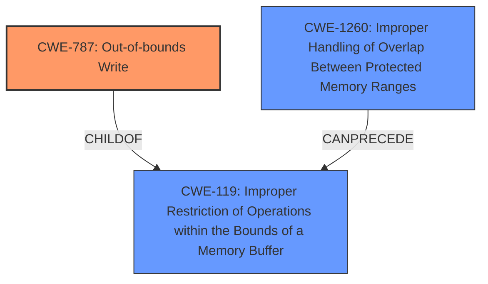

# Raw Analyzer Response for CVE-2021-3582

# Summary
| CWE ID | CWE Name | Confidence | CWE Abstraction Level | CWE Vulnerability Mapping Label | CWE-Vulnerability Mapping Notes |
|---|---|---|---|---|---|
| CWE-787 | Out-of-bounds Write | 0.9 | Base | Allowed | Primary CWE |
| CWE-1260 | Improper Handling of Overlap Between Protected Memory Ranges | 0.7 | Base | Allowed | Secondary Candidate |
| CWE-119 | Improper Restriction of Operations within the Bounds of a Memory Buffer | 0.5 | Class | Discouraged | Secondary Candidate |

## Evidence and Confidence

*   **Confidence Score:** 0.8
*   **Evidence Strength:** HIGH

## Relationship Analysis
The primary CWE selected is CWE-787, which is a base-level CWE describing an out-of-bounds write. It is a child of CWE-119, a class-level CWE that describes improper restrictions of operations within the bounds of a memory buffer. CWE-1260 is also relevant as it relates to memory protection bypass through improper handling of overlapping memory ranges and has a CANPRECEDE relationship with CWE-119, suggesting it could be a contributing factor. The selection of CWE-787 is preferred due to its specificity as the **root cause** is the out-of-bounds write due to **improper memory remapping**.

## Vulnerability Chain
The vulnerability chain begins with **improper memory remapping** that leads to an out-of-bounds write, ultimately resulting in a crash of the QEMU process on the host.
  - **Root Cause:** Improper memory remapping due to lack of bounds checking.
  - **Weakness:** Out-of-bounds write (CWE-787)
  - **Impact:** QEMU process crash, leading to denial of service.

## Summary of Analysis
The initial assessment focused on the **improper memory remapping** vulnerability. The provided evidence, particularly the CVE Reference Links Content Summary, clearly indicates that the vulnerability involves writing to memory locations outside the intended buffer, making CWE-787 (Out-of-bounds Write) the most appropriate primary classification. The content summary states that the root cause is the lack of proper bounds checking when remapping memory regions. This directly leads to out-of-bounds memory access.

The Retriever Results suggested CWE-119, CWE-824, and CWE-190, among others. While CWE-119 (Improper Restriction of Operations within the Bounds of a Memory Buffer) is a parent of CWE-787, it is too general and the guidance discourages its use. CWE-824 (Access of Uninitialized Pointer) and CWE-190 (Integer Overflow or Wraparound) do not directly relate to the described vulnerability, although integer overflows could be related to the size calculations.

CWE-1260 (Improper Handling of Overlap Between Protected Memory Ranges) was considered as a secondary CWE because the **improper memory remapping** could potentially lead to overlapping memory regions, bypassing intended memory protection. However, the primary issue is the out-of-bounds write, making CWE-787 the stronger and more specific choice.

The selection of CWE-787 is based on its specificity and the direct evidence of out-of-bounds write due to **improper memory remapping**. The CWE is at the optimal level of specificity as it accurately describes the **root cause** of the vulnerability.

# Relevant CWE Information:

The following CWEs were identified as potentially relevant to this vulnerability:

## CWE-667: Improper Locking
**Abstraction Level**: Class
**Similarity Score**: 0.76
**Source**: dense

**Description**:
The product does not properly acquire or release a lock on a resource, leading to unexpected resource state changes and behaviors.

**Mapping Guidance**:
- Usage: Allowed-with-Review
- Rationale: This CWE entry is a Class and might have Base-level children that would be more appropriate

## CWE-835: Loop with Unreachable Exit Condition ('Infinite Loop')
**Abstraction Level**: Base
**Similarity Score**: 0.75
**Source**: dense

**Description**:
The product contains an iteration or loop with an exit condition that cannot be reached, i.e., an infinite loop.

**Mapping Guidance**:
- Usage: Allowed
- Rationale: This CWE entry is at the Base level of abstraction, which is a preferred level of abstraction for mapping to the root causes of vulnerabilities.

## CWE-404: Improper Resource Shutdown or Release
**Abstraction Level**: Class
**Similarity Score**: 0.75
**Source**: dense

**Description**:
The product does not release or incorrectly releases a resource before it is made available for re-use.

**Mapping Guidance**:
- Usage: Allowed-with-Review
- Rationale: This CWE entry is a Class and might have Base-level children that would be more appropriate

## CWE-606: Unchecked Input for Loop Condition
**Abstraction Level**: Base
**Similarity Score**: 0.74
**Source**: dense

**Description**:
The product does not properly check inputs that are used for loop conditions, potentially leading to a denial of service or other consequences because of excessive looping.

**Mapping Guidance**:
- Usage: Allowed
- Rationale: This CWE entry is at the Base level of abstraction, which is a preferred level of abstraction for mapping to the root causes of vulnerabilities.

## CWE-362: Concurrent Execution using Shared Resource with Improper Synchronization ('Race Condition')
**Abstraction Level**: Class
**Similarity Score**: 0.74
**Source**: dense

**Description**:
The product contains a concurrent code sequence that requires temporary, exclusive access to a shared resource, but a timing window exists in which the shared resource can be modified by another code sequence operating concurrently.

**Mapping Guidance**:
- Usage: Allowed-with-Review
- Rationale: This CWE entry is a Class and might have Base-level children that would be more appropriate

## CWE-909: Missing Initialization of Resource
**Abstraction Level**: Class
**Similarity Score**: 0.73
**Source**: dense

**Description**:
The product does not initialize a critical resource.

**Mapping Guidance**:
- Usage: Allowed-with-Review
- Rationale: This CWE entry is a Class and might have Base-level children that would be more appropriate

## CWE-191: Integer Underflow (Wrap or Wraparound)
**Abstraction Level**: Base
**Similarity Score**: 0.73
**Source**: dense

**Description**:
The product subtracts one value from another, such that the result is less than the minimum allowable integer value, which produces a value that is not equal to the correct result.

**Mapping Guidance**:
- Usage: Allowed
- Rationale: This CWE entry is at the Base level of abstraction, which is a preferred level of abstraction for mapping to the root causes of vulnerabilities.

## CWE-366: Race Condition within a Thread
**Abstraction Level**: Base
**Similarity Score**: 0.73
**Source**: dense

**Description**:
If two threads of execution use a resource simultaneously, there exists the possibility that resources may be used while invalid, in turn making the state of execution undefined.

**Mapping Guidance**:
- Usage: Allowed
- Rationale: This CWE entry is at the Base level of abstraction, which is a preferred level of abstraction for mapping to the root causes of vulnerabilities.

## CWE-824: Access of Uninitialized Pointer
**Abstraction Level**: Base
**Similarity Score**: 0.73
**Source**: dense

**Description**:
The product accesses or uses a pointer that has not been initialized.

**Mapping Guidance**:
- Usage: Allowed
- Rationale: This CWE entry is at the Base level of abstraction, which is a preferred level of abstraction for mapping to the root causes of vulnerabilities.

## CWE-226: Sensitive Information in Resource Not Removed Before Reuse
**Abstraction Level**: Base
**Similarity Score**: 0.73
**Source**: dense

**Description**:
The product releases a resource such as memory or a file so that it can be made available for reuse, but it does not clear or "zeroize" the information contained in the resource before the product performs a critical state transition or makes the resource available for reuse by other entities.

**Mapping Guidance**:
- Usage: Allowed
- Rationale: This CWE entry is at the Base level of abstraction, which is a preferred level of abstraction for mapping to the root causes of