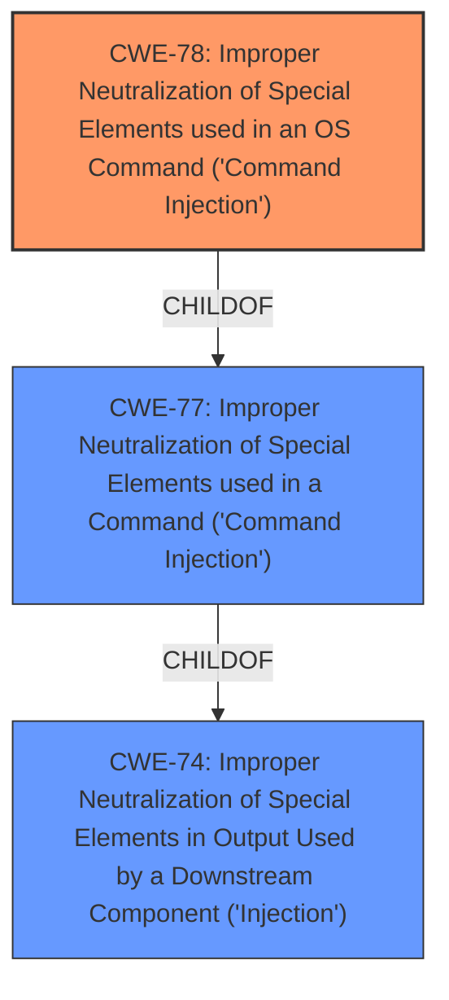

# Raw Analyzer Response for CVE-2021-3584

# Summary
| CWE ID | CWE Name | Confidence | CWE Abstraction Level | CWE Vulnerability Mapping Label | CWE-Vulnerability Mapping Notes |
|---|---|---|---|---|---|
| CWE-78 | Improper Neutralization of Special Elements used in an OS Command ('Command Injection') | 1.0 | Base | Allowed | Primary CWE |

## Evidence and Confidence

*   **Confidence Score:** 1.0
*   **Evidence Strength:** HIGH

## Relationship Analysis
The primary relationship influencing the CWE selection is the parent-child relationship between CWE-77 (Improper Neutralization of Special Elements used in a Command ('Command Injection')) and CWE-78 (Improper Neutralization of Special Elements used in an OS Command ('OS Command Injection')). Since the vulnerability specifically involves OS commands, CWE-78, being the more specific base variant, is chosen over the more general class CWE-77.

## Vulnerability Chain
The vulnerability chain involves the following sequence:

1.  **Root Cause:** **Lack of Input Sanitization** of Sendmail configuration options.
2.  **Weakness:** **Command Injection** (CWE-78) due to the use of unsanitized input in constructing OS commands.
3.  **Impact:** Remote Code Execution, leading to compromise of confidentiality, integrity, and availability.

## Summary of Analysis
The analysis indicates that the primary weakness is CWE-78, stemming from the application's failure to sanitize user-provided input used to construct OS commands. This is supported by the vulnerability description, which states, "A authenticated attacker could use Sendmail configuration options to overwrite the defaults and perform **command injection**," and the CVE Reference Links Content Summary, which highlights the **lack of input sanitization** and the use of arbitrary strings being passed to the shell. The retriever results also support this, with CWE-78 being a top match.

The choice of CWE-78 is justified as it is the most specific and accurate representation of the vulnerability, as it explicitly involves OS commands. Other CWEs like CWE-77 were considered but deemed less specific as they cover command injection in general, not specifically OS commands. The MITRE mapping guidance allows for the use of CWE-78, as it is a Base level CWE.

Relevant CWE Information:

# Enhanced Context (25 CWEs)
The following CWEs were identified as potentially relevant to this vulnerability:

## CWE-191: Integer Underflow (Wrap or Wraparound)
## CWE-197: Numeric Truncation Error
## CWE-681: Incorrect Conversion between Numeric Types
## CWE-74: Improper Neutralization of Special Elements in Output Used by a Downstream Component ('Injection')
## CWE-131: Incorrect Calculation of Buffer Size
## CWE-125: Out-of-bounds Read
## CWE-190: Integer Overflow or Wraparound
## CWE-1289: Improper Validation of Unsafe Equivalence in Input
## CWE-789: Memory Allocation with Excessive Size Value
## CWE-407: Inefficient Algorithmic Complexity
## CWE-88: Improper Neutralization of Argument Delimiters in a Command ('Argument Injection')
## CWE-1336: Improper Neutralization of Special Elements Used in a Template Engine
## CWE-22: Improper Limitation of a Pathname to a Restricted Directory ('Path Traversal')
## CWE-190: Integer Overflow or Wraparound
## CWE-116: Improper Encoding or Escaping of Output
## CWE-78: Improper Neutralization of Special Elements used in an OS Command ('OS Command Injection')
## CWE-73: External Control of File Name or Path
## CWE-79: Improper Neutralization of Input During Web Page Generation ('Cross-site Scripting')
## CWE-22: Improper Limitation of a Pathname to a Restricted Directory ('Path Traversal')
## CWE-1284: Improper Validation of Specified Quantity in Input
## CWE-94: Improper Control of Generation of Code ('Code Injection')
## CWE-917: Improper Neutralization of Special Elements used in an Expression Language Statement ('Expression Language Injection')
## CWE-88: Improper Neutralization of Argument Delimiters in a Command ('Argument Injection')
## CWE-1336: Improper Neutralization of Special Elements Used in a Template Engine
## CWE-178: Improper Handling of Case Sensitivity

CWE-77 was considered as it is the parent of CWE-78. However, since the **command injection** specifically refers to OS commands, CWE-78 is a more accurate and specific choice.
CWE-74 was considered because it is a parent of CWE-77 and CWE-78, but it is too high-level. It refers to generic injection, whereas OS command injection is more specific.
CWE-88 was considered, as argument injection could be a contributing factor. However, the primary issue is the **lack of sanitization** leading to the execution of arbitrary commands, not just the injection of arguments.
CWE-94 and CWE-1336 are not applicable as they deal with code injection and template injection, respectively, which are not the focus of this vulnerability.
CWE-918 is not applicable as it deals with Server-Side Request Forgery (SSRF), and there's no evidence of the server making requests to unexpected destinations.
CWE-22 is not applicable as it deals with path traversal, which is not the vulnerability described.