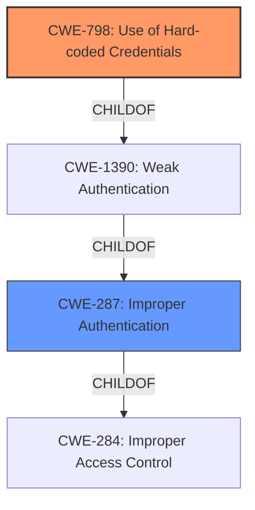

# Analysis for CVE-2021-35943

# Summary
| CWE ID | CWE Name | Confidence | CWE Abstraction Level | CWE Vulnerability Mapping Label | CWE-Vulnerability Mapping Notes |
|---|---|---|---|---|---|
| CWE-798 | Use of Hard-coded Credentials | 0.75 | Base | Allowed | Primary CWE |
| CWE-287 | Improper Authentication | 0.60 | Class | Discouraged | Secondary Candidate |

## Evidence and Confidence

*   **Confidence Score:** 0.70
*   **Evidence Strength:** MEDIUM

## Relationship Analysis
The primary relationship that influenced the selection was the child-parent relationship between CWE-1391 and CWE-798. CWE-798 is a more specific instance of using weak credentials, which is a subclass of improper authentication. CWE-287 is a parent of CWE-1390, and CWE-1390 is a parent of CWE-798. The evidence shows an **incorrect access control** because the system allows externally managed users to set an empty password, which is akin to a **hard-coded credential** that is easily bypassed.

## Vulnerability Chain
The chain of vulnerabilities starts with the **incorrect access control**, which leads to the ability to use an empty password which can be seen as a **hard-coded credential**, and ultimately results in unauthorized access.

## Summary of Analysis
The initial analysis pointed towards a general authentication or authorization issue. However, after reviewing the details, specifically the ability to use an empty password, the root cause seems to be closer to using a default or hard-coded credential. The vulnerability description explicitly mentions **incorrect access control** and the CVE summary states "Externally managed users are not prevented from using an empty password".

The retriever results also list CWE-798, CWE-1392 and other weak credential/authentication CWEs.

The final decision to select CWE-798 is based on the fact that an empty password is akin to a default password that is not being changed, which effectively becomes a **hard-coded credential**. This selection provides a more specific and accurate representation of the vulnerability compared to the broader CWE-287.

Relevant CWE Information:

# Enhanced Context (25 CWEs)
The following CWEs were identified as potentially relevant to this vulnerability:

## CWE-1392: Use of Default Credentials
**Abstraction Level**: Base
**Similarity Score**: 0.76
**Source**: dense

**Description**:
The product uses default credentials (such as passwords or cryptographic keys) for potentially critical functionality.

**Mapping Guidance**:
- Usage: Allowed
- Rationale: This CWE entry is at the Base level of abstraction, which is a preferred level of abstraction for mapping to the root causes of vulnerabilities.

## CWE-798: Use of Hard-coded Credentials
**Abstraction Level**: Base
**Similarity Score**: 0.74
**Source**: dense

**Description**:
The product contains **hard-coded credentials**, such as a password or cryptographic key.

**Mapping Guidance**:
- Usage: Allowed
- Rationale: This CWE entry is at the Base level of abstraction, which is a preferred level of abstraction for mapping to the root causes of vulnerabilities.

### Considered but not Used:

*   **CWE-287 Improper Authentication:** This was considered, but it is too high-level. The issue is not simply that authentication is broken, but more specifically that a trivially bypassable credential is being used. The MITRE mapping guidance discourages the use of CWE-287 when more specific CWEs are available, so it was rejected as the primary CWE. It is still a secondary candidate, since it represents a valid, if more general, view of the vulnerability.
*   **CWE-306 Missing Authentication for Critical Function:** While related, the vulnerability is not that authentication is missing entirely, but rather that the authentication mechanism is weak, allowing an empty password.
*   **CWE-639 Authorization Bypass Through User-Controlled Key:** This CWE is not applicable as the vulnerability doesn't involve bypassing authorization through a user-controlled key.
*   **CWE-863 Incorrect Authorization:** Similar to CWE-287, this is too high-level. While authorization might be affected, the root cause is a weak authentication mechanism.
*   **CWE-1390 Weak Authentication:** It is applicable, however CWE-798 describes a more specific case of weak authentication.
*   **CWE-842 Placement of User into Incorrect Group:** This CWE is not relevant as the vulnerability doesn't involve placing users into incorrect groups.
*   **CWE-613 Insufficient Session Expiration:** This CWE is not relevant to the vulnerability description.
*   **CWE-522 Insufficiently Protected Credentials:** While related to the concept of weak authentication, this CWE is more about how credentials are stored or transmitted, not about the credential itself being weak.
*   **CWE-284 Improper Access Control:** This CWE is too high-level and is discouraged by MITRE.
*   **CWE-1392 Use of Default Credentials:** While close, an empty password is not precisely a 'default' credential in the traditional sense. It's more like a lack of a credential, which aligns better with a hard-coded or easily bypassed credential.