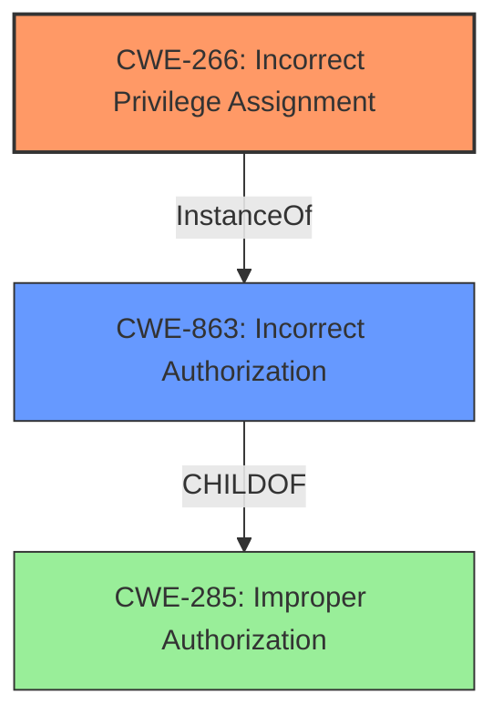

# Raw Analyzer Response for CVE-2021-35946

# Summary
| CWE ID  | CWE Name                                      | Confidence | CWE Abstraction Level | CWE Vulnerability Mapping Label | CWE-Vulnerability Mapping Notes |
| :-------- | :-------------------------------------------- | :--------- | :---------------------- | :------------------------------ | :------------------------------ |
| CWE-266 | Incorrect Privilege Assignment             | 0.9        | Base                    | Primary                         | Allowed                       |
| CWE-863 | Incorrect Authorization                    | 0.7        | Class                   | Secondary                       | Allowed-with-Review         |
| CWE-285 | Improper Authorization                   | 0.6        | Class                   | Secondary                       | Discouraged                  |

## Evidence and Confidence

*   **Confidence Score:** 0.8
*   **Evidence Strength:** HIGH

## Relationship Analysis
The primary weakness, **CWE-266 (Incorrect Privilege Assignment)**, directly addresses the root cause, which is the system's failure to properly assign privileges, enabling a user to modify permissions they shouldn't have access to. **CWE-863 (Incorrect Authorization)** is a parent Class of other more specific authorization CWEs and captures that the authorization check was performed, but was incorrect. **CWE-285 (Improper Authorization)** is a higher-level Class that describes the product does not perform or incorrectly performs an authorization check.

## Vulnerability Chain
The chain of events begins with an **incorrect privilege assignment** (**CWE-266**), where a receiver of a federated share is granted the ability to modify permissions. This leads to an **incorrect authorization** (**CWE-863**) because the system **fails to properly** validate whether the user has the right to change permissions. The final impact is **privilege escalation**, allowing the user to elevate their own permissions.

## Summary of Analysis
The initial analysis focused on identifying the root cause of the vulnerability, which is the ability for a federated share receiver to update permissions. The evidence strongly supports **CWE-266 (Incorrect Privilege Assignment)** as the primary CWE, given that the vulnerability stems from the system's failure to properly assign privileges, granting a user the ability to modify permissions they shouldn't have. This is supported by the CVE Reference Links Content Summary, which states, "The system fails to enforce the correct access control, allowing a user (federated share receiver) to modify settings that should be restricted to the share owner."

**CWE-863 (Incorrect Authorization)** was considered because the vulnerability involves an authorization check that is not correctly performed. However, **CWE-266** is more specific because it identifies the root cause as the incorrect assignment of privileges. **CWE-285 (Improper Authorization)** was also considered but is too high-level and less descriptive than **CWE-266**.

The final decision to prioritize **CWE-266** is based on its direct relevance to the **incorrect privilege assignment**, which is the **root cause** of the vulnerability. The selection of **CWE-266** is at the optimal level of specificity, providing a clear and accurate representation of the weakness.

Relevant CWE Information:

# Enhanced Context (25 CWEs)
The following CWEs were identified as potentially relevant to this vulnerability:

## CWE-274: Improper Handling of Insufficient Privileges
**Abstraction Level**: Base
**Similarity Score**: 0.80
**Source**: dense

**Description**:
The product does not handle or incorrectly handles when it has insufficient privileges to perform an operation, leading to resultant weaknesses.

**Mapping Guidance**:
- Usage: Discouraged
- Rationale: This CWE entry could be deprecated in a future version of CWE.

## CWE-266: Incorrect Privilege Assignment
**Abstraction Level**: Base
**Similarity Score**: 0.79
**Source**: dense

**Description**:
A product incorrectly assigns a privilege to a particular actor, creating an unintended sphere of control for that actor.

**Mapping Guidance**:
- Usage: Allowed
- Rationale: This CWE entry is at the Base level of abstraction, which is a preferred level of abstraction for mapping to the root causes of vulnerabilities.

## CWE-267: Privilege Defined With Unsafe Actions
**Abstraction Level**: Base
**Similarity Score**: 0.79
**Source**: dense

**Description**:
A particular privilege, role, capability, or right can be used to perform unsafe actions that were not intended, even when it is assigned to the correct entity.

**Mapping Guidance**:
- Usage: Allowed
- Rationale: This CWE entry is at the Base level of abstraction, which is a preferred level of abstraction for mapping to the root causes of vulnerabilities.

## CWE-280: Improper Handling of Insufficient Permissions or Privileges
**Abstraction Level**: Base
**Similarity Score**: 0.79
**Source**: dense

**Description**:
The product does not handle or incorrectly handles when it has insufficient privileges to access resources or functionality as specified by their permissions. This may cause it to follow unexpected code paths that may leave the product in an invalid state.

**Mapping Guidance**:
- Usage: Allowed
- Rationale: This CWE entry is at the Base level of abstraction, which is a preferred level of abstraction for mapping to the root causes of vulnerabilities.

## CWE-281: Improper Preservation of Permissions
**Abstraction Level**: Base
**Similarity Score**: 0.77
**Source**: dense

**Description**:
The product does not preserve permissions or incorrectly preserves permissions when copying, restoring, or sharing objects, which can cause them to have less restrictive permissions than intended.

**Mapping Guidance**:
- Usage: Allowed
- Rationale: This CWE entry is at the Base level of abstraction, which is a preferred level of abstraction for mapping to the root causes of vulnerabilities.

## CWE-653: Improper Isolation or Compartmentalization
**Abstraction Level**: Class
**Similarity Score**: 0.76
**Source**: dense

**Description**:
The product does not properly compartmentalize or isolate functionality, processes, or resources that require different privilege levels, rights, or permissions.

**Mapping Guidance**:
- Usage: Allowed
- Rationale: This CWE entry is at the Base level of abstraction, which is a preferred level of abstraction for mapping to the root causes of vulnerabilities.

## CWE-269: Improper Privilege Management
**Abstraction Level**: Class
**Similarity Score**: 0.76
**Source**: dense

**Description**:
The product does not properly assign, modify, track, or check privileges for an actor, creating an unintended sphere of control for that actor.

**Mapping Guidance**:
- Usage: Discouraged
- Rationale: CWE-269 is commonly misused. It can be conflated with "privilege escalation," which is a technical impact that is listed in many low-information vulnerability reports [REF-1287]. It is not useful for trend analysis.

## CWE-276: Incorrect Default Permissions
**Abstraction Level**: Base
**Similarity Score**: 0.76
**Source**: dense

**Description**:
During installation, installed file permissions are set to allow anyone to modify those files.

**Mapping Guidance**:
- Usage: Allowed
- Rationale: This CWE entry is at the Base level of abstraction, which is a preferred level of abstraction for mapping to the root causes of vulnerabilities.

## CWE-668: Exposure of Resource to Wrong Sphere
**Abstraction Level**: Class
**Similarity Score**: 0.76
**Source**: dense

**Description**:
The product exposes a resource to the wrong control sphere, providing unintended actors with inappropriate access to the resource.

**Mapping Guidance**:
- Usage: Discouraged
- Rationale: CWE-668 is high-level and is often misused as a catch-all when lower-level CWE IDs might be applicable. It is sometimes used for low-information vulnerability reports [REF-1287]. It is a level-1 Class (i.e., a child of a Pillar). It is not useful for trend analysis.

## CWE-250: Execution with Unnecessary Privileges
**Abstraction Level**: Base
**Similarity Score**: 0.76
**Source**: dense

**Description**:
The product performs an operation at a privilege level that is higher than the minimum level required, which creates new weaknesses or amplifies the consequences of other weaknesses.

**Mapping Guidance**:
- Usage: Allowed
- Rationale: This CWE entry is at the Base level of abstraction, which is a preferred level of abstraction for mapping to the root causes of vulnerabilities.

## CWE-863: Incorrect Authorization
**Abstraction Level**: Class
**Similarity Score**: 53