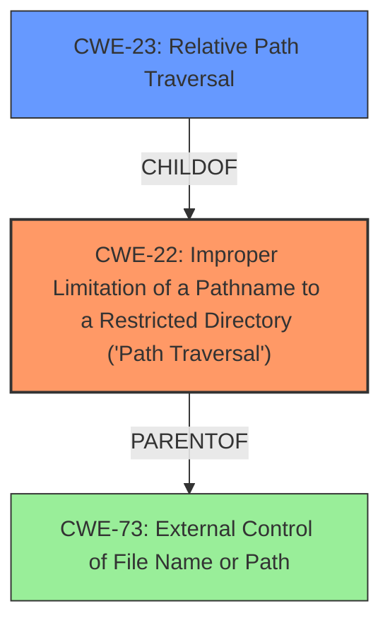

# Analysis for CVE-2021-35958

# Summary
| CWE ID | CWE Name | Confidence | CWE Abstraction Level | CWE Vulnerability Mapping Label | CWE-Vulnerability Mapping Notes |
|---|---|---|---|---|---|
| CWE-22 | Improper Limitation of a Pathname to a Restricted Directory ('Path Traversal') | 1.0 | Base | Allowed | Primary CWE. The core weakness is the path traversal vulnerability, which allows specially crafted archive files to specify file paths outside of the intended destination directory. |
| CWE-23 | Relative Path Traversal | 0.7 | Base | Allowed | Secondary Candidate. CWE-23 is a child of CWE-22 and more specific, but the description of CWE-22 better fits the overall vulnerability, including absolute path traversal. |
| CWE-73 | External Control of File Name or Path | 0.5 | Base | Allowed | Secondary Candidate. The product receives the file name from external input but does not validate it. |

## Evidence and Confidence

*   **Confidence Score:** 0.9
*   **Evidence Strength:** HIGH

## Relationship Analysis
The primary relationship impacting the decision is the parent-child relationship between CWE-22 and CWE-23. While CWE-23 (Relative Path Traversal) is more specific, the vulnerability description broadly covers path traversal, making CWE-22 (Improper Limitation of a Pathname to a Restricted Directory) a more fitting base-level classification. CWE-73 is a parent of CWE-22 and could apply but is less specific.

## Vulnerability Chain
The chain of events leading to the vulnerability:
1.  The application uses `tf.keras.utils.get_file` with `extract=True`.
2.  The application downloads a crafted archive file from an untrusted source.
3.  The archive contains filenames with path traversal sequences.
4.  The `get_file` function **does not properly neutralize** these sequences.
5.  The archive extraction writes files to arbitrary locations, leading to arbitrary file overwrite.

Here, the **lack of proper neutralization** is the root cause, resulting in a path traversal vulnerability and arbitrary file overwrite.

## Summary of Analysis
The initial analysis identified CWE-22 as the primary weakness due to the path traversal issue. The analysis of the CVE reference links content summary, specifically the statement that "The function **does not properly sanitize filenames** within a downloaded archive... allowing an attacker to craft an archive with malicious filenames that, upon extraction, can overwrite arbitrary files," strongly supports this. The retriever results also list CWE-22 as the top candidate. While CWE-23 is a child of CWE-22 and more specific to *relative* path traversal, CWE-22 encompasses both relative and absolute path traversals and thus is a better fit. CWE-73 was considered as well, since the filename is externally controlled, but the lack of sanitization leading to path traversal is better captured by CWE-22.

The final decision is to map the vulnerability to CWE-22 due to the path traversal vulnerability resulting from **improper limitation of a pathname** to a restricted directory. This aligns with the vulnerability description, the CVE reference summary, and the retriever results. CWE-22 is at the optimal level of specificity, representing the core weakness without being overly specific like CWE-23 (relative path traversal only).

Relevant CWE Information:

# Enhanced Context (25 CWEs)

## CWE-22: Improper Limitation of a Pathname to a Restricted Directory ('Path Traversal')
**Abstraction:** Base
**Status:** Stable

### Description
The product uses external input to construct a pathname that is intended to identify a file or directory that is located underneath a restricted parent directory, but the product **does not properly neutralize** special elements within the pathname that can cause the pathname to resolve to a location that is outside of the restricted directory.

### Extended Description
Many file operations are intended to take place within a restricted directory. By using special elements such as ".." and "/" separators, attackers can escape outside of the restricted location to access files or directories that are elsewhere on the system. One of the most common special elements is the "../" sequence, which in most modern operating systems is interpreted as the parent directory of the current location. This is referred to as relative path traversal. Path traversal also covers the use of absolute pathnames such as "/usr/local/bin" to access unexpected files. This is referred to as absolute path traversal.

### Alternative Terms
Directory traversal
Path traversal: "Path traversal" is preferred over "directory traversal," but both terms are attack-focused.

### Relationships
ChildOf -> CWE-706
ChildOf -> CWE-706
ChildOf -> CWE-668

### Mapping Guidance
**Usage:** Allowed
**Rationale:** This CWE entry is at the Base level of abstraction, which is a preferred level of abstraction for mapping to the root causes of vulnerabilities.
**Comments:** Carefully read both the name and description to ensure that this mapping is an appropriate fit. Do not try to 'force' a mapping to a lower-level Base/Variant simply to comply with this preferred level of abstraction.
**Reasons:**
- Acceptable-Use

### Additional Notes
**[Other]** In many programming languages, the injection of a null byte (the 0 or NUL) may allow an attacker to truncate a generated filename to apply to a wider range of files. For example, the product may add ".txt" to any pathname, thus limiting the attacker to text files, but a null injection may effectively remove this restriction.

**[Relationship]** Pathname equivalence can be regarded as a type of canonicalization error.

**[Relationship]** Some pathname equivalence issues are not directly related to directory traversal, rather are used to bypass security-relevant checks for whether a file/directory can be accessed by the attacker (e.g. a trailing "/" on a filename could bypass access rules that don't expect a trailing /, causing a server to provide the file when it normally would not).

**[Terminology]**
Like other weaknesses, terminology is often based on the types of manipulations used, instead of the underlying weaknesses. Some people use "directory traversal" only to refer to the injection of ".." and equivalent sequences whose specific meaning is to traverse directories.

Other variants like "absolute pathname" and "drive letter" have the *effect* of directory traversal, but some people may not call it such, since it doesn't involve ".." or equivalent.

**[Research Gap]** Many variants of path traversal attacks are probably under-studied with respect to root cause. CWE-790 and CWE-182 begin to cover part of this gap.

**[Research Gap]**
Incomplete diagnosis or reporting of vulnerabilities can make it difficult to know which variant is affected. For example, a researcher might say that "..\" is vulnerable, but not test "../" which may also be vulnerable.

Any combination of directory separators ("/", "\", etc.) and numbers of "." (e.g. "....") can produce unique variants; for example, the "//../" variant is not listed (CVE-2004-0325). See this entry's children and lower-level descendants.

### Observed Examples
- **CVE-2024-37032:** Large language model (LLM) management tool **does not validate** the format of a digest value (CWE-1287) from a private, untrusted model registry, enabling relative path traversal (CWE-23), a.k.a. Probllama
- **CVE-2024-4315:** Chain: API for text generation using Large Language Models (LLMs) **does not include** the "\" Windows folder separator in its denylist (CWE-184) when attempting to prevent Local File Inclusion via path traversal (CWE-22), allowing deletion of arbitrary files on Windows systems.
- **CVE-2022-45918:** Chain: a learning management tool debugger uses external input to locate previous session logs (CWE-73) and **does not properly validate** the given path (CWE-20), allowing for filesystem path traversal using "../" sequences (CWE-24)

## CWE-23: Relative Path Traversal
**Abstraction:** Base
**Status:** Draft

### Description
The product uses external input to construct a pathname that should be within a restricted directory, but it **does not properly neutralize** sequences such as ".." that can resolve to a location that is outside of that directory.

### Extended Description
This allows attackers to traverse the file system to access files or directories that are outside of the restricted directory.

### Alternative Terms
Zip Slip: "