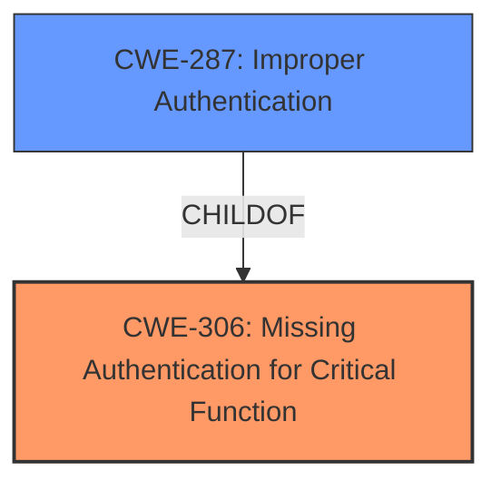

# Raw Analyzer Response for CVE-2021-35964

# Summary
| CWE ID  | CWE Name                                      | Confidence | CWE Abstraction Level | CWE Vulnerability Mapping Label | CWE-Vulnerability Mapping Notes |
| ------- | --------------------------------------------- | ---------- | --------------------- | ------------------------------- | ------------------------------- |
| CWE-306 | Missing Authentication for Critical Function  | 0.9        | Base                  | Primary                         | Allowed                         |
| CWE-287 | Improper Authentication                         | 0.7        | Class                 | Secondary                       | Discouraged                     |

## Evidence and Confidence

*   **Confidence Score:** 0.9
*   **Evidence Strength:** HIGH

## Relationship Analysis
The primary relationship influencing the CWE selection is the ChildOf relationship between CWE-306 and CWE-287. CWE-306 is a more specific case of CWE-287, indicating missing authentication for critical functions, which aligns directly with the vulnerability description. The Retriever Results also support this, ranking CWE-306 as the top combined result. Since CWE-306 is a Base level CWE, it is preferred over the Class level CWE-287 based on mapping guidance.

## Vulnerability Chain
The vulnerability chain starts with the **root cause**, which is the **missing authentication** on the management page. This leads to the ability for remote attackers to bypass authentication and execute management functions without logging in. The impact includes unauthorized access to member information and the ability to modify or delete courses, ultimately causing users to fail to access the learning content.

Missing Authentication -> Unauthorized Access -> Data Modification/Deletion -> Service Disruption

## Summary of Analysis
The initial analysis focused on identifying the **root cause** of the vulnerability. The vulnerability description clearly states that the management page **does not perform identity verification**, allowing remote attackers to bypass authentication. This directly aligns with the definition of CWE-306, Missing Authentication for Critical Function. The CVE Reference Links Content Summary further supports this by stating that the **root cause is a broken authentication mechanism** and highlights the **weakness of broken authentication**.

The Retriever Results also reinforce this assessment, with CWE-306 being the top combined result. While CWE-287 (Improper Authentication) was also considered, it is a more general Class-level CWE, and CWE-306 provides a more specific and accurate representation of the vulnerability. As per MITRE mapping guidance, the most specific applicable CWE should be chosen, making CWE-306 the primary choice.

The evidence from the vulnerability description, combined with the retriever results and relationship analysis, provides strong support for classifying this vulnerability as CWE-306. The confidence level is high (0.9) due to the clear and direct evidence.

Relevant CWE Information:

# Enhanced Context (25 CWEs)

## CWE-303: Incorrect Implementation of Authentication Algorithm
**Abstraction Level**: Base
**Similarity Score**: 0.78
**Source**: dense

**Description**:
The requirements for the product dictate the use of an established authentication algorithm, but the implementation of the algorithm is incorrect.

**Mapping Guidance**:
- Usage: Allowed
- Rationale: This CWE entry is at the Base level of abstraction, which is a preferred level of abstraction for mapping to the root causes of vulnerabilities.

**Why Not Used**: The vulnerability description states authentication is missing, not incorrectly implemented.

## CWE-807: Reliance on Untrusted Inputs in a Security Decision
**Abstraction Level**: Base
**Similarity Score**: 0.77
**Source**: dense

**Description**:
The product uses a protection mechanism that relies on the existence or values of an input, but the input can be modified by an untrusted actor in a way that bypasses the protection mechanism.

**Mapping Guidance**:
- Usage: Allowed
- Rationale: This CWE entry is at the Base level of abstraction, which is a preferred level of abstraction for mapping to the root causes of vulnerabilities.

**Why Not Used**: This vulnerability is due to a missing authentication mechanism, not a reliance on untrusted inputs.

## CWE-274: Improper Handling of Insufficient Privileges
**Abstraction Level**: Base
**Similarity Score**: 0.77
**Source**: dense

**Description**:
The product does not handle or incorrectly handles when it has insufficient privileges to perform an operation, leading to resultant weaknesses.

**Mapping Guidance**:
- Usage: Discouraged
- Rationale: This CWE entry could be deprecated in a future version of CWE.

**Why Not Used**: The vulnerability is due to a missing authentication mechanism, not an improper handling of privileges.

## CWE-280: Improper Handling of Insufficient Permissions or Privileges
**Abstraction Level**: Base
**Similarity Score**: 0.76
**Source**: dense

**Description**:
The product does not handle or incorrectly handles when it has insufficient privileges to access resources or functionality as specified by their permissions. This may cause it to follow unexpected code paths that may leave the product in an invalid state.

**Mapping Guidance**:
- Usage: Allowed
- Rationale: This CWE entry is at the Base level of abstraction, which is a preferred level of abstraction for mapping to the root causes of vulnerabilities.

**Why Not Used**: The vulnerability is due to a missing authentication mechanism, not an improper handling of permissions or privileges.

## CWE-639: Authorization Bypass Through User-Controlled Key
**Abstraction Level**: Base
**Similarity Score**: 0.76
**Source**: dense

**Description**:
The system's authorization functionality does not prevent one user from gaining access to another user's data or record by modifying the key value identifying the data.

**Mapping Guidance**:
- Usage: Allowed
- Rationale: This CWE entry is at the Base level of abstraction, which is a preferred level of abstraction for mapping to the root causes of vulnerabilities.

**Why Not Used**: The vulnerability is due to a missing authentication mechanism, not an authorization bypass.

## CWE-472: External Control of Assumed-Immutable Web Parameter
**Abstraction Level**: Base
**Similarity Score**: 0.76
**Source**: dense

**Description**:
The web application does not sufficiently verify inputs that are assumed to be immutable but are actually externally controllable, such as hidden form fields.

**Mapping Guidance**:
- Usage: Allowed
- Rationale: This CWE entry is at the Base level of abstraction, which is a preferred level of abstraction for mapping to the root causes of vulnerabilities.

**Why Not Used**: The vulnerability is due to a missing authentication mechanism, not a failure to verify externally controllable parameters.

## CWE-1391: Use of Weak Credentials
**Abstraction Level**: Class
**Similarity Score**: 0.76
**Source**: dense

**Description**:
The product uses weak credentials (such as a default key or hard-coded password) that can be calculated, derived, reused, or guessed by an attacker.

**Mapping Guidance**:
- Usage: Allowed-with-Review
- Rationale: This CWE entry is a Class and might have Base-level children that would be more appropriate

**Why Not Used**: The vulnerability is due to a missing authentication mechanism, not the use of weak credentials.

## CWE-345: Insufficient Verification of Data Authenticity
**Abstraction Level**: Class
**Similarity Score**: 0.76
**Source**: dense

**Description**:
The product does not sufficiently verify the origin or authenticity of data, in a way that causes it to accept invalid data.

**Mapping Guidance**:
- Usage: Discouraged
- Rationale: This CWE entry is a level-1 Class (i.e., a child of a Pillar). It might have lower-level children that would be more appropriate

**Why Not Used**: The vulnerability is due to a missing authentication mechanism, not a lack of data authenticity verification.

## CWE-1390: Weak Authentication
**Abstraction Level**: Class
**Similarity Score**: 0.76
**Source**: dense

**Description**:
The product uses an authentication mechanism to restrict access to specific users or identities, but the mechanism does not sufficiently prove that the claimed identity is correct.

**Mapping Guidance**:
- Usage: Allowed-with-Review
- Rationale: This CWE entry is a Class and might have Base-level children that would be more appropriate

**Why Not Used**: While related, the problem is the authentication is missing, not weak.

## CWE-657: Violation of Secure Design Principles
**Abstraction Level**: Class
**Similarity Score**: 0.75
**Source**: dense

**Description**:
The product violates well-established principles for secure design.

**Mapping Guidance**:
- Usage: Discouraged
- Rationale: This CWE entry is a level-1 Class (i.e., a child of a Pillar). It might have lower-level children that would be more appropriate

**Why Not Used**: Too general of a class.

## CWE-285: Improper Authorization
**Abstraction Level**: Class
**Similarity Score**: