# Analysis Report for CVE-2021-35965

# Vulnerability Analysis Report: CVE-2021-35965

## Description


## Analysis (with Relationship Data)

# Summary
| CWE ID | CWE Name | Confidence | CWE Abstraction Level | CWE Vulnerability Mapping Label | CWE-Vulnerability Mapping Notes |
|---|---|---|---|---|---|
| CWE-798 | Use of Hard-coded Credentials | 1 | Base | Allowed | Primary CWE |
| CWE-259 | Use of Hard-coded Password | 0.8 | Variant | Allowed | Secondary Candidate |
| CWE-1393 | Use of Default Password | 0.7 | Base | Allowed | Secondary Candidate |
| CWE-1391 | Use of Weak Credentials | 0.6 | Class | Allowed-with-Review | Secondary Candidate |

## Evidence and Confidence

*   **Confidence Score:** 0.9
*   **Evidence Strength:** HIGH

## Relationship Analysis
The primary CWE, CWE-798 **Use of Hard-coded Credentials**, is a Base level CWE that describes the general case of hard-coded credentials. The vulnerability description clearly indicates the presence of a **weak factory default administrator password** that is **hard-coded** in the source code. CWE-259 **Use of Hard-coded Password** and CWE-1393 **Use of Default Password** are more specific Variant and Base level CWEs respectively that refine the nature of the hard-coded credential. CWE-1391 **Use of Weak Credentials** is a Class level CWE that is a parent of CWE-798. The hierarchical relationships help to understand the specific type of credential involved (password) and the nature of its weakness (hard-coded).

```mermaid
graph TD
    cwe798["CWE-798: Use of Hard-coded Credentials"]
    cwe259["CWE-259: Use of Hard-coded Password"]
    cwe1391["CWE-1391: Use of Weak Credentials"]
    cwe1393["CWE-1393: Use of Default Password"]
    
    cwe259 -->|CHILDOF| cwe798
    cwe1393 -->|CHILDOF| cwe1392
    cwe798 -->|CHILDOF| cwe1391
    
    classDef primary fill:#f96,stroke:#333,stroke-width:2px
    classDef secondary fill:#69f,stroke:#333
    classDef tertiary fill:#9e9,stroke:#333
    class cwe798 primary
    class cwe259,cwe1391,cwe1393 secondary
```



## Vulnerability Chain
The vulnerability chain starts with the **root cause** of a **weak factory default administrator password** being **hard-coded**. This leads to the **impact** where remote attackers can obtain administrator privileges without logging in.

## Summary of Analysis
The initial assessment strongly points to CWE-798 **Use of Hard-coded Credentials** as the primary weakness. The vulnerability description clearly states the presence of a **hard-coded password**, and the CVE Reference Links Content Summary confirms this by stating that the **root cause** is that "The digital learning platform contains a default administrator password that is hard-coded in a configuration file."

The relationship analysis further refines this assessment. While CWE-1391 **Use of Weak Credentials** is a parent Class of CWE-798, it is less specific. CWE-259 **Use of Hard-coded Password** is a child of CWE-798 and thus more specific and is about hardcoded passwords specifically, but CWE-798 is a better match since it covers both passwords and cryptographic keys, and the description doesn't explicitly state that it's *only* a password. CWE-1393 **Use of Default Password** could also be considered since the password is a default one.

Based on the evidence and relationship analysis, CWE-798 is the most appropriate primary CWE because it directly addresses the **root cause** of the **hard-coded credentials** and is at the Base level of abstraction, which is preferred. CWE-259 and CWE-1393 are also relevant as secondary candidates. CWE-1391 is a class level CWE so it is less specific than the others. The selected CWEs are at the optimal level of specificity, capturing the essence of the vulnerability while adhering to the recommended abstraction levels.

Relevant CWE Information:

# Enhanced Context (25 CWEs)
The following CWEs were identified as potentially relevant to this vulnerability:

## CWE-916: Use of Password Hash With Insufficient Computational Effort
**Abstraction Level**: Base
**Similarity Score**: 0.81
**Source**: dense

**Description**:
The product generates a hash for a password, but it uses a scheme that does not provide a sufficient level of computational effort that would make password cracking attacks infeasible or expensive.

**Mapping Guidance**:
- Usage: Allowed
- Rationale: This CWE entry is at the Base level of abstraction, which is a preferred level of abstraction for mapping to the root causes of vulnerabilities.


## CWE-328: Use of Weak Hash
**Abstraction Level**: Base
**Similarity Score**: 0.80
**Source**: dense

**Description**:
The product uses an algorithm that produces a digest (output value) that does not meet security expectations for a hash function that allows an adversary to reasonably determine the original input (preimage attack), find another input that can produce the same hash (2nd preimage attack), or find multiple inputs that evaluate to the same hash (birthday attack).

**Mapping Guidance**:
- Usage: Allowed
- Rationale: This CWE entry is at the Base level of abstraction, which is a preferred level of abstraction for mapping to the root causes of vulnerabilities.


## CWE-1391: Use of Weak Credentials
**Abstraction Level**: Class
**Similarity Score**: 0.79
**Source**: dense

**Description**:
The product uses weak credentials (such as a default key or hard-coded password) that can be calculated, derived, reused, or guessed by an attacker.

**Mapping Guidance**:
- Usage: Allowed-with-Review
- Rationale: This CWE entry is a Class and might have Base-level children that would be more appropriate


## CWE-798: Use of Hard-coded Credentials
**Abstraction Level**: Base
**Similarity Score**: 0.77
**Source**: dense

**Description**:
The product contains hard-coded credentials, such as a password or cryptographic key.

**Mapping Guidance**:
- Usage: Allowed
- Rationale: This CWE entry is at the Base level of abstraction, which is a preferred level of abstraction for mapping to the root causes of vulnerabilities.


## CWE-312: Cleartext Storage of Sensitive Information
**Abstraction Level**: Base
**Similarity Score**: 0.76
**Source**: dense

**Description**:
The product stores sensitive information in cleartext within a resource that might be accessible to another control sphere.

**Mapping Guidance**:
- Usage: Allowed
- Rationale: This CWE entry is at the Base level of abstraction, which is a preferred level of abstraction for mapping to the root causes of vulnerabilities.


## CWE-836: Use of Password Hash Instead of Password for Authentication
**Abstraction Level**: Base
**Similarity Score**: 0.76
**Source**: dense

**Description**:
The product records password hashes in a data store, receives a hash of a password from a client, and compares the supplied hash to the hash obtained from the data store.

**Mapping Guidance**:
- Usage: Allowed
- Rationale: This CWE entry is at the Base level of abstraction, which is a preferred level of abstraction for mapping to the root causes of vulnerabilities.


## CWE-1240: Use of a Cryptographic Primitive with a Risky Implementation
**Abstraction Level**: Base
**Similarity Score**: 0.76
**Source**: dense

**Description**:
To fulfill the need for a cryptographic primitive, the product implements a cryptographic algorithm using a non-standard, unproven, or disallowed/non-compliant cryptographic implementation.

**Mapping Guidance**:
- Usage: Allowed
- Rationale: This CWE entry is at the Base level of abstraction, which is a preferred level of abstraction for mapping to the root causes of vulnerabilities.


## CWE-330: Use of Insufficiently Random Values
**Abstraction Level**: Class
**Similarity Score**: 0.75
**Source**: dense

**Description**:
The product uses insufficiently random numbers or values in a security context that depends on unpredictable numbers.

**Mapping Guidance**:
- Usage: Discouraged
- Rationale: This CWE entry is a level-1 Class (i.e., a child of a Pillar). It might have lower-level children that would be more appropriate


## CWE-1392: Use of Default Credentials
**Abstraction Level**: Base
**Similarity Score**: 0.75
**Source**: dense

**Description**:
The product uses default credentials (such as passwords or cryptographic keys) for potentially critical functionality.

**Mapping Guidance**:
- Usage: Allowed
- Rationale: This CWE entry is at the Base level of abstraction, which is a preferred level of abstraction for mapping to the root causes of vulnerabilities.


## CWE-257: Storing Passwords in a Recoverable Format
**Abstraction Level**: Base
**Similarity Score**: 0.75


## CWE Relationship Analysis

Current CWEs represent these abstraction levels: .


### Vulnerability Chain Analysis

**Chain starting from CWE-916:**
- 916 (Use of Password Hash With Insufficient Computational Effort) - ROOT


**Chain starting from CWE-312:**
- 312 (Cleartext Storage of Sensitive Information) - ROOT


### CWE Relationship Diagram

```mermaid
graph TD
    classDef primary fill:#f96,stroke:#333,stroke-width:2px
    classDef secondary fill:#69f,stroke:#333
    classDef tertiary fill:#9e9,stroke:#333
```


*Report generated on 2025-04-02 06:16:41*
