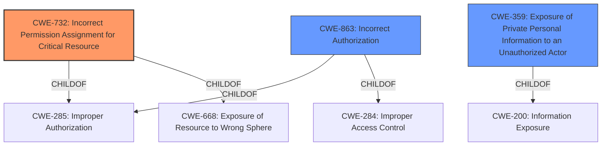

# Analysis for CVE-2021-35970

# Summary
| CWE ID | CWE Name | Confidence | CWE Abstraction Level | CWE Vulnerability Mapping Label | CWE-Vulnerability Mapping Notes |
|---|---|---|---|---|---|
| **CWE-732** | **Incorrect Permission Assignment for Critical Resource** | 0.8 | Class | Primary | Allowed-with-Review, Matches due to the **incorrect data type for permission checks** leading to information exposure. |
| CWE-359 | Exposure of Private Personal Information to an Unauthorized Actor | 0.7 | Base | Secondary | Allowed, Information exposure (**e-mail addresses and other sensitive information**) to unauthorized actors. |
| CWE-863 | Incorrect Authorization | 0.6 | Class | Secondary | Allowed-with-Review, Due to **incorrect data type for permission checks**. |

## Evidence and Confidence

*   **Confidence Score:** 0.7
*   **Evidence Strength:** HIGH

## Relationship Analysis
The primary relationship influencing the decision is the hierarchical structure with CWE-732 as a Class and CWE-359 as a Base. The vulnerability involves assigning permissions in a way that exposes sensitive information, aligning with CWE-732. CWE-359 further specifies this as exposure of private personal information. CWE-863 is related as the **incorrect** permission assignment leads to **incorrect authorization**.

## Vulnerability Chain
The chain of root cause and weaknesses includes:
  - **Root Cause:** **Incorrect data type for permission checks**.
  - **Weakness:** Incorrect permission assignment leading to inadequate access control.
  - **Impact:** Exposure of e-mail addresses and other sensitive information.

## Summary of Analysis
The initial assessment focused on the **incorrect data type for permission checks** leading to information exposure. The primary CWE, CWE-732, captures the essence of **incorrect permission assignment** for a critical resource, which in this case, is user data. The description mentions that "permission checks use an **incorrect data type**," directly supporting this classification.

CWE-732 is chosen because the vulnerability lies in how permissions were configured (using an **incorrect data type**), allowing unauthorized access. This is more precise than simply stating a missing authorization check (CWE-862) or improper authorization (CWE-285), although both are related.

The selection of CWE-732 is further supported by the "CVE Reference Links Content Summary," which states, "**Inadequate Access Control:** The `checkPermissions` function was not properly enforcing access restrictions, allowing unauthorized access to sensitive user information (email addresses)."

CWE-359 is included to explicitly state the exposure of private personal information.

CWE-863 is included as secondary because the permissions check was done using the wrong data type which resulted in **Incorrect Authorization**

The final decision is based on the evidence from the vulnerability description and the "CVE Reference Links Content Summary," combined with the hierarchical relationships and mapping guidance provided by MITRE. The selected CWEs are at the optimal level of specificity, providing a clear and accurate representation of the vulnerability.